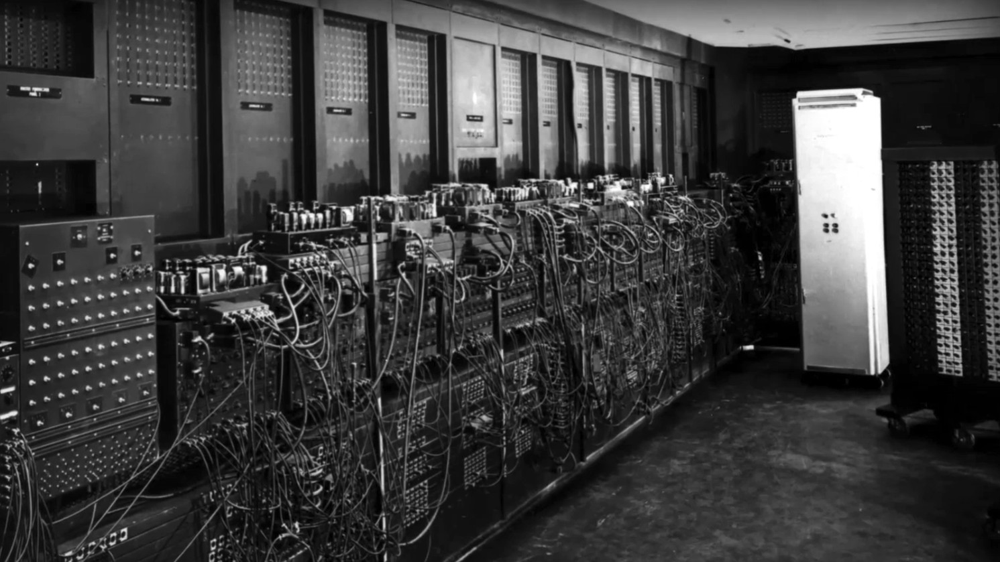
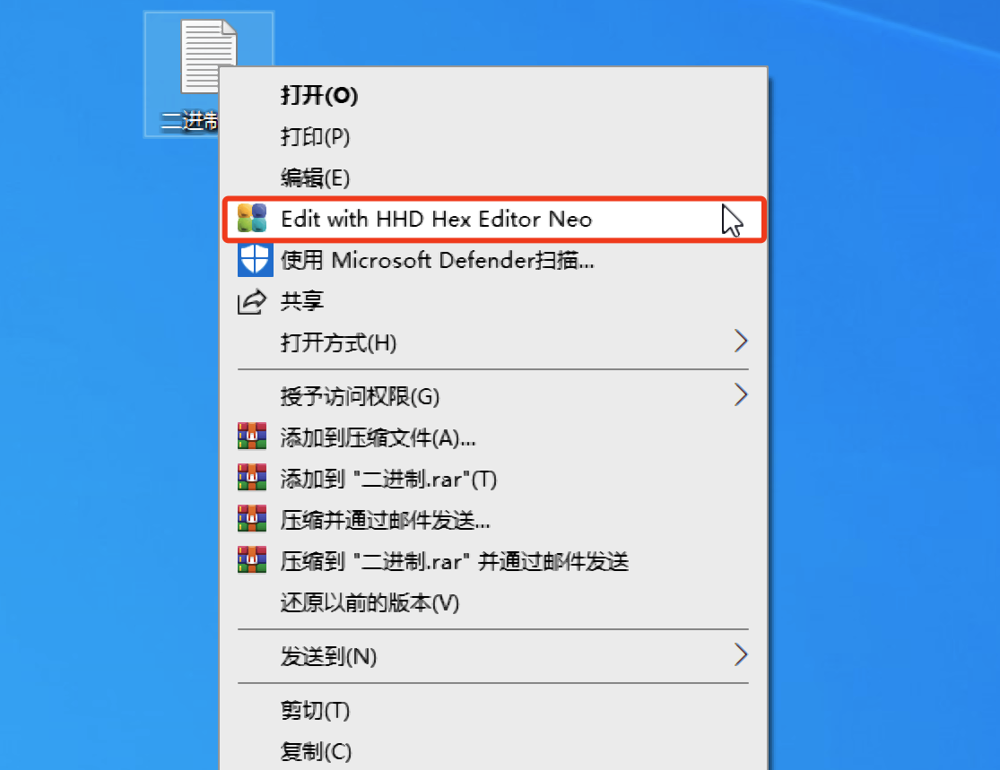
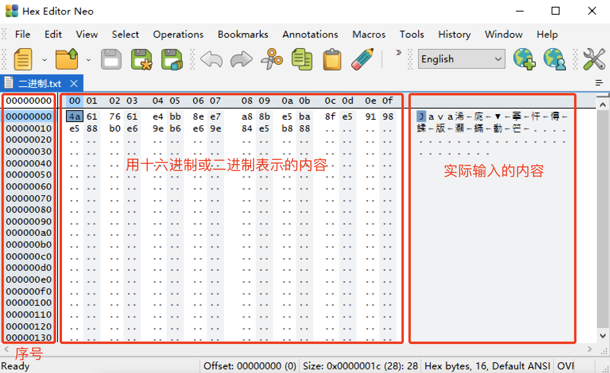
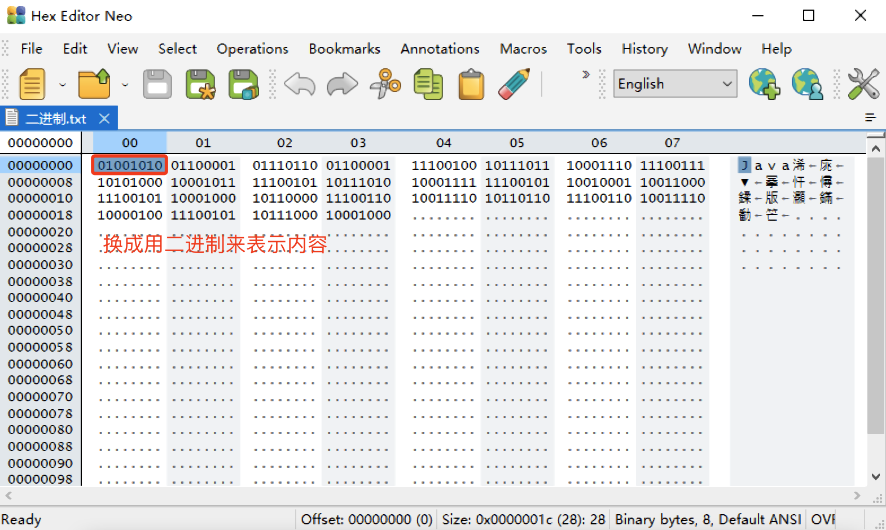
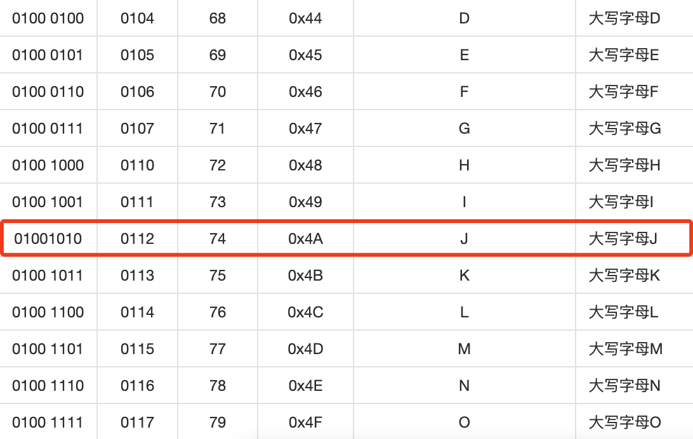
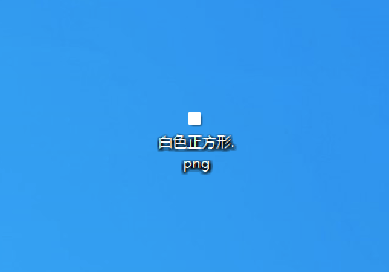
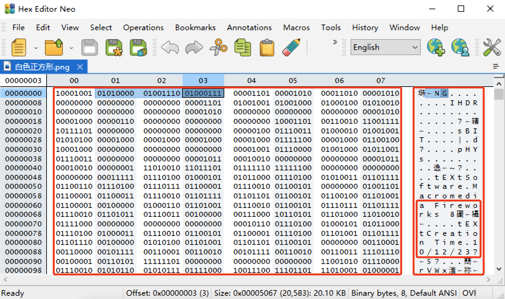
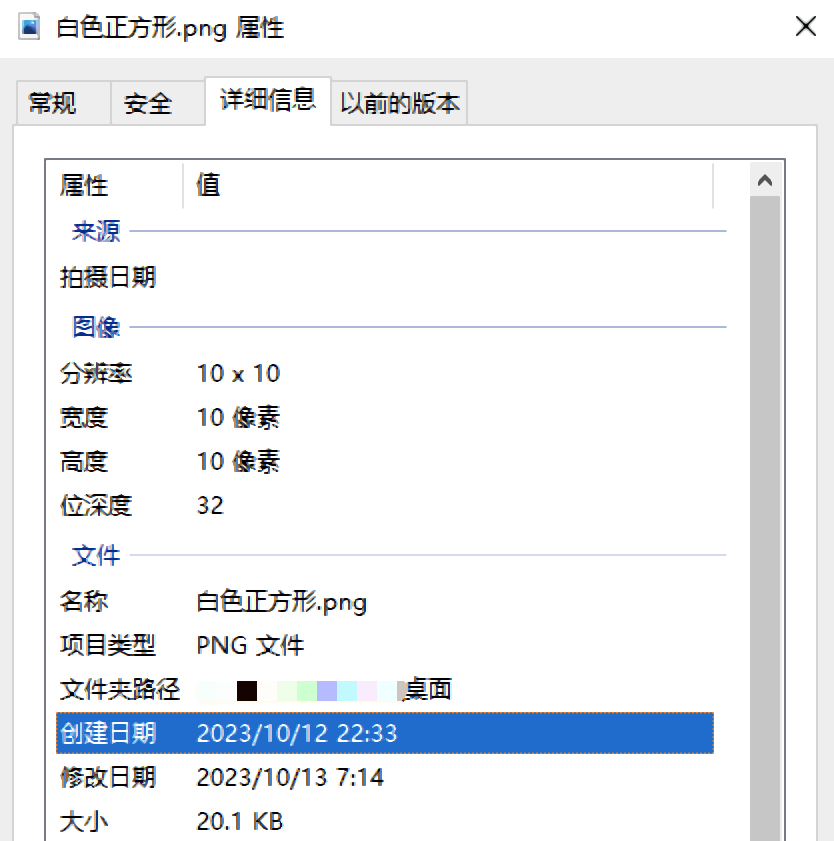
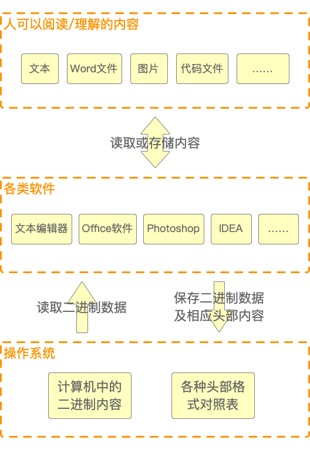
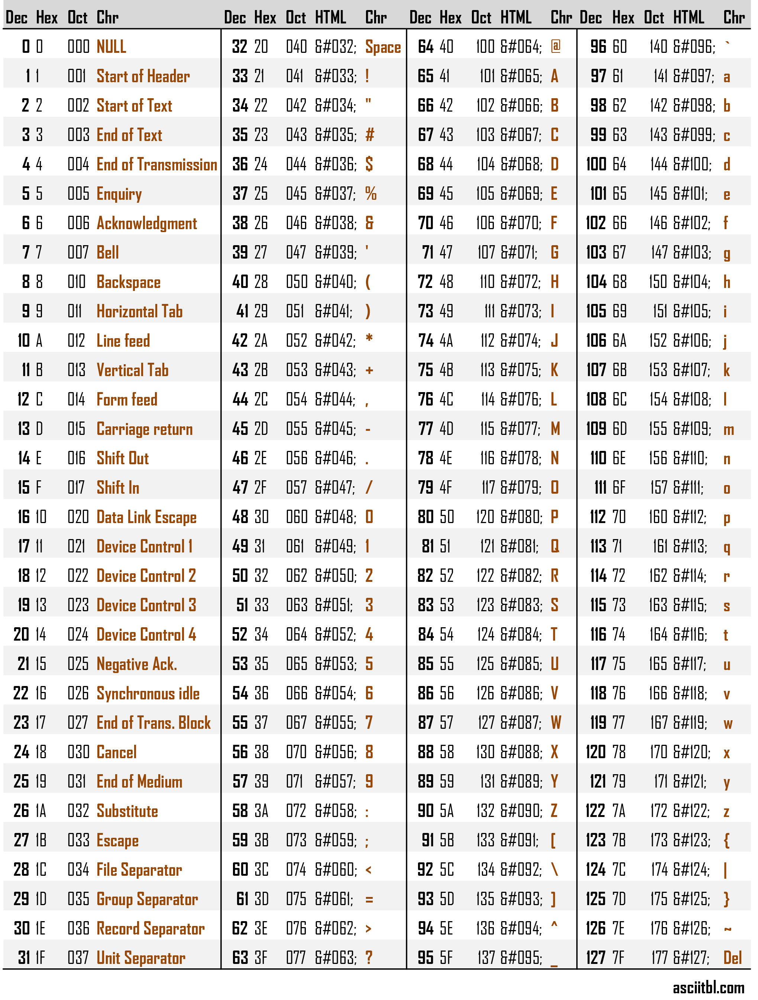

# 第一篇 开发基础篇

信息技术在过去的二三十年中发展非常迅猛，成为了许多人追逐的热门行业。但他们中有相当一部分既没有计算机专业科班的背景，也没有接受正规的、体系化的、循序渐进的理论指导和实践机会，即使是一些有着十多年工作经验的人也是如此。这就导致一个非常尴尬的现象：有的人可以把面试题倒背如流，也可以拿“高精尖”技术侃侃而谈，但在实际开发时却连最基本的技术概念都不甚了解，出现一些本不该有的低级错误。这就是本篇之所以会存在的主要原因之一——笔者希望通过自己有限的努力，把这个尴尬现象的影响面稍稍降低那么一点点。另一方面，笔者也希望借此机会对一些重要的开发常识和知识做些系统性的梳理、回顾和总结，抛砖引玉，以期让广大读者能够在信息技术行业，尤其是软件开发行业中走得更顺，更远。

“有了软肋，也就有了铠甲”——希冀这一篇的内容能襄助广大读者一臂之力，把“阿喀琉斯之踵”变为“海格力斯之箭”。

## 第1章 编程常识

常识很重要，这应该可以得到一部分人的认同。但哪些常识是日常开发工作中会高频接触到并需要了解的呢？

本章讲解了二进制、算法与数据结构、同步与异步、并发与并行、缓冲与缓存。它们虽仅占全部“常识域”的一小部分，且受篇幅所限无法深入展开，但就“二八定律”来说，用来厘清一些技术概念和解决实际问题已经够用了。掌握它们，对于开发者来说，有百利而无一害。

### 统治地球的冯·诺依曼们

1961年，一个叫叶永烈的21岁青年（他也是《十万个为什么》的作者，前网文时代的先驱），写了一本叫做《小灵通漫游未来》的科普小说。如图1-1所示。

书中提到了可视电话、电子表、家庭机器人、助听器、隐形眼镜、人造食品、语音识别、远程教学等诸多“科学幻想”。时至今日，这些当年的“痴心妄想”早已成为现在人人都习以为常的东西。而这其中，计算机所起到的作用居功至伟。

世界上第一台“通用”计算机有个好听的名字：埃尼阿克（ENIAC，全称为Electronic Numerical Integrator And Computer，电子数字积分计算机）。严格来说，它不能叫做计算机，只能说是有一间房子那么大的计算器（而且还是世界上第二台计算器，不是第一台），如图1-2所示。

因为ENIAC主要是由真空管拼凑起来的，里面包括了几百个电子逻辑门、开关和电线。所以也可以把ENIAC看成浑身长满大“灯泡”的铁箱子。这些构成逻辑门的真空管只有两种状态：不是被“打开”的状态，就是被“关闭”的状态（在经典物理学尚还存在情况下，不可能有第三种状态）。所以为了数学和物理表达上的简便，就用“1”表示“开”，用“0”表示“关”——计算机中的二进制由此诞生。

但在电子计算机诞生的一个多世纪以前（也就是1834年），就已经有人构思出了现代计算机的完整雏形——分析机。它拥有分工明确的处理器、控制器、存储器、输入与输出等不同装置。这是一个叫查尔斯·巴贝奇（Charles Babbage）的英国天才发明家的杰作。只是由于他的设计“过于先进”，那时候的世界还制造不出他所需要的设备。直到100多年后，才由一个叫约翰·冯·诺依曼的匈牙利裔美籍数学家、计算机科学家、物理学家、化学家、博弈论之父，跨越时空地实现了巴贝奇的天才构想，如图1-3所示。

虽然关于谁才是真正的“计算机之父”至今没有确切的定论，有人认为是查尔斯·巴贝奇（通用计算机之父），有人认为是阿兰·图灵（Alan Turing，计算机科学之父），有人认为是约翰·阿坦那索夫（John Vincent Atanasoff，电子计算机之父），还有人认为是冯·诺依曼（现代计算机之父）。从不同的侧面来说，这都对。但是笔者认为，查尔斯·巴贝奇太过于超前，在错误的时间得到了正确的结果，抱憾终生；阿兰·图灵更侧重于密码学和人工智能在计算机上的应用；而约翰·阿坦那索夫虽然也摸到了现代计算机体系结构的大门，但终归还是一颗“近失弹”（Near Miss，军事术语，意思是说在极近的距离下失去目标，虽无杀伤但冲击力极大）。他们当中，只有冯·诺依曼是站在巨人的肩膀上（结合了包括莱布尼兹和查尔斯·巴贝奇等前人的科学理念），第一次完整地提出了现代计算机体系结构的基本思想。

在1944年，ENIAC还未建成之时，冯·诺依曼在返回洛斯·阿拉莫斯的列车上写出了那篇长达101页且影响整个计算机历史走向的《EDVAC报告书的第一份草案》，准备着手设计建造EDVAC（Electronic Discrete Variable Automatic Computer，电子离散变量自动计算机）。

这份草案不仅详细说明了EDVAC的设计思路，也指明了现代计算机（以下简称“冯·诺依曼机”）的发展道路：

1. 计算机需要使用二进制表示数据；
2. 计算机要像存储数据一样存储程序；
3. 计算机由运算器、控制器、存储器、输入和输出五大部分组成。

从那时起直到现在，不管是巨型机、大型机、中型机、小型机还是微型机（个人计算机）；不管是台式机、笔记本、PAD（平板电脑）、PDA（个人数字助理，在工业、医疗、物流等行业广泛使用，例如抄表器、扫码枪、护理机）、智能手机还是智能电视，全世界大部分的类计算机设备都是遵照冯·诺依曼当初所规定的体系结构设计并制造出来的。

当然，世界上除了冯·诺依曼机还有一些其他体系结构的计算机，例如光子计算机、分子计算机、量子计算机等。除非有特别说明，本书后续的内容都是建立在冯·诺依曼机的基础上进行论述的。

### 二进制的那些事

大多数人听到“二进制”的时候，脑海里可能马上就会联想到电影《黑客帝国》中由“0”和“1”组成的矩阵。

笔者不打算在这里详细讨论二进制的运算、反码、补码之类枯燥的东西，但有几个和开发相关的概念需要做一点澄清和普及。因为这些内容就像空气——用的时候不觉得，但一认真审视起来就容易犯迷糊。

#### 二进制文件

我们在计算机中看到的各种文件，例如文本、图片、音乐、视频、Word文件等，对于计算机来说，没有任何差别，因为它们都是由“0”和“1”组成的。但这么说还是太笼统，举个例子就很容易理解了。

首先，在Windows中下载并安装一个叫做Hex Editor Neo的软件，这是一种十六进制编辑器。当然也可以通过安装Vscode或Notepad++的插件的方式安装。

然后，在Windows的桌面上新建一个txt文本文件，名字可以任意起，在文件其中输入一些内容后保存，比如输入“Java编程语言”。

关闭文本编辑器窗口，然后光标悬停在文本文件的图标上并单击鼠标右键，选择用Hex Editor Neo软件打开它，如图1-4所示。

打开后如图1-5所示。

可以很清楚地看到，整个区域分为左中右三个部分。左边部分显示的是十六进制序号；中间部分显示的是刚才输入的内容，用十六进制数字表示；而右边则是内容的字符编码，只不过中文都变成了乱码。现在换成用二进制来显示它。依次点击菜单上的“View”->“Display As”->“Binary”。

切换之后，显示出来的二进制内容如图1-6所示。

可以看到第一行第一列，原来显示十六进制的“4a”换成了二进制“01001010”。这正是“4a”对应的二进制数值，而将“01001010”转换成十进制数就是“74”。为什么要转换为十进制数呢？因为只有转换为十进制才能通过ASCII码表查到“74”所对应的字符是大写字母“J”，也就是刚才在文本中输入的第一个字母，如图1-7所示。

依此类推，这些十六进制内容转换之后正是刚才输入的“Java编程语言”。

刚才展示的是文本数据，现在再来看一下图像数据。

用Photoshop或其他画图软件创建一个10×10像素的正方形，底色为白色，如图1-8所示。

然后再次用Hex Editor Neo软件打开它，可以看到如图1-9所示的二进制内容。

上图中间部分第一行第二至四列的内容分别为“01010000”、“01001110”和“01000111”，按照图1-7中的方法，它们分别对应ASCII中的“P”、“N”、“G”。

这正是文件名后缀“PNG”。这是巧合吗？并不是，因为在右边部分的剩余内容中可以看到其他和这个文件相关的一些信息，如创建文件的软件工具，文件创建时间等信息，这和用Windows属性工具显示出来的信息是一致的，如图1-10所示。

这里没有再继续深入了解，但可以断定：Hex Editor Neo显示的内容一定包含了所有Windows属性显示的内容。

从这个意义上说，如果能够完全掌握用二进制创建文件的规则，是不是可以用Hex Editor Neo代替任何软件呢？例如用Hex Editor Neo代替文本编辑器，代替Word，代替Photoshop，甚至代替IDEA来编程呢？这不但理论上是完全可行的，而且事实上也确实可行。不过，却不会有人真的那么做，因为太费时费力，效率太低，而且极易出错。

我们平常所看到的任何文件，除了文件的内容本身，还含有一部分附加信息。这些附加信息用户是看不到的，即使看到了也没有意义。因为它们是给计算机操作系统准备的，用以区分各类不同的文件类型及读取、存储方式，如图1-11所示。

从上图可以看出，操作系统和各种软件是这样工作的：

1. 读取时，操作系统通过附加信息就知道该将文件交给哪个软件处理、转译并展示；
2. 存储时，各种软件会先给文件添加专属的附加信息（软件安装时会在操作系统的注册表中“登记”这些附加信息），然后再交由操作系统一并保存；
3. 卸载后，由于对应的附加信息被从注册表中清除，所以操作系统也就不知道对应类型的文件该给哪种软件处理了。

这种附加信息有一个计算机专有名词：文件头。这也正是操作系统和各种应用软件存在的意义：有些文件头十分庞大，如果要人力用二进制的方式去编写完成，无疑既费力又不讨好，但计算机却十分擅长这种精确无误且枯燥无比的重复性劳动。

#### 字符集编码

由于计算机只能存储和处理二进制的“0”和“1”，无法处理其他的字母、数字和符号，所以就需要有某种东西来达到类似桥梁的作用——例如图1-7中的ASCII——通过它，人们就可以看懂用计算机表示字母、数字或其他符号。

人们能够想到的最直接的方法是就是对字母进行编号，例如A为1，B为2，C为3等。著名英国作家弗朗西斯·培根（Francis Bacon）曾用五位序列来编码英文的26个字母，在十六世纪用来传递密信。

如果以二进制来表示25（2的5次方，5位）也就是32，可以存32个字母，对于26个英文字母来说是足够用了。但它无法区分大小写字母，也无法再区分数字和标点符号。因此就有了ASCII（American Standard Code for Information Interchange，美国信息交换标准代码）。

标准的ASCII码发明于1963年，但1967年才第一次发表，1986年则作了最后一次更新，目前ASCII包含27（2的7次方，也就是128）个字符。这个128个字符用来表示大小写字母、数字0～9、标点符号、以及像“#”、“@”、“）”、“\r”（回车）、“\n”换行、“\t”（制表）等这样的特殊符号，如图1-12所示。

因为ASCII诞生的年代较早，所以使用非常广泛，使得不同的组织、不同的计算机之间能够互相交换数据与信息。但它也有个尴尬的限制：ASCII只为印欧语系日耳曼语族中的英语所设计，甚至都不兼容同一语系同一语族下的德语、荷语等其他语种。好在当初设计二进制的时候规定1个字节（Byte）由8位（Bit）二进制数组成，因此ASCII也就顺理成章地由7位扩展为8位（2的8次方），也就是扩展后ASCII有256个字符，又叫Extended ASCII（扩展ASCII，简称为EASCII）。

但EASCII由于国际化和标准化程度不够，所以就被设计更为优良的ISO/IEC 8859字符编码方案取代了。不过，即使是ISO/IEC 8859依然只是使用了单个字节，即8位来表示字符集，所以ASCII、EASCII和ISO/IEC 8859统称为单字节字符集（SBCS），而且ISO/IEC 8859也只能表示欧洲各国所使用到的字符，所以范围依然很有限。

当计算机在世界范围内的应用越来越广泛时，单字节字符集就已经完全无法使用了，因为仅仅中文常用汉字就有几千个，还不包括各种非常用字、生僻字。除此之外，每家计算机制造商、大的软件厂商也都发布自己的字符集。例如ASMO-708、DOS-720、Windows-1250、IBM EBCDIC等。这些字符集统称为多字节字符集（MBCS）。

为了解决这种“一锅粥”式的混乱局面，1992年，Unicode出现了。它为每种语言的每个字符设定了一个唯一的二进制编码，以满足跨语言跨平台的文本转换、处理要求。Unicode使用4字节共32位，也就是232个字符来填充字符集。Unicode本身只是一个字符集标准，针对它的实现称为UTF（Unicode Transformation Format，Unicode格式转换）。

顺便说一句，实际开发中使用UTF-8时有几个地方需要注意：

1. “UTF-8”是标准写法，因为Windows不区分大小写，所以写成“utf-8”也行。也可以把中间的“-”省略，写成“UTF8”；
2. 在MySQL的配置文件中只能使用“utf8”，如果写成“utf-8”或者“UTF-8”都不会生效；
3. 对于MySQL来说，“utf8mb4”才是真正意义上的“utf8”，因为低版本的MySQL中“utf8”最大字符长度为3字节，遇到表情之类的特殊字符就会出错。

由于Unicode的实现细节较为复杂，且了解这些对开发帮助不大，故无需深究。只需要知道：如果收发双方的计算机使用的都是Unicode编码，那么是绝不会出现乱码现象的。发出的内容是什么，收到的内容就是什么，也不会再出现类似“???”、“锟斤拷”、“�”等莫名其妙的字符了。
