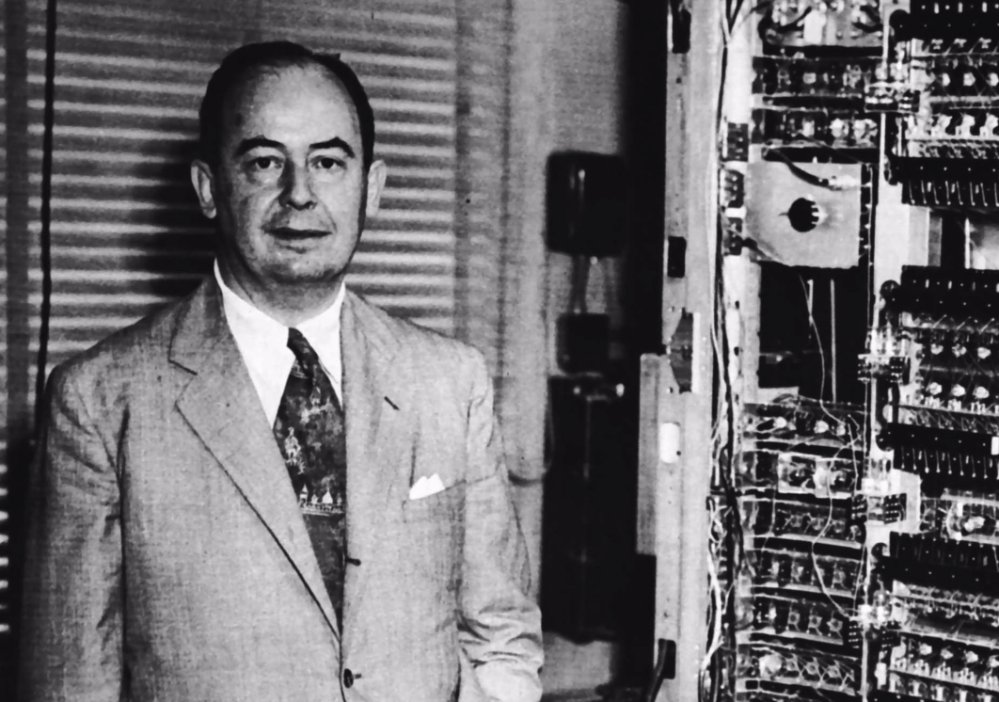

# 第一篇 开发基础篇

信息技术在过去的二三十年中发展非常迅猛，成为了许多人追逐的热门行业。但他们中有相当一部分既没有计算机专业科班的背景，也没有接受正规的、体系化的、循序渐进的理论指导和实践机会，即使是一些有着十多年工作经验的人也是如此。这就导致一个非常尴尬的现象：有的人可以把面试题倒背如流，也可以拿“高精尖”技术侃侃而谈，但在实际开发时却连最基本的技术概念都不甚了解，出现一些本不该有的低级错误。这就是本篇之所以会存在的主要原因之一——笔者希望通过自己有限的努力，把这个尴尬现象的影响面稍稍降低那么一点点。另一方面，笔者也希望借此机会对一些重要的开发常识和知识做些系统性的梳理、回顾和总结，抛砖引玉，以期让广大读者能够在信息技术行业，尤其是软件开发行业中走得更顺，更远。

“有了软肋，也就有了铠甲”——希冀这一篇的内容能襄助广大读者一臂之力，把“阿喀琉斯之踵”变为“海格力斯之箭”。

## 第1章 编程常识

常识很重要，这应该可以得到一部分人的认同。但哪些常识是日常开发工作中会高频接触到并需要了解的呢？

本章讲解了二进制、算法与数据结构、同步与异步、并发与并行、缓冲与缓存。它们虽仅占全部“常识域”的一小部分，且受篇幅所限无法深入展开，但就“二八定律”来说，用来厘清一些技术概念和解决实际问题已经够用了。掌握它们，对于开发者来说，有百利而无一害。

### 统治地球的冯·诺依曼们

1961年，一个叫叶永烈的21岁青年（他也是《十万个为什么》的作者，前网文时代的先驱），写了一本叫做《小灵通漫游未来》的科普小说。如图1-1所示。

书中提到了可视电话、电子表、家庭机器人、助听器、隐形眼镜、人造食品、语音识别、远程教学等诸多“科学幻想”。时至今日，这些当年的“痴心妄想”早已成为现在人人都习以为常的东西。而这其中，计算机所起到的作用居功至伟。

世界上第一台“通用”计算机有个好听的名字：埃尼阿克（ENIAC，全称为Electronic Numerical Integrator And Computer，电子数字积分计算机）。严格来说，它不能叫做计算机，只能说是有一间房子那么大的计算器（而且还是世界上第二台计算器，不是第一台），如图1-2所示。

因为ENIAC主要是由真空管拼凑起来的，里面包括了几百个电子逻辑门、开关和电线。所以也可以把ENIAC看成浑身长满大“灯泡”的铁箱子。这些构成逻辑门的真空管只有两种状态：不是被“打开”的状态，就是被“关闭”的状态（在经典物理学尚还存在情况下，不可能有第三种状态）。所以为了数学和物理表达上的简便，就用“1”表示“开”，用“0”表示“关”——计算机中的二进制由此诞生。

但在电子计算机诞生的一个多世纪以前（也就是1834年），就已经有人构思出了现代计算机的完整雏形——分析机。它拥有分工明确的处理器、控制器、存储器、输入与输出等不同装置。这是一个叫查尔斯·巴贝奇（Charles Babbage）的英国天才发明家的杰作。只是由于他的设计“过于先进”，那时候的世界还制造不出他所需要的设备。直到100多年后，才由一个叫约翰·冯·诺依曼的匈牙利裔美籍数学家、计算机科学家、物理学家、化学家、博弈论之父，跨越时空地实现了巴贝奇的天才构想，如图1-3所示。

虽然关于谁才是真正的“计算机之父”至今没有确切的定论，有人认为是查尔斯·巴贝奇（通用计算机之父），有人认为是阿兰·图灵（Alan Turing，计算机科学之父），有人认为是约翰·阿坦那索夫（John Vincent Atanasoff，电子计算机之父），还有人认为是冯·诺依曼（现代计算机之父）。从不同的侧面来说，这都对。但是笔者认为，查尔斯·巴贝奇太过于超前，在错误的时间得到了正确的结果，抱憾终生；阿兰·图灵更侧重于密码学和人工智能在计算机上的应用；而约翰·阿坦那索夫虽然也摸到了现代计算机体系结构的大门，但终归还是一颗“近失弹”（Near Miss，军事术语，意思是说在极近的距离下失去目标，虽无杀伤但冲击力极大）。他们当中，只有冯·诺依曼是站在巨人的肩膀上（结合了包括莱布尼兹和查尔斯·巴贝奇等前人的科学理念），第一次完整地提出了现代计算机体系结构的基本思想。

在1944年，ENIAC还未建成之时，冯·诺依曼在返回洛斯·阿拉莫斯的列车上写出了那篇长达101页且影响整个计算机历史走向的《EDVAC报告书的第一份草案》，准备着手设计建造EDVAC（Electronic Discrete Variable Automatic Computer，电子离散变量自动计算机）。

这份草案不仅详细说明了EDVAC的设计思路，也指明了现代计算机（以下简称“冯·诺依曼机”）的发展道路：

1. 计算机需要使用二进制表示数据；
2. 计算机要像存储数据一样存储程序；
3. 计算机由运算器、控制器、存储器、输入和输出五大部分组成。
