# 第一篇 开发基础篇

信息技术在过去的二三十年中发展非常迅猛，成为了许多人追逐的热门行业。但他们中有相当一部分既没有计算机专业科班的背景，也没有接受正规的、体系化的、循序渐进的理论指导和实践机会，即使是一些有着十多年工作经验的人也是如此。这就导致一个非常尴尬的现象：有的人可以把面试题倒背如流，也可以拿“高精尖”技术侃侃而谈，但在实际开发时却连最基本的技术概念都不甚了解，出现一些本不该有的低级错误。这就是本篇之所以会存在的主要原因之一——笔者希望通过自己有限的努力，把这个尴尬现象的影响面稍稍降低那么一点点。另一方面，笔者也希望借此机会对一些重要的开发常识和知识做些系统性的梳理、回顾和总结，抛砖引玉，以期让广大读者能够在信息技术行业，尤其是软件开发行业中走得更顺，更远。

“有了软肋，也就有了铠甲”——希冀这一篇的内容能襄助广大读者一臂之力，把“阿喀琉斯之踵”变为“海格力斯之箭”。

## 第1章 编程常识

常识很重要，这应该可以得到一部分人的认同。但哪些常识是日常开发工作中会高频接触到并需要了解的呢？

本章讲解了二进制、算法与数据结构、同步与异步、并发与并行、缓冲与缓存。它们虽仅占全部“常识域”的一小部分，且受篇幅所限无法深入展开，但就“二八定律”来说，用来厘清一些技术概念和解决实际问题已经够用了。掌握它们，对于开发者来说，有百利而无一害。

### 统治地球的冯·诺依曼们

1961年，一个叫叶永烈的21岁青年（他也是《十万个为什么》的作者，前网文时代的先驱），写了一本叫做《小灵通漫游未来》的科普小说。如图1-1所示。

书中提到了可视电话、电子表、家庭机器人、助听器、隐形眼镜、人造食品、语音识别、远程教学等诸多“科学幻想”。时至今日，这些当年的“痴心妄想”早已成为现在人人都习以为常的东西。而这其中，计算机所起到的作用居功至伟。

世界上第一台“通用”计算机有个好听的名字：埃尼阿克（ENIAC，全称为Electronic Numerical Integrator And Computer，电子数字积分计算机）。严格来说，它不能叫做计算机，只能说是有一间房子那么大的计算器（而且还是世界上第二台计算器，不是第一台），如图1-2所示。

因为ENIAC主要是由真空管拼凑起来的，里面包括了几百个电子逻辑门、开关和电线。所以也可以把ENIAC看成浑身长满大“灯泡”的铁箱子。这些构成逻辑门的真空管只有两种状态：不是被“打开”的状态，就是被“关闭”的状态（在经典物理学尚还存在情况下，不可能有第三种状态）。所以为了数学和物理表达上的简便，就用“1”表示“开”，用“0”表示“关”——计算机中的二进制由此诞生。

但在电子计算机诞生的一个多世纪以前（也就是1834年），就已经有人构思出了现代计算机的完整雏形——分析机。它拥有分工明确的处理器、控制器、存储器、输入与输出等不同装置。这是一个叫查尔斯·巴贝奇（Charles Babbage）的英国天才发明家的杰作。只是由于他的设计“过于先进”，那时候的世界还制造不出他所需要的设备。直到100多年后，才由一个叫约翰·冯·诺依曼的匈牙利裔美籍数学家、计算机科学家、物理学家、化学家、博弈论之父，跨越时空地实现了巴贝奇的天才构想，如图1-3所示。

虽然关于谁才是真正的“计算机之父”至今没有确切的定论，有人认为是查尔斯·巴贝奇（通用计算机之父），有人认为是阿兰·图灵（Alan Turing，计算机科学之父），有人认为是约翰·阿坦那索夫（John Vincent Atanasoff，电子计算机之父），还有人认为是冯·诺依曼（现代计算机之父）。从不同的侧面来说，这都对。但是笔者认为，查尔斯·巴贝奇太过于超前，在错误的时间得到了正确的结果，抱憾终生；阿兰·图灵更侧重于密码学和人工智能在计算机上的应用；而约翰·阿坦那索夫虽然也摸到了现代计算机体系结构的大门，但终归还是一颗“近失弹”（Near Miss，军事术语，意思是说在极近的距离下失去目标，虽无杀伤但冲击力极大）。他们当中，只有冯·诺依曼是站在巨人的肩膀上（结合了包括莱布尼兹和查尔斯·巴贝奇等前人的科学理念），第一次完整地提出了现代计算机体系结构的基本思想。

在1944年，ENIAC还未建成之时，冯·诺依曼在返回洛斯·阿拉莫斯的列车上写出了那篇长达101页且影响整个计算机历史走向的《EDVAC报告书的第一份草案》，准备着手设计建造EDVAC（Electronic Discrete Variable Automatic Computer，电子离散变量自动计算机）。

这份草案不仅详细说明了EDVAC的设计思路，也指明了现代计算机（以下简称“冯·诺依曼机”）的发展道路：

1. 计算机需要使用二进制表示数据；
2. 计算机要像存储数据一样存储程序；
3. 计算机由运算器、控制器、存储器、输入和输出五大部分组成。

从那时起直到现在，不管是巨型机、大型机、中型机、小型机还是微型机（个人计算机）；不管是台式机、笔记本、PAD（平板电脑）、PDA（个人数字助理，在工业、医疗、物流等行业广泛使用，例如抄表器、扫码枪、护理机）、智能手机还是智能电视，全世界大部分的类计算机设备都是遵照冯·诺依曼当初所规定的体系结构设计并制造出来的。

当然，世界上除了冯·诺依曼机还有一些其他体系结构的计算机，例如光子计算机、分子计算机、量子计算机等。除非有特别说明，本书后续的内容都是建立在冯·诺依曼机的基础上进行论述的。

### 二进制的那些事

大多数人听到“二进制”的时候，脑海里可能马上就会联想到电影《黑客帝国》中由“0”和“1”组成的矩阵。

笔者不打算在这里详细讨论二进制的运算、反码、补码之类枯燥的东西，但有几个和开发相关的概念需要做一点澄清和普及。因为这些内容就像空气——用的时候不觉得，但一认真审视起来就容易犯迷糊。

#### 二进制文件

我们在计算机中看到的各种文件，例如文本、图片、音乐、视频、Word文件等，对于计算机来说，没有任何差别，因为它们都是由“0”和“1”组成的。但这么说还是太笼统，举个例子就很容易理解了。

首先，在Windows中下载并安装一个叫做Hex Editor Neo的软件，这是一种十六进制编辑器。当然也可以通过安装Vscode或Notepad++的插件的方式安装。

然后，在Windows的桌面上新建一个txt文本文件，名字可以任意起，在文件其中输入一些内容后保存，比如输入“Java编程语言”。

关闭文本编辑器窗口，然后光标悬停在文本文件的图标上并单击鼠标右键，选择用Hex Editor Neo软件打开它，如图1-4所示。

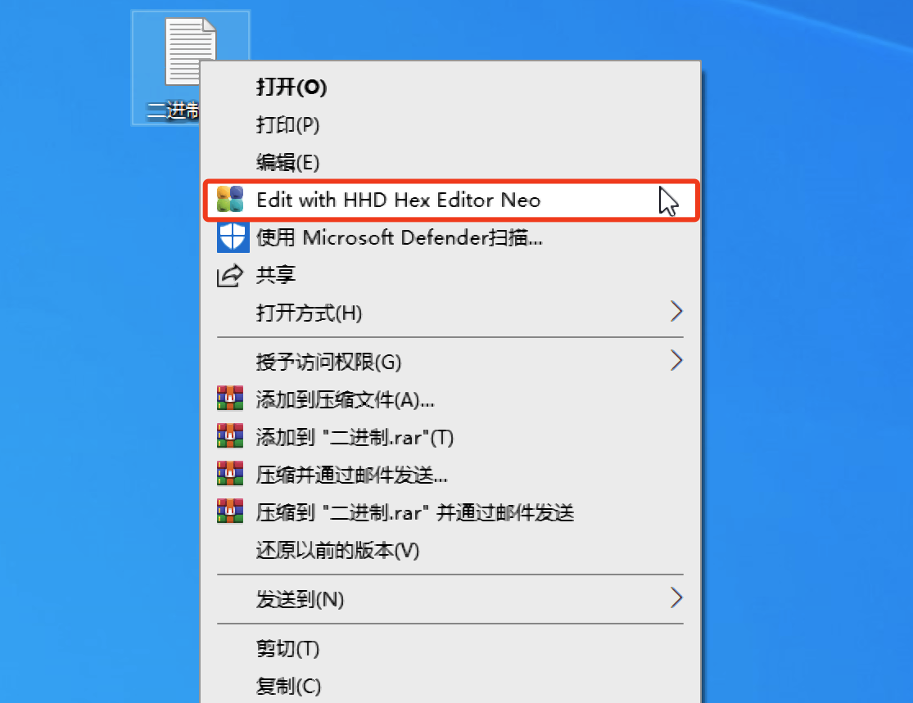

打开后如图1-5所示。

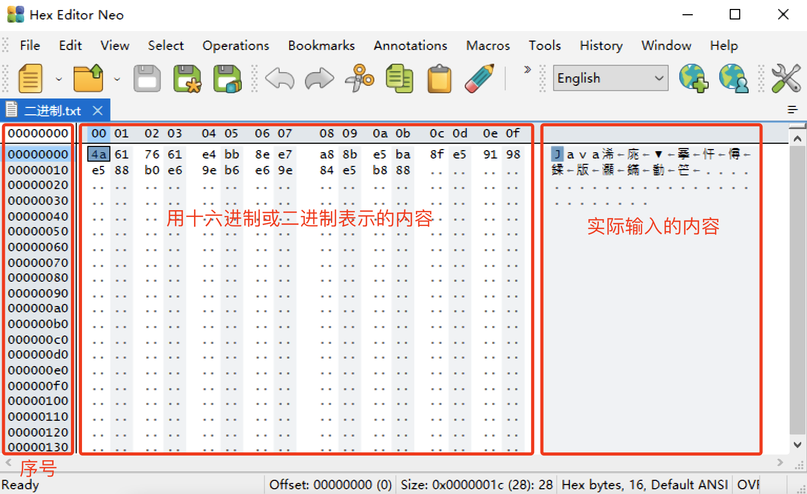

可以很清楚地看到，整个区域分为左中右三个部分。左边部分显示的是十六进制序号；中间部分显示的是刚才输入的内容，用十六进制数字表示；而右边则是内容的字符编码，只不过中文都变成了乱码。现在换成用二进制来显示它。依次点击菜单上的“View”->“Display As”->“Binary”。

切换之后，显示出来的二进制内容如图1-6所示。

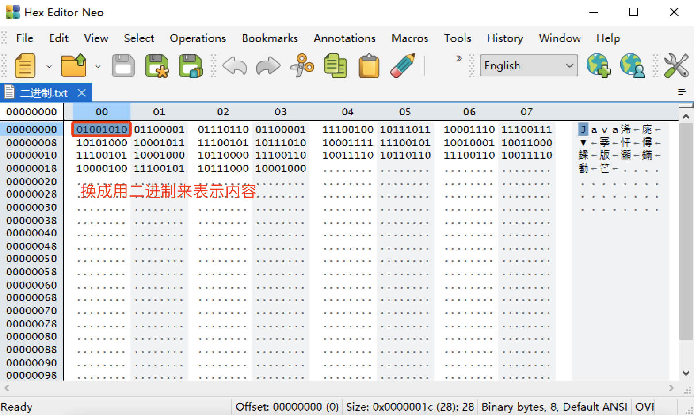

可以看到第一行第一列，原来显示十六进制的“4a”换成了二进制“01001010”。这正是“4a”对应的二进制数值，而将“01001010”转换成十进制数就是“74”。为什么要转换为十进制数呢？因为只有转换为十进制才能通过ASCII码表查到“74”所对应的字符是大写字母“J”，也就是刚才在文本中输入的第一个字母，如图1-7所示。

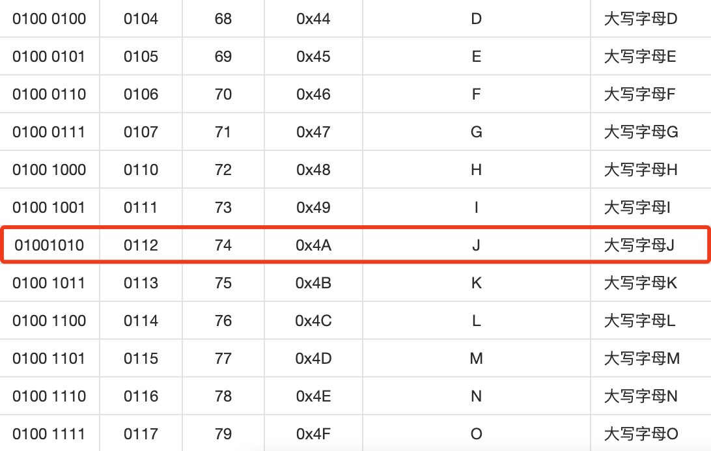

依此类推，这些十六进制内容转换之后正是刚才输入的“Java编程语言”。

刚才展示的是文本数据，现在再来看一下图像数据。

用Photoshop或其他画图软件创建一个10×10像素的正方形，底色为白色，如图1-8所示。

然后再次用Hex Editor Neo软件打开它，可以看到如图1-9所示的二进制内容。

上图中间部分第一行第二至四列的内容分别为“01010000”、“01001110”和“01000111”，按照图1-7中的方法，它们分别对应ASCII中的“P”、“N”、“G”。

这正是文件名后缀“PNG”。这是巧合吗？并不是，因为在右边部分的剩余内容中可以看到其他和这个文件相关的一些信息，如创建文件的软件工具，文件创建时间等信息，这和用Windows属性工具显示出来的信息是一致的，如图1-10所示。

这里没有再继续深入了解，但可以断定：Hex Editor Neo显示的内容一定包含了所有Windows属性显示的内容。

从这个意义上说，如果能够完全掌握用二进制创建文件的规则，是不是可以用Hex Editor Neo代替任何软件呢？例如用Hex Editor Neo代替文本编辑器，代替Word，代替Photoshop，甚至代替IDEA来编程呢？这不但理论上是完全可行的，而且事实上也确实可行。不过，却不会有人真的那么做，因为太费时费力，效率太低，而且极易出错。

我们平常所看到的任何文件，除了文件的内容本身，还含有一部分附加信息。这些附加信息用户是看不到的，即使看到了也没有意义。因为它们是给计算机操作系统准备的，用以区分各类不同的文件类型及读取、存储方式，如图1-11所示。

从上图可以看出，操作系统和各种软件是这样工作的：

1. 读取时，操作系统通过附加信息就知道该将文件交给哪个软件处理、转译并展示；
2. 存储时，各种软件会先给文件添加专属的附加信息（软件安装时会在操作系统的注册表中“登记”这些附加信息），然后再交由操作系统一并保存；
3. 卸载后，由于对应的附加信息被从注册表中清除，所以操作系统也就不知道对应类型的文件该给哪种软件处理了。

这种附加信息有一个计算机专有名词：文件头。这也正是操作系统和各种应用软件存在的意义：有些文件头十分庞大，如果要人力用二进制的方式去编写完成，无疑既费力又不讨好，但计算机却十分擅长这种精确无误且枯燥无比的重复性劳动。

#### 字符集编码

由于计算机只能存储和处理二进制的“0”和“1”，无法处理其他的字母、数字和符号，所以就需要有某种东西来达到类似桥梁的作用——例如图1-7中的ASCII——通过它，人们就可以看懂用计算机表示字母、数字或其他符号。

人们能够想到的最直接的方法是就是对字母进行编号，例如A为1，B为2，C为3等。著名英国作家弗朗西斯·培根（Francis Bacon）曾用五位序列来编码英文的26个字母，在十六世纪用来传递密信。

如果以二进制来表示25（2的5次方，5位）也就是32，可以存32个字母，对于26个英文字母来说是足够用了。但它无法区分大小写字母，也无法再区分数字和标点符号。因此就有了ASCII（American Standard Code for Information Interchange，美国信息交换标准代码）。

标准的ASCII码发明于1963年，但1967年才第一次发表，1986年则作了最后一次更新，目前ASCII包含27（2的7次方，也就是128）个字符。这个128个字符用来表示大小写字母、数字0～9、标点符号、以及像“#”、“@”、“）”、“\r”（回车）、“\n”换行、“\t”（制表）等这样的特殊符号，如图1-12所示。

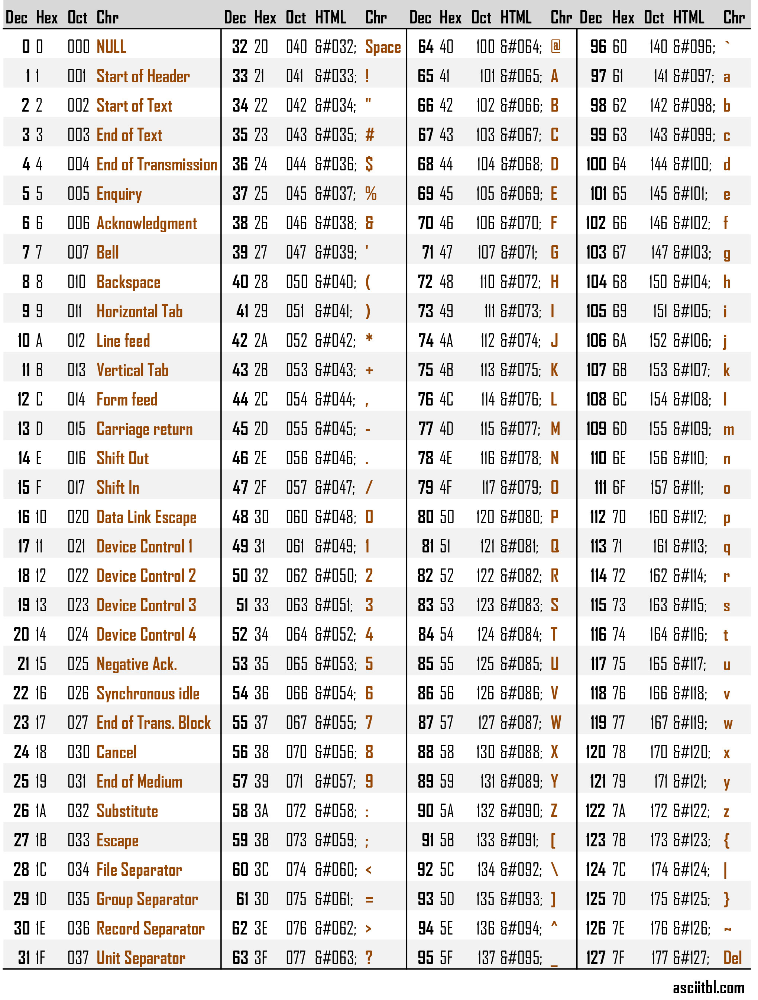

因为ASCII诞生的年代较早，所以使用非常广泛，使得不同的组织、不同的计算机之间能够互相交换数据与信息。但它也有个尴尬的限制：ASCII只为印欧语系日耳曼语族中的英语所设计，甚至都不兼容同一语系同一语族下的德语、荷语等其他语种。好在当初设计二进制的时候规定1个字节（Byte）由8位（Bit）二进制数组成，因此ASCII也就顺理成章地由7位扩展为8位（2的8次方），也就是扩展后ASCII有256个字符，又叫Extended ASCII（扩展ASCII，简称为EASCII）。

但EASCII由于国际化和标准化程度不够，所以就被设计更为优良的ISO/IEC 8859字符编码方案取代了。不过，即使是ISO/IEC 8859依然只是使用了单个字节，即8位来表示字符集，所以ASCII、EASCII和ISO/IEC 8859统称为单字节字符集（SBCS），而且ISO/IEC 8859也只能表示欧洲各国所使用到的字符，所以范围依然很有限。

当计算机在世界范围内的应用越来越广泛时，单字节字符集就已经完全无法使用了，因为仅仅中文常用汉字就有几千个，还不包括各种非常用字、生僻字。除此之外，每家计算机制造商、大的软件厂商也都发布自己的字符集。例如ASMO-708、DOS-720、Windows-1250、IBM EBCDIC等。这些字符集统称为多字节字符集（MBCS）。

为了解决这种“一锅粥”式的混乱局面，1992年，Unicode出现了。它为每种语言的每个字符设定了一个唯一的二进制编码，以满足跨语言跨平台的文本转换、处理要求。Unicode使用4字节共32位，也就是232个字符来填充字符集。Unicode本身只是一个字符集标准，针对它的实现称为UTF（Unicode Transformation Format，Unicode格式转换）。

顺便说一句，实际开发中使用UTF-8时有几个地方需要注意：

1. “UTF-8”是标准写法，因为Windows不区分大小写，所以写成“utf-8”也行。也可以把中间的“-”省略，写成“UTF8”；
2. 在MySQL的配置文件中只能使用“utf8”，如果写成“utf-8”或者“UTF-8”都不会生效；
3. 对于MySQL来说，“utf8mb4”才是真正意义上的“utf8”，因为低版本的MySQL中“utf8”最大字符长度为3字节，遇到表情之类的特殊字符就会出错。

由于Unicode的实现细节较为复杂，且了解这些对开发帮助不大，故无需深究。只需要知道：如果收发双方的计算机使用的都是Unicode编码，那么是绝不会出现乱码现象的。发出的内容是什么，收到的内容就是什么，也不会再出现类似“???”、“锟斤拷”、“�”等莫名其妙的字符了。

### 算法与数据结构

“算法”术语源于古代波斯博识者阿尔·花拉子密，也是1000多年前的代数之父。如图1-13所示。

通俗地讲，算法就是完成计算的具体步骤（或办法）。同一种结果，往往可以用不同的算法写出来，而且有些算法会比其他算法更节省时间、节省空间。如何得到高效的算法，用尽可能少的步骤或时间解决问题，是早在现代计算机问世的千年之前就已存在的问题。

首先要澄清一下，当人们说到“算法”两个字的时候，可能不自觉地说的是它在广义上的概念，也就是既包括处理一般数据结构的基础算法，也包括用于处理大规模数据集的机器学习算法（或人工智能算法。严格来说机器学习和人工智能还是有差别的），如图1-14所示。

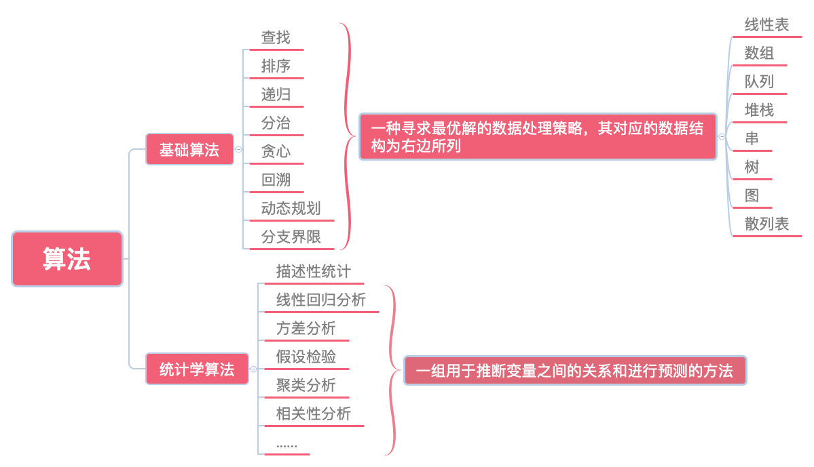

但是笔者并不准备也不可能详细讨论所有的这两大类算法，这里只讲一讲基础算法。

算法既然决定处理数据的方法和效率，那么数据本身对算法有没有影响呢？或者说，计算机存储、组织数据的方式对算法有没有影响呢？——当然有，就像我们不太可能从字典的第一页去找单词一样。也正如收纳箱便于人们分类整理、存放衣服那样，结构清晰且分明的数据，也便于计算机的存储和处理。

#### 算法评价工具

在各种算法中，被用得最多的当推“查找”和“排序”这两类。这也是显而易见的——毕竟，人们在生活中就常常面临“找东西”和“比大小”的问题。比如，钥匙忘在哪儿了？忘单位还是忘家里了？如果是忘家里，是客厅还是卧室？——这就用到了简单的二分查找算法。或者，管他三七二十一，先从家里开始找，翻遍每一个角落，不行再去单位翻遍每一个角落——这又用到了顺序查找。再比如，如果用字典查英语单词“Java”的意思，人们一般会从“J”开头的字母开始往后翻，而既不是从头开始，也不是从字典的中间开始，这也是一种查找算法，称为索引。“比大小”也是一样：“高矮胖瘦”和“多快好省”，无一不是排序在起作用。

计算机科学研究算法的目的就是要提高计算效率，即用尽量少的时间和空间，在有限资源下求最优解。迄今为止，各类计算机算法已有成百上千种，即使是像排序这样“简单”的算法也有十好几种。那怎么衡量哪种算法更高效，也就是更省时间或者更省空间呢？因此，科学家们提出用“大O表示法”（Big-O）来衡量算法的执行效率。其中：

1. 衡量算法执行时间效率的称为“时间复杂度”，定义为T(n) = O(f(n))；
2. 衡量算法执行空间效率的称为“空间复杂度”，定义为S(n) = O(f(n))。

所谓算法的时间复杂度，指的是某种算法运行一次所需要的时间。但这个时间不是具体的时、分、秒，而是执行运算的操作次数——很显然，操作次数越少，需要的时间也就越少。例如，如果在100个数中用顺序查找的方法找到“1”这个数字，那么在最坏的情况下（从第一个数开始，找到最后一个数），需要“找”100次，也就是要执行100次比较操作。所以它的时间复杂度为O(100)，这是一种非常简单的线性复杂度。

有的算法不管有多少需要查找的数据，它的复杂度始终都不变，只有1次，或至多2～3次。那么它的复杂度可以就用O(1)来表示。例如查找算法中的索引查找或哈希查找。还有的算法的时间复杂度是以某数为底的对数，例如二分查找就是以2为底的对数log，因为它每次都只对一半的数值进行查找。为什么是对数呢？最直观的解释就是图1-15所示那样。

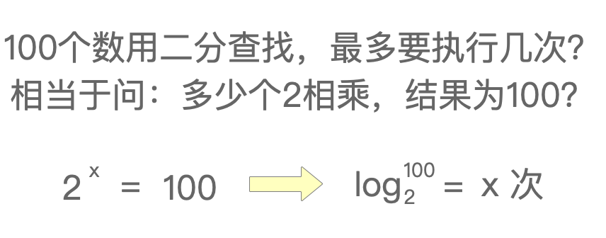

所以，按照时间复杂度，各种查找算法的时间复杂度排序如表1-1所列的那样。

> 表1-1 几大常见查找算法的时间复杂度

| 算法名称 | 算法复杂度 |
|:---:|:---:|
| 顺序查找 | O(n) |
| 二分查找（折半查找） | O(log n) |
| 插值查找 | O(log log n) |
| 哈希查找 | O(1) |

除了这几种常见的算法及其复杂度之外，还有很多其他的算法及其复杂度。笔者就不一一说明。图1-16展示了一个算法时间复杂度的比较，它们与算法类别无关，适用于查找、排序及其他算法。

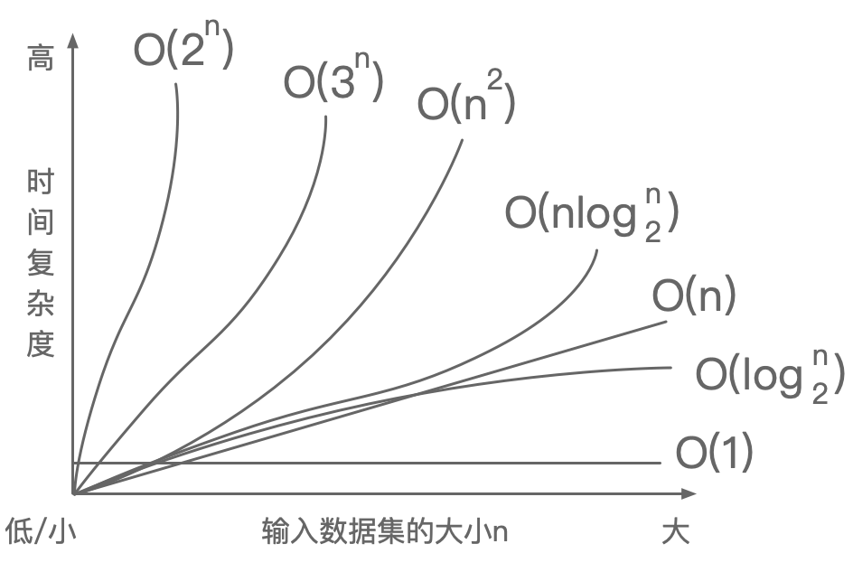

按照时间复杂度从小到大的排序，它们分别是：O(1) < O(logn) < O(n) < O(nlogn) < O(n2) < O(n3) < 0(2n) < O(n!) < O(nn)。

在算法执行时，通常需要用到三种不同类型的存储空间：

1. 输入空间：保存输入数据所需存储空间的大小；
2. 暂存空间：算法执行时，存储中间变量等数据所需的空间大小；
3. 输出空间：保存输出数据所需存储空间的大小。

一般情况下，算法的空间复杂度 = 暂存空间 + 输出空间大小。

和算法时间复杂度一样，常见的空间复杂度及其排序是：O(1) < O(logn) < O(n) < O(n2) < 0(2n)。

如图1-17所示。

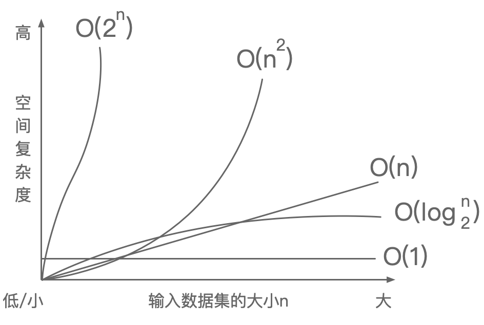

所以，当需要通过算法执行某些具体任务时，只需要通过本书给出的时间复杂度和空间复杂度的总结和排序，也就是算法的通用工具，就能大概知道该选取哪种算法比较合适了。当然，也可以求助一些在线的算法复杂度计算工具，看看算法是否能达到预期要求。

#### 图解数据结构

现在就来捋一捋前面提到过的那些数据结构，也顺便澄清一些数据结构中让人常“犯迷糊”的地方。

首先是“数组”。有的编程语言称为Array，但在Java中，ArrayList的底层就是由数组支撑的。它的特点如图1-18所示。

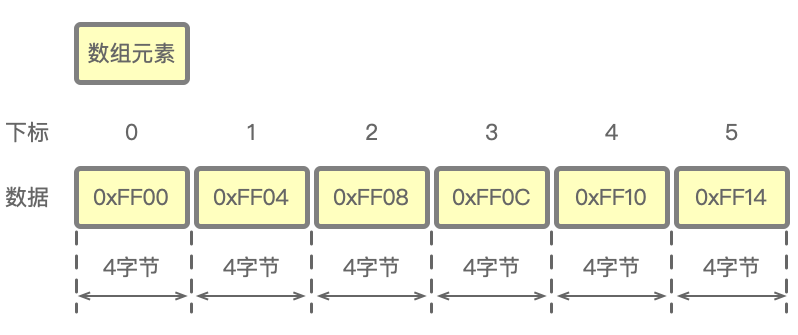

1. 数组只能存储相同类型的元素，也就是说要么是数字，要么是字符，要么是对象；
2. 数组长度在初始化分配时就固定下来了；
3. 数组元素是顺序且连续存放的，所以元素地址也是顺序且连续的；
4. 数组可以随机访问。

数组读取效率高，但插入、删除很麻烦。

“链表”则是一种特殊的List列表，如图1-19所示。

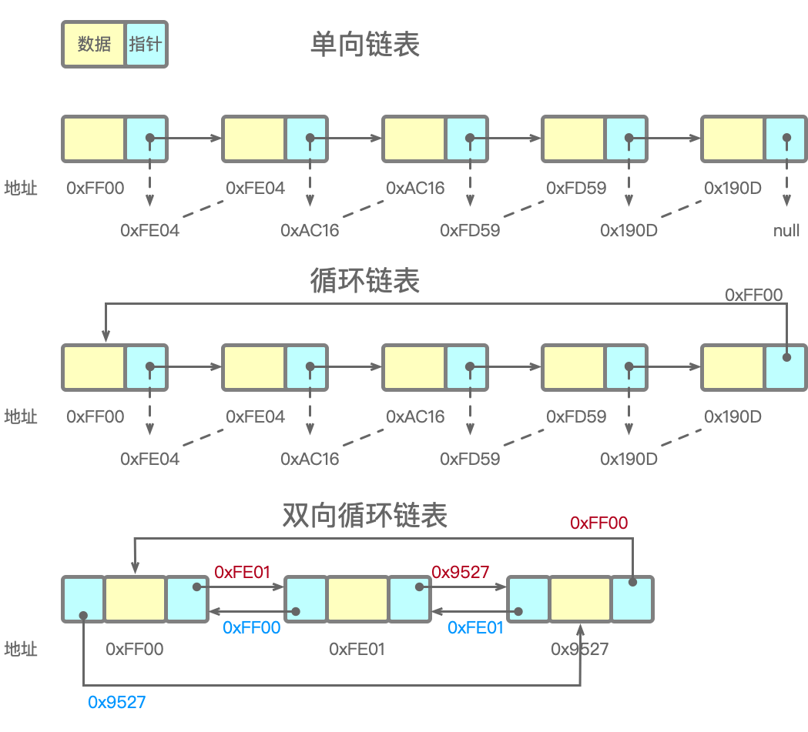

相较于数组，它有如下特性：

1. 和数组一样，链表也只能存储相同类型的元素；
2. 链表长度在实际使用时是可变的；
3. 元素的存储地址不是连续的内存空间；
4. 链表是有方向的，有空链表、单向链表、双向链表和循环链表；
5. 链表只能按序遍历；
6. 插入、删除效率高，但读取比较麻烦。

上图做了简化，没有给链表加上头尾指针或者所谓的Guard位。所以稍作总结，数组和链表的区别如表1-2所示。

> 表1-2 数组和链表的区别

|  | 数组 | 链表 |
|:---:|:---:|:---:|
| 内存地址 | 连续的内存空间 | 不连续的内存空间 |
| 长度 | 分配时固定 | 分配时可指定，但也能动态调整 |
| 访问效率 | 增删效率低，读取高 | 增删效率高，读取低 |
| 访问方式 | 可以随机遍历 | 只能顺序遍历 |
| 方向 | 无 | 有 |

“栈”如图1-20所示，用一句简单的话来说就是“先进后出”（FILO，First In Last Out）。

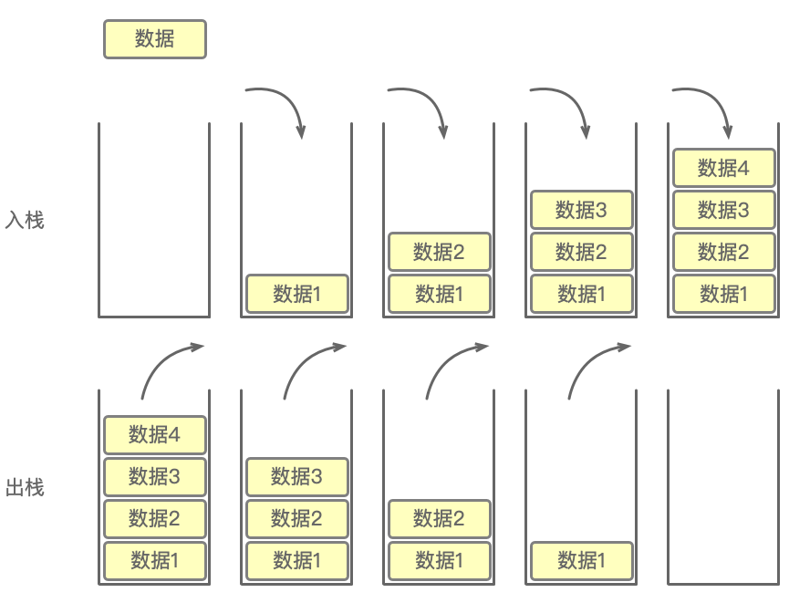

1. 栈是内存中的一块区域，是一个先进后出的线性表；
2. 用于存储运算时需要的临时数据，大小固定，由程序自动创建和释放；
3. 容量较小，一般只有几KB～几MB大小，但访问速度很快。

“队列”和栈类似，它和栈唯一的区别是“先进先出”（FIFO，First In First Out）。

1. 只能在队头端插入，而在队尾端删除；
2. 链式队列长度不固定，插入删除方便，读取不便。如图1-21所示；

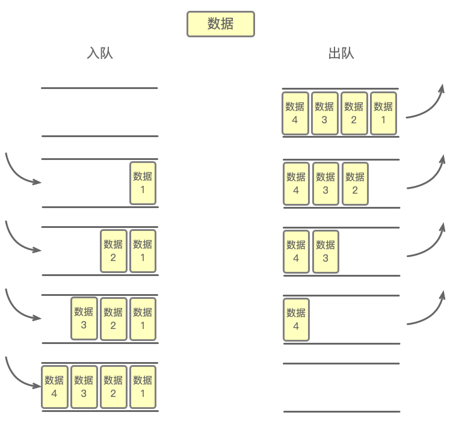

3. 循环队列长度固定，插入删除不便，读取方便。如图1-22所示。

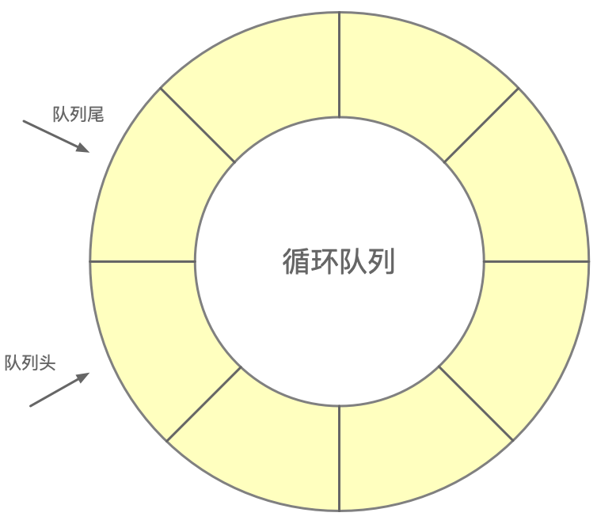

“树”作为数据结构中的一个大类，在底层中间件中的应用非常广泛。例如MySQL数据库的索引就是用B+树实现的。在搞清楚一系列各种不同的树之前，要先知道关于树都有哪些名词、术语和属性，不然有些树的定义或区别无法描述。如图1-23所示。

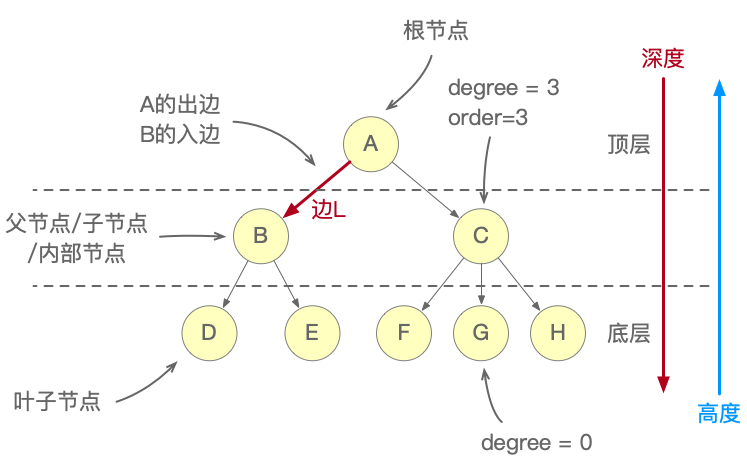

1. 节点：组成树的基础，它有自己的名字或“键”，节点可以带有附加信息，称为“有效载荷”。上图中A、B、C、D、E、F、G、H都是树的节点；
2. 边：组成树的基础，节点之间通过边相连。箭头指向节点的边称为入边，反之为出边，图中红色的边L就是A的出边，B的入边；
3. 根节点：处于顶层且没有入边只有出边的节点。A就是整棵树的根节点；
4. 父节点：有出边指向其他节点的节点。A就是B的父节点；
5. 子节点：有入边且和上层节点相连的节点。B就是A的子节点；
6. 内部节点：除根节点和叶子节点之外的节点叫做内部节点。B和C都是内部节点，它们既非根节点也非叶子节点；
7. 叶子节点：只有入边没有出边的子节点。D、E、F、G、H都是叶子节点，它们都只有入边没有出边；
8. 度：每个节点的子节点或叶子节点的数量，称为degree。A节点和B节点的度degree都是2。C节点的度degree是3。而D、E、F、G、H这几个叶子节点的度degree是0；
9. 阶：直观且简单地说，度数值最大的子节点即为该树的阶，称为order。阶是针对整棵树而言的，因为C节点的度degree最大为3，所以上图中整颗树的阶order就是3；
10. 树的深度：从根节点开始计数，如根节点可以记为为0或1，自顶向下逐层累加后的值即为树的深度。步长可为1或更大的数；
11. 树的高度：从叶子节点开始计数，如叶子节点可以记为为0或1，自底向上逐层累加后的值即为树的高度。步长可为1或更大的数；
12. 深度和高度可以是整棵树的，也可以是某个节点n[i]的。如果是某个节点n[i]的深度，则是从根节点开始到节点n[i]之间的路径长度；如果是某个节点n[i]的高度，则是从叶子节点开始到n[i]节点之间的路径长度。

在厘清了树的定义之后，就可以再来看看树有哪些不同的分类了，如图1-24所示。

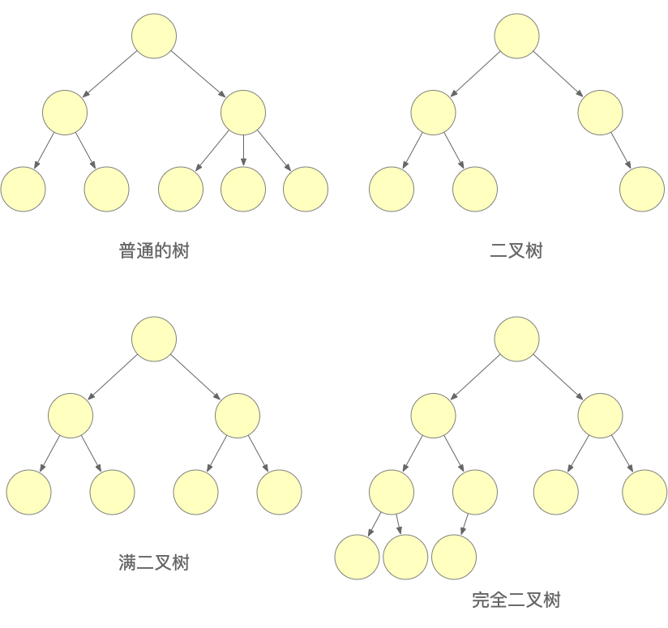

1. 普通的树：每个节点有0个或者多个子节点；
2. 二叉树：每个节点有0个或者最多2个子节点；
3. 满二叉树：它是一颗二叉树，且除叶子节点外，其他各层的节点都有且仅有2个子节点；
4. 完全二叉树：它是一颗二叉树，且从根节点至倒数第2层是一颗满二叉树，叶子节点会优填充左子树。
5. 二叉查找树（BST）：又称二叉搜索树，它是一颗二叉树，如图1-25所示。
  - 若其左子树不空，则左子树上节点的值必定小于它根节点的值；
  - 若其右子树不空，则右子树上节点的值必定大于它根节点的值；
  - 任意节点的左右子树也都是二叉查找树。
6. 平衡二叉树（AVL）：它是一颗二叉查找树，其左右子树的高度差的绝对值不超过1，且左右子树也都是平衡二叉树，如图1-25所示。
7. 红黑树（RBT）：它是一颗二叉查找树，如图1-25所示。
  - 根节点和叶子节点都是黑色的，且叶子节点都是值为null的节点；
  - 每个节点要么是红色的，要么是黑色的；
  - 红色节点的子节点和父节点都是黑色的；
  - 从任一节点到叶子节点，其路径上包含的黑色节点数量相同。
8. “B树”：有些文档或资料中也叫它“B-树”，但称它为B-树有些不妥，因为称其为B-树，可能会让人误认为B-树是另一种数据结构。所以没有所谓的B-树，只有B树。如图1-26所示。

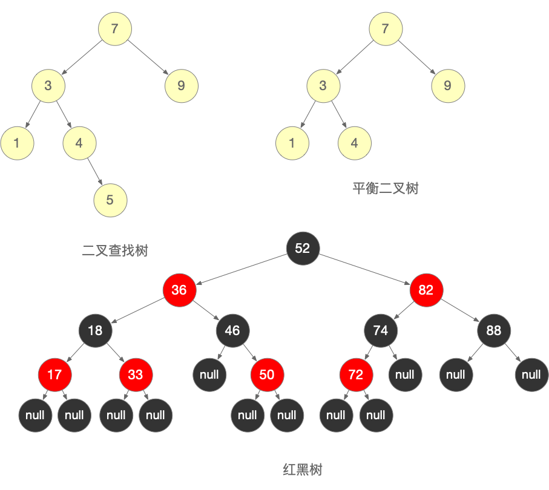

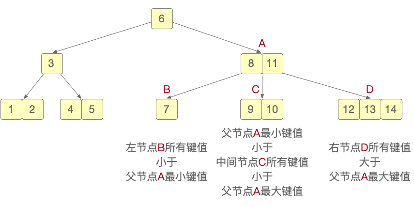

一个m阶的B树具有如下定义：

- 根节点不是叶子节点时，根节点有n个子节点，2 <= n <= m；
- 每个内部节点都至少有n个子节点，n = Math.ceil(m / 2)。且其所含键k的数量范围为n - 1 <= k <= m - 1，键是用于指向数据记录的指针。Math.ceil()函数表示向上取整，例如Math.ceil(1.1)和Math.ceil(1.8)向上取整的结果都为2；
- 有n个键的非叶子节点必须有n + 1个子节点；
- 所有叶子节点的深度（或高度）都一样，也就是说它们都要在同一层；
- 每个节点中键的数值都从小到大排序，且每个节点的子树也按照下列顺序从左至右依次排列：
  - 第一个子树的所有键值都小于其父节点的最小键值；
  - 第二个子树的所有键值都大于其父节点的最小键值，而又小于其父节点的第二小键值；
  - 其他中间子树的键值属性及排列位置依此类推；
  - 最后一个子树的所有键值都大于其父节点的最大键值。

从上图也可以很容易地看出键值排列的规律：

- 左节点B中的所有键值都要小于父节点A中最小的键值“8”；
- 中间节点C中所有键值都要大于父节点A的最小键值“8”，但又都小于父节点A第二小的键值“11”；
- 右节点D中的所有键值都要大于父节点A中最大的键值“11”。

下图1-27和图1-28展示了B树从1到14的插值生成过程。如果阶数太少说明不了问题，但阶数多了过程又太冗长。以4阶B树作为演示刚好合适。在4阶B树中，每个结点最多只4个子节点，最多只有3个键（key = m阶 - 1），最少有1个键（key = Math.ceil(m / 2) - 1），有n个键的非叶子节点必须有n + 1个子节点。所以整个插值过程如下。

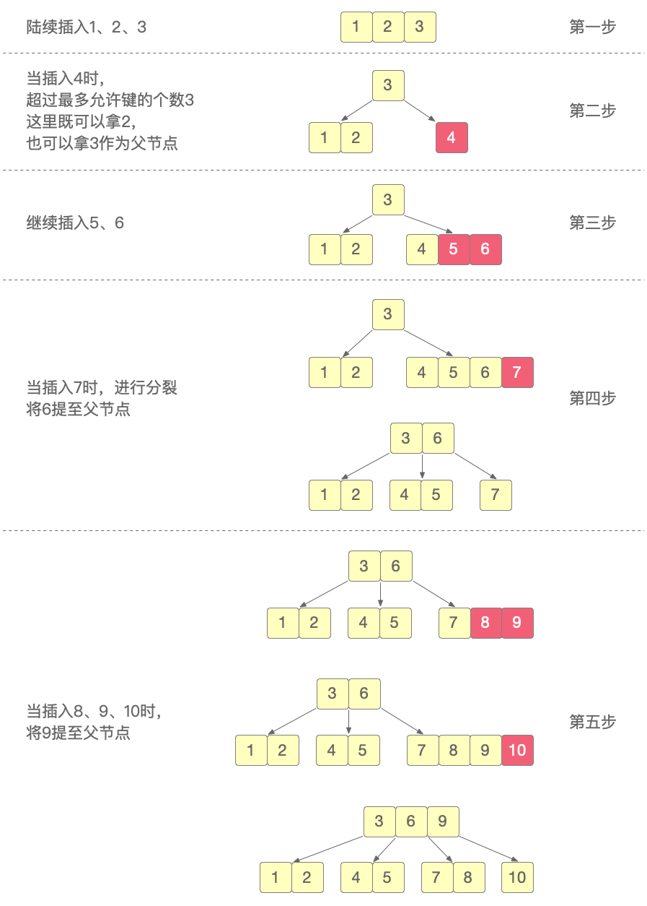

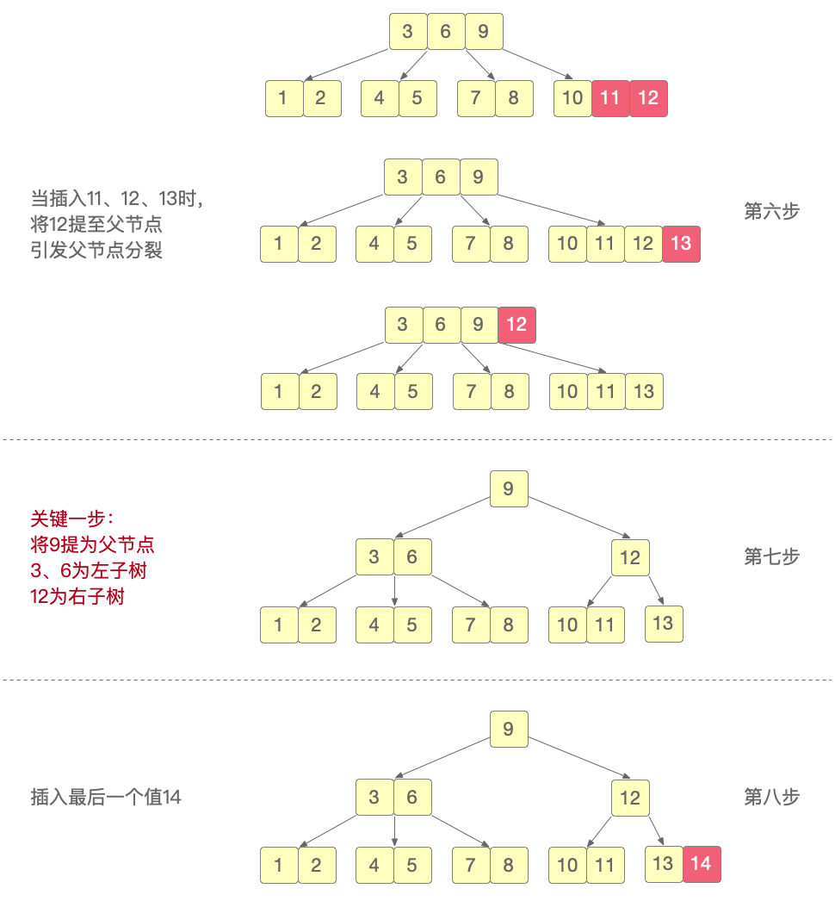

从图1-28生成的结果可以看到它和图1-26有些不同。这也是笔者想指出的B树的另外一个“隐藏”属性：

- 如果不是从1开始插值，而是从其他数开始，也就是说生成B树的插值顺序不同，那么生成的B树也就不同；
- 如果第2步选择键值“2”作父节点，那么最终生成B树的结果也会不同。

以上两点充分说明：插值顺序和权重对生成B树的结果有直接影响。这也是很多资料当中都没有提到的一点。

9. B+树：和B树类似，它在B树的基础上做了一些改变，如图1-29所示。

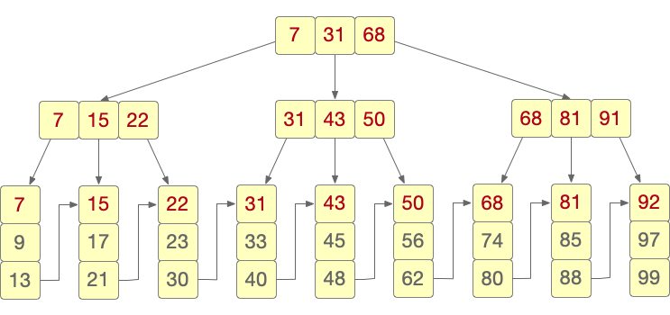

B+树的生成和B树非常类似，只是它所有的数据都在叶子节点上而已，此处就不再展示其生成过程了。

在树型数据结构中，B树和B+树比较复杂，如果是需要开发文件系统一类的应用，或者数据库底层存储，那就必须要深入掌握它所涉及到的每一个技术细节。否则，了解其原理就行了。但MySQL的底层存储是通过B+树实现的，所以有些面试官比较爱问和B+树相关的问题。

知道了树再来理解“堆”就不难了，因为它几乎总是一颗完全二叉树，如图1-30所示。

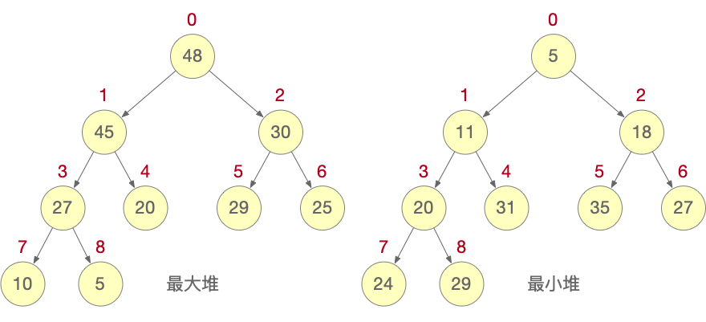

“堆”具有如下特性：

1. 从根节点开始，堆的序号是从上至下，从左至右；
2. 可以直接用数组来表示一个堆，因为对任意一个父节点n，它的子节点的序号一定是2n+1和2n+2；
3. 对于最大堆来说，其父节点的键值比其子节点的键值都大；
4. 对于最小堆来说，其父节点的键值比其子节点的键值都小。

堆栈常被并列提及，是因为它们在开发时所起的作用较大，尤其是在JVM这一块，表1-3将它们作了一个简单比较。

> 表1-3 栈和堆的区别

|  | 栈 | 堆 |
|:---:|:---:|:---:|
| 分配方式 | 程序自动分配，也可用JVM设置 | 程序自动分配，也可用JVM设置 |
| 内存大小 | 很小，一般几KB～几MB | 较大，可达到几个GB，甚至TB |
| 访问速度 | 较快 | 比栈要慢 |
| 应用场景 | 保存线程临时变量、对象 | 保存一些全局、静态的变量和对象 |

“散列表”（又叫哈希表，Hash Table）是一种通过某种函数，将“键”映射为“值”的数据结构。它的算法的时间复杂度是恒定的O(1)，如图1-31所示。这个映射函数也称为哈希函数。

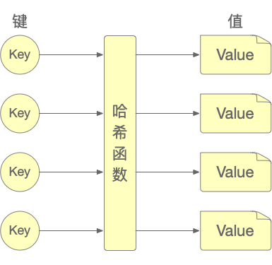

“图”的数据结构虽然在理论学习的资料中出现不多，但其实很多人每天都在用：地图导航，如图1-32所示。

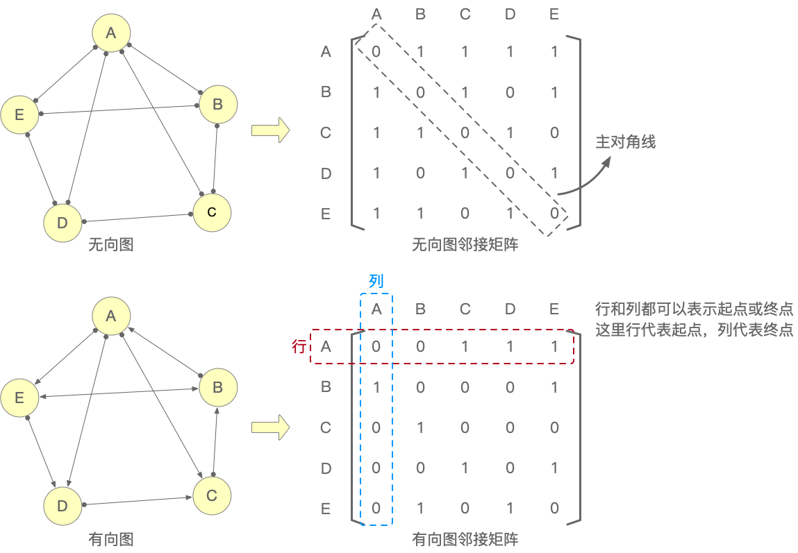

图具有如下属性：

1. 图包括顶点和边，边可以根据顶点之间的关系设置不同的权重；
2. 图分为有向图和无向图；入度：有向图的某个顶点作为终点的次数和；出度：有向图的某个顶点作为起点的次数和；
3. 图可以用邻接矩阵表示，也就是通过二维数组表示顶点间是否相连，或者表示顶点之间的权重；邻接矩阵的行或列都可以代表起点或终点；
4. 有向图上从起点A到终点B之间无连接，则邻接矩阵上的值为0，从起点B到终点A之间有连接，则邻接矩阵上的值为1；
5. 无向图的邻接矩阵基于主对角线对称，如图1-33所示。有向图无对称属性；
6. 图也可以用邻接表来表示，在邻接表中，每一个顶点都是一个链表的表头，链表的节点则是与该顶点有连线的顶点；
7. 邻接表和逆邻接表组合在一起就是十字链表。

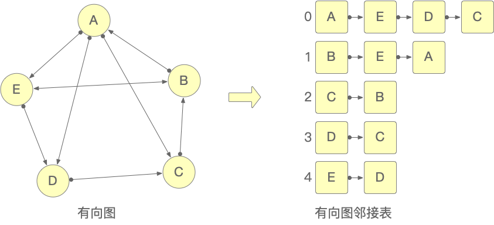

由于逆邻接表、十字链表在本质上和邻接表类似，所以这里就不做重复讲解了。

最后是“串”，这是一种比较特殊的数据结构，它对应到Java编程语言就是字符串类型String。它是由0个或者多个字符组成的有限序列，一般记为：S =“a1a2...an”(n >= 0)。其中：

1. S为串名，单引号括起来的字符序列是串的值；
2. a_i表示字符，可以是字母、数字或特殊字符；
3. 串中字符的个数n称为串的长度；
4. n=0的串称为空串（用∅表示）；
5. 字符串可以用定长数组、堆和块链结构来存储。如图1-34所示。

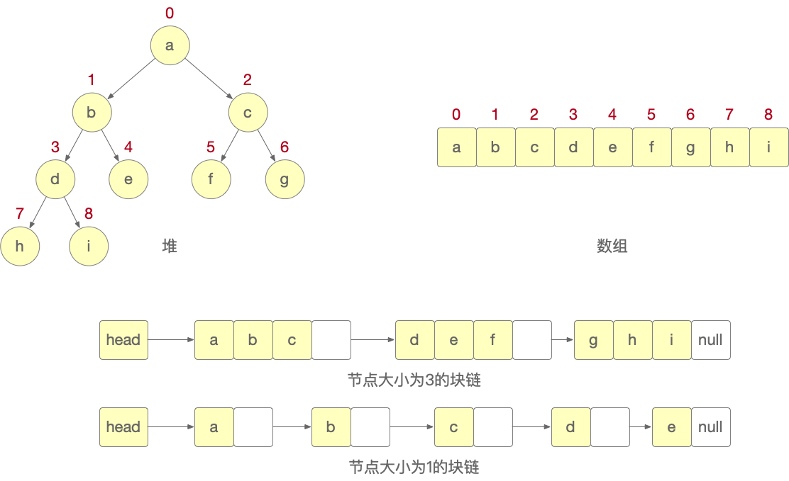
