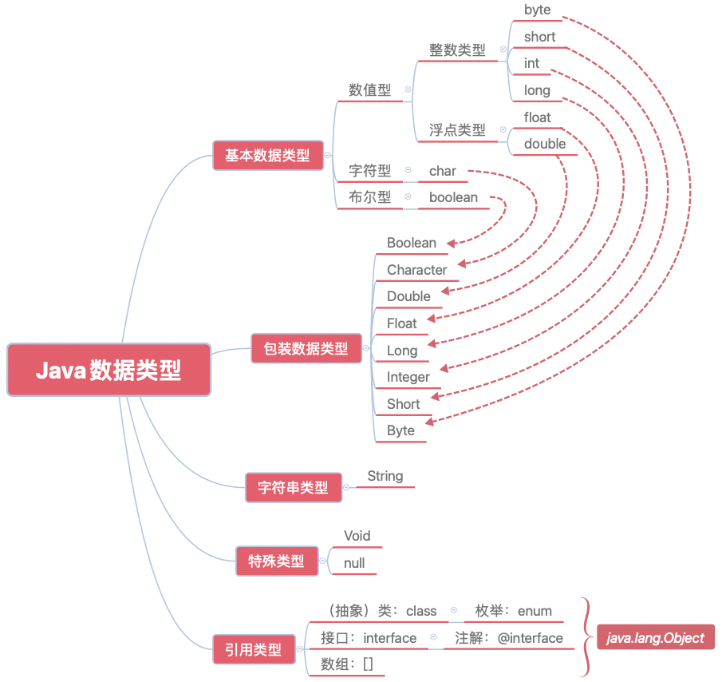

## 第2章 Java关键特性

Java诞生以来，二十多年长盛不衰，一直在TIOBE编程语言排行榜“数一数二”或者“不三不四”的位置徘徊。除了庞大的生态支持，也与它自身的语言特性有关。本章笔者结合自身研发经验，把Java的数据类型、抽象类与接口、泛型、注解、反射与代理这几个关键特性重点讲解一番。至于I/O、集合以及多线程等其他特性会在另外章节中单独讲述。

### 2.1 关于数据类型

“Java到底有几种数据类型”？当笔者每次对求职者和一些有开发经验的工程师提出这个问题时，得到的答案都不太一样。笔者极为粗略地统计了一下，在被问到的10个人里面，总会有那么1～2人搞不清楚有几种，大概有3～5人说有八种，还有说十几种的（但却不知道是哪十几种），也有说三种的。因此，作为一门编程语言最基础的特性，笔者认为这个问题有必要澄清一下。

#### 2.1.1 Java到底有几种数据类型

除了那些确实搞不清楚的摸鱼工，从不同的视角来看，说三种的、说八种的和说十几种的人其实都算对。这是因为下面几个原因：

1. Oracle官方给的Java文档，其“基本”数据类型确实就只有三大类，分别是数字型、字符型和布尔型，所以说三种的也大致正确。
2. Java的三大数据类型里，确实包含了八种基本数据类型，所以说八种的也算对，如表2-1所示。

> 表2-1 Java的八种基本数据类型

| 类型 | 位数 | 范围 | 类型信息 |
|:---:|:---:|:---:|:---:|
| byte | 8-bit | -128 ～ 127 | byte.class == Byte.TYPE |
| short | 16-bit | -32768 ～ 32767 | short.class == Short.TYPE |
| int | 32-bit | -2<sup>31</sup> ～ 2<sup>31</sup> - 1 | int.class == Integer.TYPE |
| long | 64-bit | -2<sup>63</sup> ～ 2<sup>63</sup> - 1 | long.class == Long.TYPE |
| float | 32-bit | 1.4E-45 ～ 3.40E+38 | float.class == Float.TYPE |
| double | 64-bit | 4.9E-324 ～ 1.8E+308 | double.class == Double.TYPE |
| char | 16-bit | 0 ～ 65535 | boolean.class == Boolean.TYPE |
| boolean | - | true / false | char.class == Character.TYPE |

3. 如果算上八种基本数据类型、八种包装类型，String类型，那么Java就有十七种数据类型里，所以说十几种的也算对。

但笔者认为，Java的数据类型应该有五大类二十二种，如图2-1所示。

> 图2-1 Java的数据类型



1. 基本数据类型，也就是Java定义的基本数据类型，有byte、short、int、long、float、double、char、boolean这八种；
2. 包装数据类型：由基本类型通过对象化的“包装”而得。对象化的数据间的比较，虽然有的仍然可以用“==”，但建议还是用equals()方法；
3. 字符串类型，这是一种非常特殊的类型，在Java中非常特殊；
4. 特殊类型：
  - Void，当方法没有返回值或者指定无值的泛型时就会用到Void，例如Future<Void>和Map<String, Void>，也可以用void.class == Void.TYPE验证；
  - null，它是任何引用类型的默认值，表示一个空地址。它的出现表示数据有缺失，故而其地址为空；
5. 引用类型：
  - class，包括所有的类和抽象类。枚举java.lang.Enum<E>也是一个抽象类，它的父类是java.lang.Object；
  - Java的接口虽然也是继承自Object，不过奇怪的是，在官方文档的继承结构中却并未体现出来，接口包括普通接口和注解接口这两类；
  - 最后，数组是一种引用类型，而且它的直接父类也是Object。

#### 2.1.2 屏蔽精度丢失问题

除了整数和字符串，Java还有两种用得比较多的数据类型，分别是长整型和浮点型，但这两种类型用不好会引起很多麻烦。先看看下面这行非常普通的代码。

```java
System.out.println(0.09 + 0.01);
```

之所以把这行简单的代码放在这里，是因为它的运行结果并不像大多数人期望的那样是0.1，而是`0.09999999999999999`。这是在MacBook Pro和Oracle JDK 12.0.2环境中运行的结果。笔者把这段代码换到Windows 10和Oracle JDK 11.10.13，结果还是一样。可能会有人说，是因为在计算机中0.09的二进制是`0.000101110000101000111101011100...`，0.01的二进制是`.000000101000111101...`，这两个二进制数的小数部分位数非常多，所以当它们相加之后由于运算的精度问题，丢失了最后几位，就导致结果不符合预期。这看起来确实是一个比较好的“解释”。但是，如果把加法变成减法，结果就正常了，正是预期的0.08。
