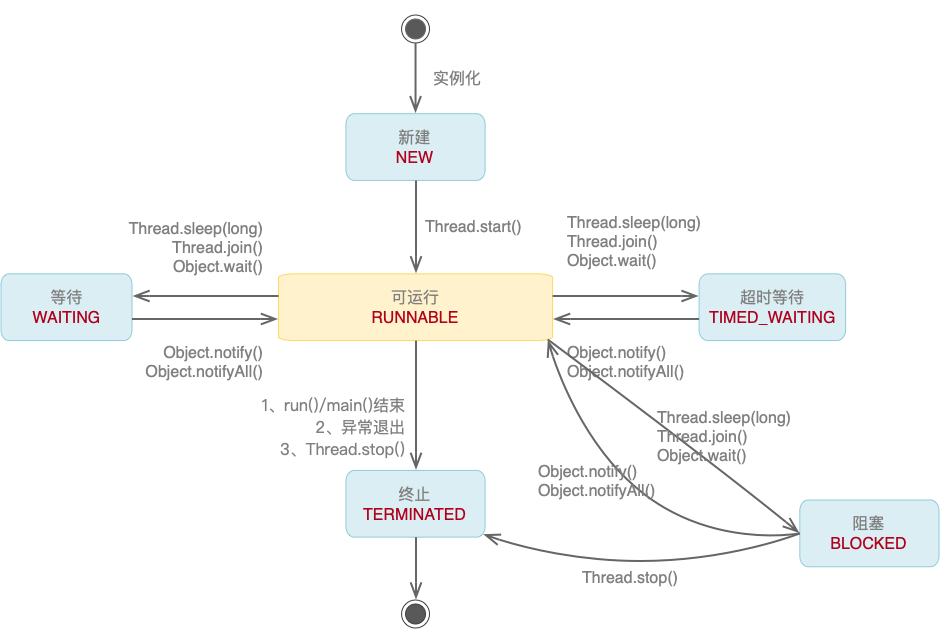
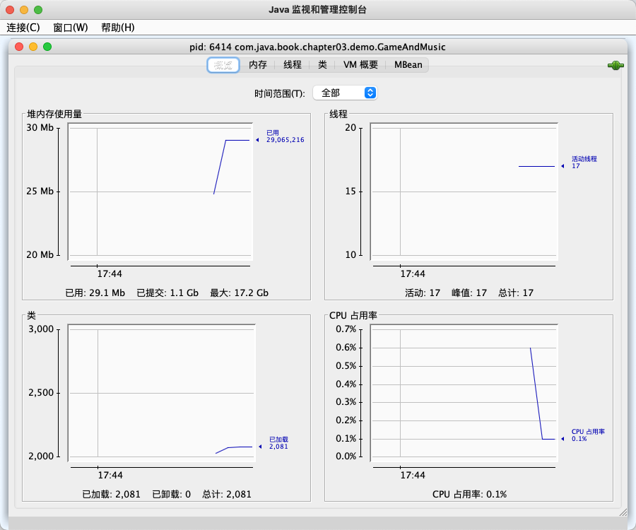
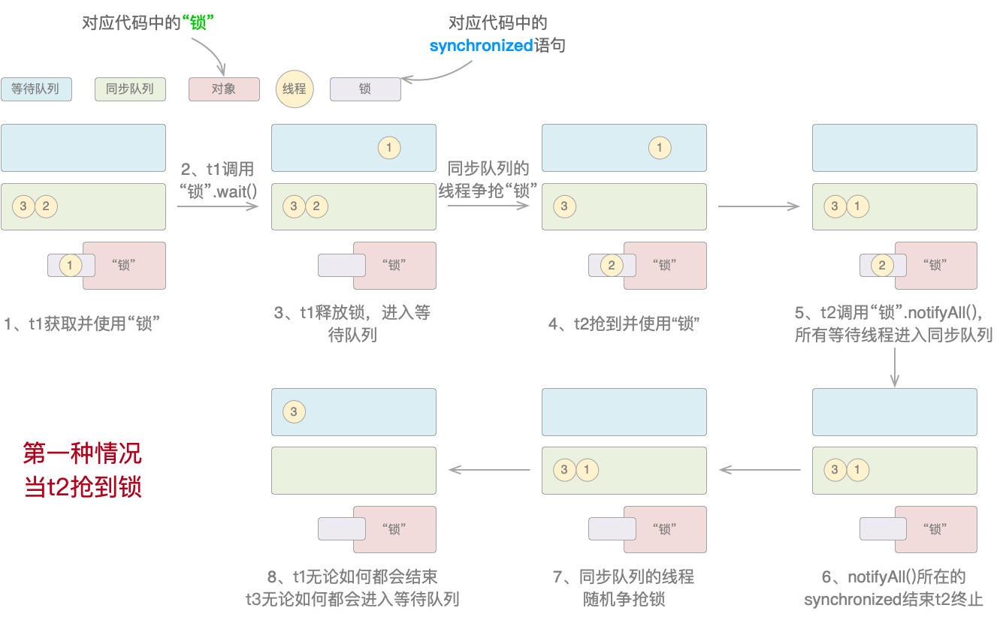
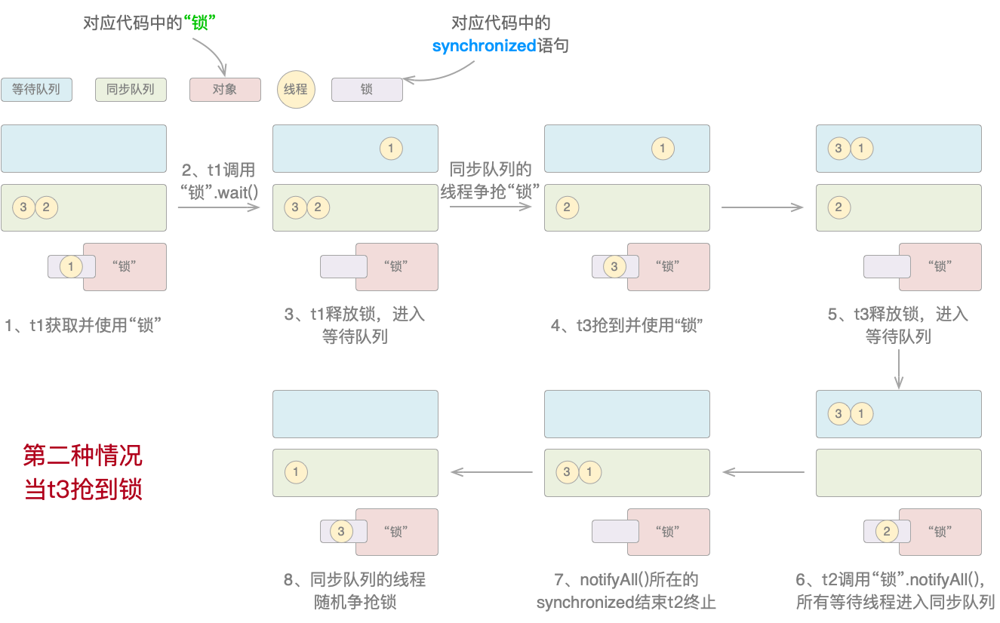
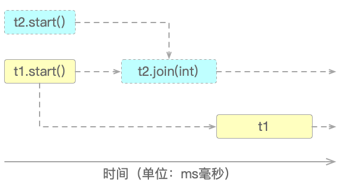
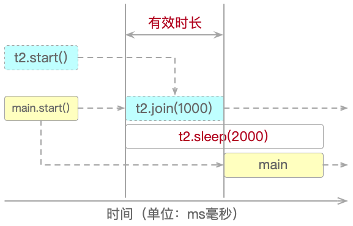
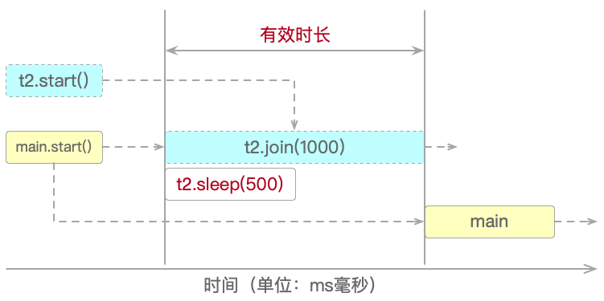

## 第3章 多线程

如果说在Java开发的相关职位面试中哪一类问题能排进TOP3的话，那么毫无疑问多线程必定霸榜。可以负责任地说，多线程的开发能力可以不用，但不能没有，因为它既是衡量Java工程师能力的主要标准之一，又是应用程序性能的托底保障。而且多线程唯一可以确定的就是它的运行结果无法确定，这也正是它最为有趣的地方。
本章结合笔者实际工作经验，讲解了Tread和Runnable的区别、常用Thread API、线程关键字、线程池、CAS原子操作、锁与AQS、并发工具包等内容。多线程的内容虽“多”，但基于“二八原则”，只需要吃透一些关键重难点，掌握一点好的实践经验，基本上就可以解决实际工作中的大部分问题了。

### 3.1 正确认识多线程

知道多线程的工程师不少，但真正了解它的却不多。笔者并非妄自菲薄认为自己懂得比别人多，而是从自身实际开发经验出发，与读者分享一些自身对多线程的认识，也同时发现自身的不足。

#### 3.1.1 混乱的生命周期

关于线程生命周期的问题，很多资料都不统一，比较乱。问题的焦点集中在线程生命周期的状态上。

1. 有说四种的：NEW、RUNNABLE（RUNNING、READY）、BOLCKED、TERMINATED；
2. 有说五种的：NEW、RUNNABLE、RUNNING、BOLCKED、DEAD；
3. 有说六种的：NEW、RUNNABLE（RUNNING、READY）、WAITING、TIMED_WAITING、BOLCKED、TERMINATED。

笔者认为，不管四种、五种还是六种，都只是“纸面”上的猜测。还是那句话：“Talk is cheap， show me the code”。通过代码来看看到底有几种才是最准确的，如代码清单3-1所示。

> 代码清单3-1 StandardThreadState.java

```java
public class StandardThreadState implements Runnable {
    ......

    public static void main(String[] args) {
        StandardThreadState state = new StandardThreadState();
        Thread thread1 = new Thread(state);
        Thread thread2 = new Thread(state);
        System.out.println(thread1.getState());// NEW
        thread1.start();
        System.out.println(thread1.getState());// RUNNABLE
        thread2.start();
        try {
            TimeUnit.MILLISECONDS.sleep(100);
            System.out.println(thread1.getState());// TIMED_WAITING
            System.out.println(thread2.getState());// BLOCKED
            TimeUnit.MILLISECONDS.sleep(2000);
            System.out.println(thread1.getState());// TERMINATED
        } catch (InterruptedException e) {
            throw new RuntimeException(e);
        }
    }
}
```

执行上述代码后，打印结果如下：

```java
NEW
RUNNABLE
TIMED_WAITING
BLOCKED
TERMINATED
```

结果显示有五种。把代码稍加改动，然后再运行试试。如代码清单3-2所示。

> 代码清单3-2 MoreThreadState.java

```java
public class MoreThreadState implements Runnable {
    private synchronized void sync() {
        try {
            TimeUnit.SECONDS.sleep(2);
            wait();
            ......
        }
    }
}
```

再次执行，打印结果如下：

```java
NEW
RUNNABLE
TIMED_WAITING
BLOCKED
WAITING
TIMED_WAITING
```

把两种结果合并一下，那么线程的生命周期准确来说应该是六种：NEW、RUNNABLE、TIMED_WAITING、BLOCKED、WAITING、TERMINATED。而且从实际的角度来看，也没有所谓的RUNNING、READY和DEAD这几种状态。

事实上，线程所有的状态都已在Thread类源码的State枚举中定义过了。但也由此可见：纸上得来终觉浅，根据代码运行结果得到的线程生命周期状态图，如图3-1所示。

> 图3-1 线程生命周期状态图



这个线程生命周期状态图就正确了吗？不一定。后续还会回过头来审视它，现在先继续前进。至于这些状态转换的原因，完整的代码注释已经给出了明确的说明。

#### 3.1.2 Thread与Runnable

为多线程镇守大门的哼哈二将就是Thread类和Runnable接口，很多Java工程师都比较熟悉它们。但对于一部分程序员来说它们还存在两个误区。

1. 误区一：“有两种创建线程的方式，或者继承Thread类并重写run()方法，或者实现Runnable接口”。在JDK的源码中，Thread是实现了Runnable接口的。但严格来说，只有Thread类才能真正创建并通过start()方法启动线程，Runnable接口是没有这个能力的。但指定线程所要执行的功能的run()方法却是有两种：
  - 继承并重写Thread的run()方法;
  - 实现Runnable接口的run()方法，并将它作为Thread或其子类的构造器参数。

不管哪种方式，最终还是要通过Thread的start()方法启动线程。将Thread和Runnable分离则是为了遵循单一职责原则：一个类或模块只负责完成一个职责（或功能），而不要存在多于一个导致变更的原因。

2. 误区二：“Thread类和Runnable接口的run()方法效果是一样的”。此误区的澄清可见如下代码清单。

> 代码清单3-3 SubThread.java

```java
public class SubThread extends Thread {
    private int i = 1;

    @Override
    public void run() {
        while (i <= 10) {
            System.out.println("当前线程: " + Thread.currentThread() + " - " + i++);
        }
    }

    public static void main(String[] args) {
        SubThread subThread1 = new SubThread();
        SubThread subThread2 = new SubThread();
        subThread1.start();
        subThread2.start();
    }
}
```

> 代码清单3-4 ExtractMethod.java

```java
public class ExtractMethodRunnable implements Runnable {
    private int i = 1;

    @Override
    public void run() {
        while (i <= 10) {
            System.out.println("当前线程: " + Thread.currentThread() + " - " + i++);
        }
    }

    public static void main(String[] args) {
        ExtractMethodRunnable extractMethod = new ExtractMethodRunnable();
        Thread thread1 = new Thread(extractMethod);
        Thread thread2 = new Thread(extractMethod);
        thread1.start();
        thread2.start();
    }
}
```

当运行代码清单3-3和代码清单3-4时，会发现明显不同：

1. 代码清单3-3中的两个子线程subThread1和subThread2分别单独从1打印到10，因为Thread类的run()方法是不能共享的，也就是说A线程不能把B线程的run()方法当作自己的执行单元；
2. 而代码清单3-4利用Runnable接口就很容易地实现了run()方法共享，让两个线程共同完成从1到10的打印。

通过这个小实验可以知道，Runnable是真正的多线程，用它封装多线程功能代码，比直接用Thread类更好——以Runnable封装功能，用Thread创建并启动线程。

#### 3.1.3 让它停下来

自Java 1.2之后，多线程的stop()方法就已经被废弃了，理由是不安全。还有另外两个方法一并被废弃：suspend()和resume()。虽已过去了十多年，但至今仍有很多资料在毫无意义地讨论它们。stop()方法会给数据造成不一致性，如代码清单3-5所示。完整代码在cn.javabook.chapter03.demo包。

> 代码清单3-5 StopService.java

```java
public class StopService {
    ......
    public static void main(String[] args) {
        try {
            StopService service = new StopService();
            StopThreadA threadA = new StopThreadA(service);
            threadA.start();
            TimeUnit.MILLISECONDS.sleep(100);
            StopThreadB threadB = new StopThreadB(service);
            threadB.start();
            TimeUnit.MILLISECONDS.sleep(3000);
            threadA.stop();
            System.out.println("stop()执行后username和password的结果为：");
        } catch (InterruptedException e) {
            e.printStackTrace();
        }
    }
}
```

执行StopService的main()方法后，打印结果如下：

```java
stop()执行后username和password的结果为：
username = StopThreadA
password = password
```

很明显，结果出乱子了。因为这里希望看到的结果要么是：

```java
username = StopThreadA
password = 123456
```

要么是：

```java
username = username
password = password
```

如果希望停止线程的执行，那么可以用interrupt()方法或抛出异常的方式来变相实现。使用抛出异常的方式，只需在main()方法做些改变即可，如下代码片段所示：

```java
public static void main(String[] args) {
    ......
    // threadA.stop();
    throw new RuntimeException();
}
```

执行上述代码后，打印结果如下：

```java
Exception in thread "main" java.lang.RuntimeException
	at cn.javabook.chapter03.demo.StopService.main(StopService.java:46)
```

可见虽抛出了异常，但也停止了继续打印。

#### 3.1.4 线程可视化

首先来一段可以“永不停歇”的行为：一边打游戏一边听音乐，如代码清单3-6所示。

> 代码清单3-6 GameAndMusic.java

```java
public class GameAndMusic {
    private static void playGame() {
        for (;;) {
            System.out.println("打游戏");
            try {
                TimeUnit.SECONDS.sleep(1);
            } catch (InterruptedException e) {
                throw new RuntimeException(e);
            }
        }
    }

    private static void listenMusic() {
        for (;;) {
            System.out.println("听音乐");
            try {
                TimeUnit.SECONDS.sleep(1);
            } catch (InterruptedException e) {
                throw new RuntimeException(e);
            }
        }
    }

    public static void main(String[] args) {
        new Thread(GameAndMusic::playGame, "打游戏听音乐").start();
        listenMusic();
    }
}
```

如果能直观地看到线程运行时的各种状态，无疑会对分析多线程有很大的助益。所以当在Windows或MacOS的命令行中输入“jconsole”命令时，就可以看到图3-2所示的内容。

> 图3-2 打开jconsole


可以看到在“本地进程”选项列表中出现了刚才运行的Java程序，选中后单击链接，如图3-3所示。

> 图3-3 程序运行状况概览



单击“线程”选项，就出现了刚才运行的代码清单3-6中GameAndMusic子线程的名称“打游戏听音乐”，可以查看关于它的更多信息。

除了jconsole之外，还有jvisualvm、jcmd这两款Java自带的强大工具和jmc这个独立的工具。不过工具不在多，只要能够用得趁手，就是神器。

### 3.2 常见的Thread API

线程生命周期中各种状态之间的互相转换，是通过一系列的方法来完成的，俗称Thread API。这些方法有的由Object类提供，有的由Thread类实现；有的是实例方法，有的是静态方法。

#### 3.2.1 等待（wait）与通知（notify / notifyAll）

Java从一开始就非常重视多线程并给其提供了良好的支持。这种重视反映在Object类的两个方法之上：wait(int)和notify() / notifyAll()。先看看代码清单3-7的执行结果。

> 代码清单3-7 WaitNotify.java

```java
public class WaitNotify {
    public static void main(String[] args) {
        Thread t1 = new Thread(() -> {
            System.out.println("t1 等待");
            synchronized ("锁") {
                System.out.println("t1 开始");
                try {
                    "锁".wait();// t1进入等待队列并释放锁
                } catch (InterruptedException e) {
                    e.printStackTrace();
                }
                System.out.println("t1 结束");
            }
        });
        Thread t2 = new Thread(() -> {
            System.out.println("t2 等待");
            synchronized ("锁") {
                System.out.println("t2 开始");
                try {
                    "锁".notifyAll();// 通知其他所有线程（t1和t3）进入同步队列
                } catch (Exception e) {
                    e.printStackTrace();
                }
                System.out.println("t2 结束");
            }
        });
        Thread t3 = new Thread(() -> {
            System.out.println("t3 等待");
            synchronized ("锁") {
                System.out.println("t3 开始");
                try {
                    TimeUnit.MILLISECONDS.sleep(100);
                    "锁".wait();// t3进入等待队列并释放锁
                } catch (InterruptedException e) {
                    throw new RuntimeException(e);
                }
                System.out.println("t3 结束");
            }
        });
        t1.start();
        t2.start();
        t3.start();
    }
}
```

反复执行代码清单3-7会发现这么一个规律：

1. 如果t2抢到锁并在t3之前执行，那么就一定会有线程处于等待状态，无法结束，如图3-4所示。

> 图3-4 当t2先抢到锁时



2. 如果t3抢到锁并在t2之前执行，那么所有线程就都可以结束，如图3-5所示。

> 图3-5 当t2先抢到锁时



这就涉及到两个概念：线程的等待队列和同步队列。

1. 线程等待队列：存放处于WAITING或TIMED_WAITING状态的线程，在其中排队等待被唤醒或自动醒来（醒来后才能进入同步队列）；
2. 线程同步队列：存放处于RUNNABLE可运行状态的线程，在其中排队等待执行（同步队列也就是AQS中的CLH队列，后面会讲到）。

在图3-4中，t2先抢到锁，因此在线程任务执行完成后立即调用notifyAll()方法。因为此时t1处于等待队列，而t3还未抢到锁，所以执行完notifyAll()方法后t1和t3共同处于同步队列。当t2终止时，t1和t3争抢锁，不管它们之中哪个抢到锁，t3都会进入等待队列，而t1一定会执行完。

在图3-5中，t3先抢到锁，因此在线程任务执行完成后立即调用wait()方法。故此时t1和t3都处于等待队列。当唯一一个处于同步队列的线程t2调用notifyAll()方法后，t1和t3全部进入同步队列并争抢锁，不管它们之中哪个先抢到，t1和t3都会执行完。

理解了代码清单3-7也就理解了wait()和notify() / notifyAll()的机制。不管再增加多少个线程，本质上都是一样。

顺便说一句wait(int)和wait()的区别：一个可自动醒来，一个要notify() / notifyAll()唤醒。

#### 3.2.2 插队（join）与谦让（yield）

join(int)和yield()都是Thread类的方法，只不过join(int)是实例方法，yield()是静态方法。

join(int)的意思如果用大白话说就是强行插队，如图3-6所示。

> 图3-6 执行join(int)方法的线程可以强行插队



上图显示，t1和t2同时启动，而当t2执行join(int)后，就会强行让其他线程等待自己执行完之后再开始执行。正如代码清单3-8所示。完整代码在cn.javabook.chapter03.threadapi包。

> 代码清单3-8 JoinThread.java

```java
public class JoinThread {
    public static void main(String[] args) {
        Thread t1 = new Thread(() -> {
            System.out.println("thread1");
        });
        Thread t2 = new Thread(() -> {
            ......
        });
t1.start();
        t2.start();
        try {
            t2.join(1000);
        } catch (InterruptedException e) {
            e.printStackTrace();
        }
    }
}
```

执行上述代码后，打印结果如下：

```java
thread2
thread1
flag =
```

为什么flag没有值呢？源码的详细注释中已有说明，但用图来解释就是如图3-7和图3-8所示那样。

> 图3-7 join(int)时间 < sleep()时间



> 图3-8 join(int)时间 > sleep()时间



1. 图3-7显示，当join(int)时间 <  sleep()时间，t2执行join(int)时间后main马上接着执行，不等待sleep()结束，相当于sleep()被截断了；
2. 图3-8显示，当join(int)时间 >  sleep()时间，t2执行时间以join(int)为准，之后main接着执行；
3. 当join(0)时，则main要无限期等待，直到t2执行结束。

在代码清单3-8中有一点务必要清楚：join()方法并不会使所有线程暂停，而是使调用join()方法的线程暂停，具体在这里来说就是main主线程调用了join()方法。因为main主线程被暂停，所以在它里面的t1线程的执行也就一并暂停了，而并不是t2让t1.start()暂停了。所以，上面所说的“其他线程”指的其实是main线程，所以这里的所谓t1其实只是个龙套而已，千万不要被表象蒙蔽了。

至于Thread.yield()，则是一种非强制式的方法，它会告诉线程调度器自愿放弃当前的CPU资源。但也仅仅只是“告诉”，执不执行就无法预知了，而它后续可能依然会参与对到CPU资源的争夺中，调用Thread.yield()方法的线程并不会释放锁。它的作用如代码清单3-9所示。

> 代码清单3-9 YieldThread.java

```java
public class YieldThread {
    public static void main(String[] args) {
        Thread t1 = new Thread(() -> {
            System.out.println("t1 开始执行");
            Thread.yield();
            System.out.println("t1 执行结束");
        });
        Thread t2 = new Thread(() -> {
            System.out.println("t2 开始执行");
            try {
                TimeUnit.MILLISECONDS.sleep(1000);
            } catch (InterruptedException e) {
                throw new RuntimeException(e);
            }
            System.out.println("t2 执行结束");
        });
        t1.start();
        t2.start();
    }
}
```

执行完成后，打印结果可能是下面几种中的任意一种：

```java
t1 开始执行			t1 开始执行			t2 开始执行			t2 开始执行
t2 开始执行			t1 执行结束			t1 开始执行			t2 执行结束
t1 执行结束			t2 开始执行			t1 执行结束			t1 开始执行
t2 执行结束 		    t2 执行结束			t2 执行结束			t1 执行结束
```
