## 第9章 认证与授权

互联网崇尚开放，不过这个开放是有条件的，就像自由的前提是自律一样。如果没有认证（Authentication），那么在网络的虚拟世界中就无人知道“你是谁”。如果没有授权（Authorization），那么也无法知道“你能干什么”。这两个问题是任何一个互联网应用，包括社交APP都必须面对和解决的。

本章讲解了基于RBAC的角色权限设计中的一些问题、方法与技巧，并扩展到目前流行的OAuth2.0第三方授权机制和动态令牌技术。

### 9.1 RBAC

在谈RBAC之前，先简单了解一下出现于它之前的一些技术，包括DAC、MAC和PBAC，还是很有必要的。其实认证授权的相关技术思想不止这几个，但了解这几个就已经足够了。

#### 9.1.1 先导技术

所谓DAC，全称为Discretionary Access Control，自主访问控制。它是源于Linux的一种对资源的访问控制方式。由资源所有者负责管理访问权限，并通过ACL（Acess Control List，访问控制列表）管理非所有者权限。这话有点绕，但如果熟悉Linux的读者看到下面的命令就能马上明白这段话的意思了。

```linux
# chmod 644 filename
```

上面这个命令，意思就是：只有拥有者有filename的读写权限；而组用户和其他用户只有它的读权限。这就是最直白的DAC了，这也是DAC当中的“D”所代表的单词“Discretionary”的意思：自主——拥有资源操作权限的用户可以再把权限“传授”给其他人。

同样地，通过DAC，Windows中的当前用户可以把某些资源的操作权限授权给其他用户。因此，有些人认为这么做太不安全，而且用户可能都不知道自己在干嘛，无意间泄漏信息。所以，就有了MAC方案。

相对于DAC的自由，MAC中的“M”表示单词“Mandatory”（强制），所以它也叫强制访问控制。它给资源对象和用户都赋予了一些权限标识，用户能否操作某个资源对象是由系统硬性规定的，而非用户自决的。对MAC最好的阐释如图9-1所示。

> 图9-1 谍战片中的“MAC”


MAC非常适合秘密机构或者其他等级观念极其强烈的行业，但无法满足需要足够灵活性的商业服务系统。所以，商人和技术专家们就想出了一个介于DAC和MAC之间的办法：PBAC。

PBAC全称“Policy-Based Access Control”，是一种基于策略的访问控制方法。PBAC会预先定义一些操作，可以由系统管理员来决定哪些用户能执行这些操作。这既不同于用户授权给其他人，又不同于强制指定权限给用户。不过它现在基本上已经被淘汰，只存在于一些老旧系统之中，如图9-2所示的Windows的安全策略就是PBAC的例子。

> 图9-2 Windows中的“PBAC”

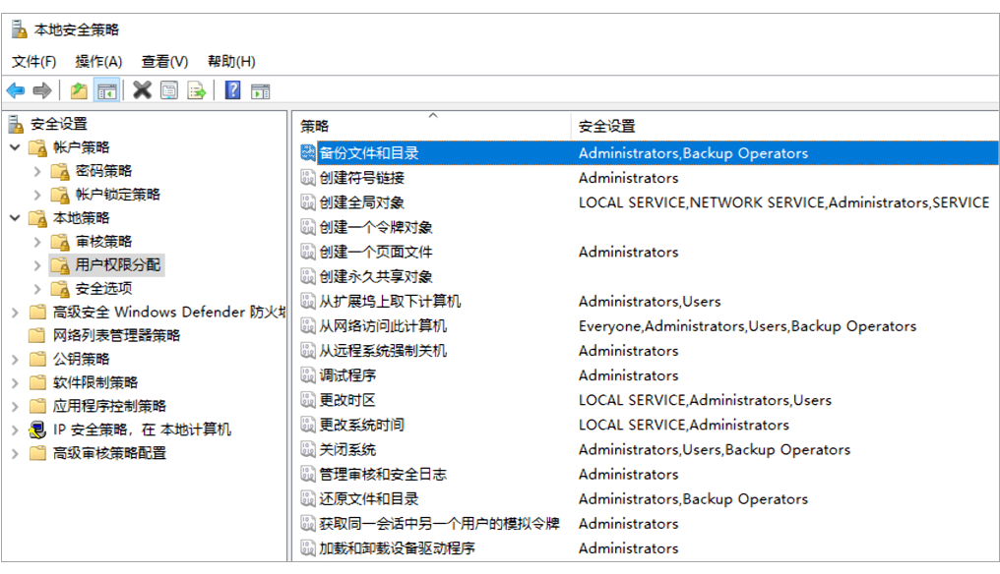

直到现在，这几种RBAC之前出现的认证授权技术方案仍然是存在的，正如短视频仍然替代不了纸质书籍一样。

本来在RBAC和PBAC之间还有一个ABAC，全称是“Attribute-Based Access Control”，基于属性的权限控制。它的技术实现思路是：通过动态计算，或者编写简单的逻辑，来判断一个或一组属性来是否满足某种条件，并对之进行授权。比如“允许所有住的远的员工有10分钟的弹性打卡时间”，这种基于业务逻辑的操作条件判断就是典型的ABAC。这种权限管理方式确实异常强大且灵活，但却极其复杂，而且设计难、门槛高、应用少，所以除了在一些大的商用系统中使用之外，几乎再也没有什么露脸的机会。

#### 9.1.2 从0到3

RBAC是“Role-Based Access Control”的缩写，意思是基于角色的访问控制。这是迄今为止普及面最广泛的权限设计模型。它把某个用户与一个或多个角色关联，而又把角色与一个或多个操作权限关联，从而让用户与操作权限间接关联。这样做的好处是：

1. 角色等同于职位、身份、组织等，或其他可以区分类别的东西，让操作权限的归属在逻辑上更清晰；
2. 省去了每新增一个用户就要关联一遍所有权限的麻烦；
3. 角色的概念不是固定的，它可以无限扩展，也就是说它可以有无限的层级，可以满足从小作坊到跨国集团的认证授权需求。

RBAC发展到现在，经历了几种不同的扩展模式或阶段：

1. RBAC0：最基础的用户-角色-权限；
2. RBAC1：在RBAC0之上增加角色继承特性；
3. RBAC2：在RBAC1之上增加职责分离（互斥与约束）特性；
4. RBAC3：在RBAC2之上增加组织、用户组的控制特性。

下面来一个个地看。

RBAC0的结构如图9-3所示，是RBAC系列中最基础最简单的一种权限结构，这种权限结构适用于所有的初创公司和100人以内的小公司。

> 图9-3 RBAC0逻辑模型


稍加说明：这是ER模型中的多对多（或m:n）关联关系，“0”表示用户可以不在关联关系中，也就是用户可以不和任何角色关联。而“1..m”则表示“用户-角色”如果存在关联的话，那么至少要关联1个用户，但也可以关联m个用户；反过来，角色也一样。这其实就是m:n关系在数据库逻辑模型上的体现。和它对应的数据库物理模型如图9-4所示。

> 图9-4 RBAC0物理模型

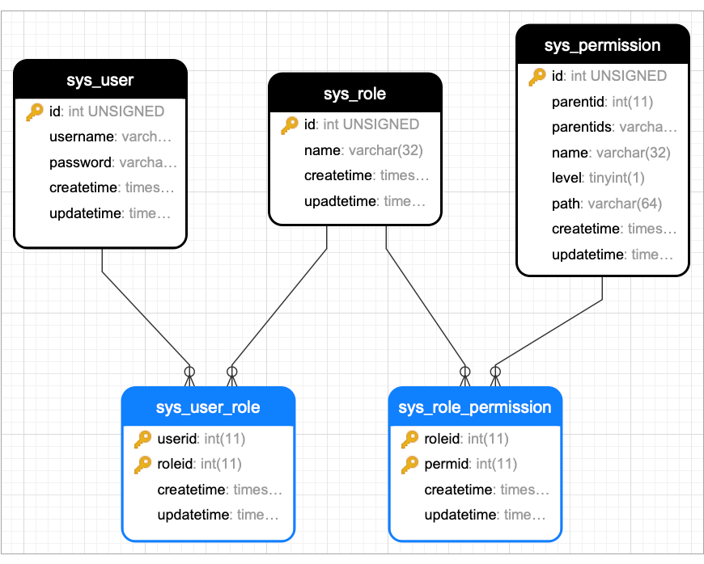

上图中的数据表都做了简化，不影响对模型的理解说明。在RBAC0的基础上，RBAC0引入了角色继承的概念。这里的“继承”并不是对象继承的意思，而是一种权限叠加的概念。它有两种“继承”方式，其逻辑模型如图9-5所示。

> 图9-5 RBAC1逻辑模型

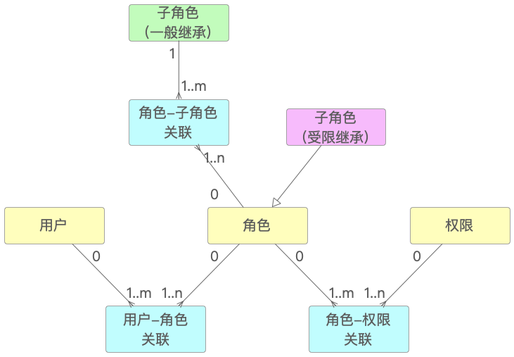

从上图可以看到：

1. 一般继承：允许角色多重继承，即某个角色C可能既具有角色A，又具有角色B的权限，也就是角色与自身存在多对多的关系。从模型中也能反映出，角色可以不关联子角色，但如果存在关联关系，那么至少有一个角色被子角色继承；同理，子角色至少要关联一个角色，但如果存在关联关系，那么至少有一个子角色继承其他角色。或者这么理解：角色可以没有子角色，但子角色至少要继承自一个父角色，否则它无法独立存在。例如开发部经理，既有开发、测试、运维，可能还具有一定的产品、业务权限；
2. 受限继承：角色只能单一继承，即角色C要么继承自角色A，要么继承自角色B，不可能同时继承自角色A和角色B。例如对于一个财务部门的员工来说，会计或出纳的权限，只能二选一。

其逻物理模型如图9-6所示。

> 图9-6 RBAC1物理模型


RBAC2 在RBAC1的基础上，抽象出了“职责”的概念，而“职责”也意味着：

1. 角色互斥：互斥角色是指各自权限互相制约的两个角色，同一用户只能分配到一组互斥角色集合中至多一个角色。比如财务部的用户就不能同时拥有会计和审核员这两个角色；
2. 基数约束：用户可拥有的角色数量受限，角色被分配的用户数量受限，角色对应的权限数量也受限等；
3. 先决条件：用户在获得角色A的同时，必须先获得角色B。

这种职责分离的实现可以通过增加由代码读取的配置表来实现。其逻辑模型和物理模型分别如图9-7和图9-8所示。

> 图9-7 RBAC2逻辑模型

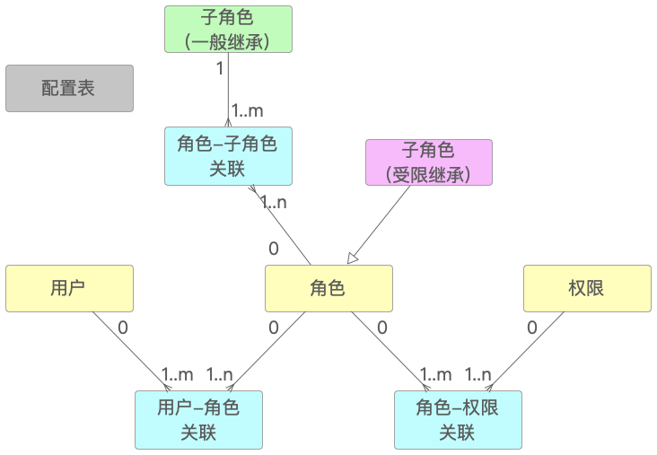

> 图9-8 RBAC2逻辑模型

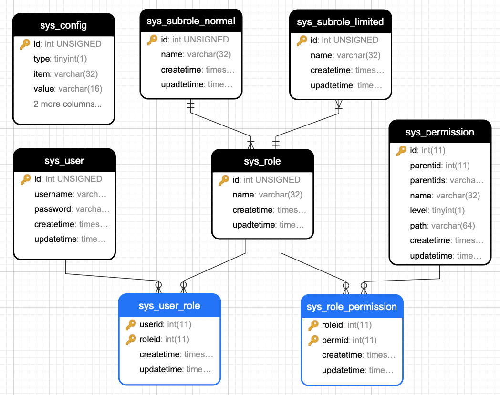

其实到了这个程度，全世界99.99%的公司或者组织机构都已经足够用了。但是RBAC依然发展出了RBAC3。RBAC3 = RBAC2 + 用户组/组织机构。

1. 用户组：当用户基数增大，角色类型增多时，可能会有一部分人具有相同的属性。比如外卖送餐部门人数众多，如果一个个地分配角色，会非常麻烦。但是如果给这些员工创建一个用户组，员工加入用户组后，即可自动获取该用户组的所有角色，退出用户组，同时也撤销了用户组下的所有角色，极大地方便了管理工作；
2. 组织机构：另一种分类方式是通过将组织与角色进行关联，实现类似用户组的功能；
3. 用户组-组织机构混合式：通过用户组实现对角色的整合，然后再按照组织机构的不同范围来查看数据；
4. 混合权限：有时候某个特殊的用户，比如公司董事长或总经理，会直接被赋予一些其他角色都没有的权限，不必再通过角色“中转”。用户组与权限也是一样。

RBAC3的逻辑模型和物理模型分别如图9-9和图9-10所示。

> 图9-9 RBAC3逻辑模型

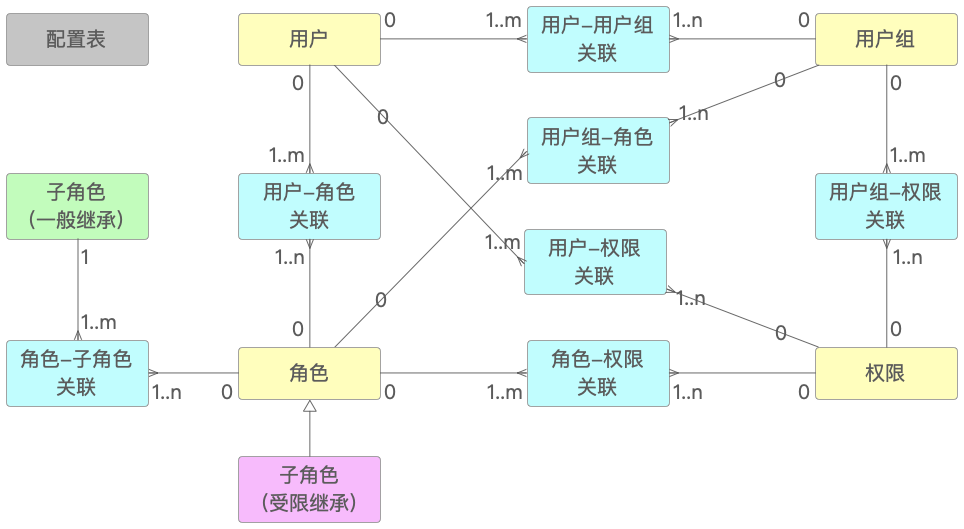

> 图9-10 RBAC3物理模型

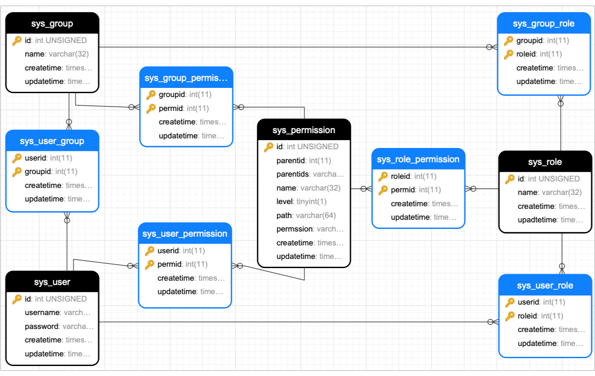

接下来，该把学到的知识用于实践了。

#### 9.1.3 以表种“树”

依据笔者的开发经验来看，大多数应用中的权限表大概都是如图9-11所设计那样的。

> 图9-11 权限表的一种物理结构

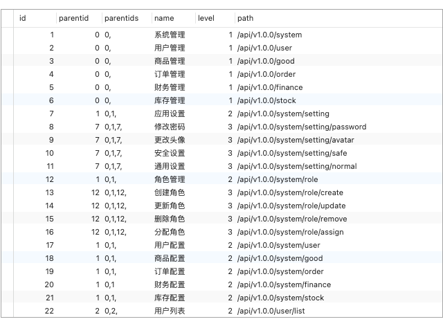

权限表中存储的不外就是id、权限名称、层级、路径等信息。上图所示的这张表其实是一颗权限树的化身，如图9-12所示。

> 图9-12 从权限表到权限树

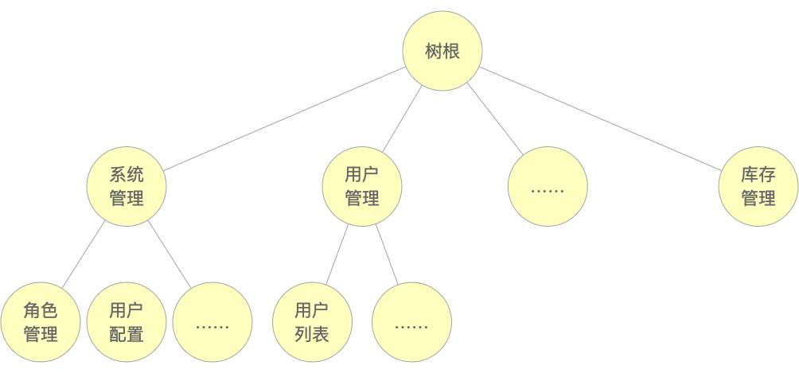

只不过它和普通的表结构一样，将主键设为自增编码，除了parentid和parentids能看出数据之间的关系外，就没有其他方式可以证明它是棵树了。这种方式的优点是不用管它的id生成，但缺点是不便于观察各树节点之间的联系，因此就出现了一种能够让主键携带更多信息的编码方式，如图9-13所示。

> 图9-13 权限表的另一种物理结构

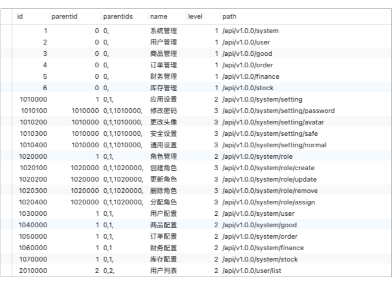

可以看到id列和图9-11所示的id不一样。它像身份证一样，是一种“占位符”编码。例如我国身份证号码按从左到右数第1到第6位表示出生地编码，第7到第14位为出生年月日，第15和第16位为出生顺序编号，第17位为性别标号，第18位为效验码。

同理，图9-13所示的权限表结构中，id为7位数，利用编码中的占位符来代替单纯数字的底层逻辑是：

1. 所有层级，也就是level字段值为“1”的大类按照自然数的编码顺序依次递增；
2. 除了树根以外，所有编码都从“1”开始计数；
3. 从level层级为2的权限开始，编码为7位数，例如：1010000；
4. 编码第一位：占位符，从1～9表示大类业务编号；
5. 编码第二、三位（01）：表示层级为3的树节点权限，编码从01～99，最多可以有99个树节点；
6. 编码第四、五位（00）：表示层级为4的树节点权限，编码01～99，最多可以有99个树节点；
7. 编码第六、七位（00）：表示层级为5的树节点权限，编码01～99，最多可以有99个树节点；
8. 用这种方式，最多可以表示9 × 99 × 99 × 99 = 8732691个子节点，也就是8732691个权限项。

这种id编号方式能很清晰地看出层级结构，但如果需要无限扩展层级结构时就只能增加id的位数，但这样到后期扩容时变动太大，极难实施。而id自增方式可以很方便地实现无限扩展，但id编号却毫无规律，不容易看出层级关联。所以二者各有利弊，需要在实际开发中酌情选择。

如果确认当前及今后可能出现的层级不多，建议使用占位符方式，反之利用自增方式。一般来说权限数据相对比较固定，极少改动，因此可以使用MyISAM的存储引擎，且事先可以以初始化的方式创建较为完整的权限数据。

另外，可能有的读者会注意到在parentids字段值的结尾都有个“,”，这是为什么呢？答案就在执行SQL时。例如，当查找“id=1”的所有子类时：

1. 有“,”时的查询语句：SELECT * FROM sys_permission WHERE parentids LIKE '%1,%'；
2. 无“,”时的查询语句：SELECT * FROM sys_permission WHERE parentids LIKE '%1%'。

读者可以比较一下查询结果会有什么不同。当然，在互联网应用中的MySQL中是不允许出现LIKE查询的，这里只是多说一句。

#### 9.1.4 解析权限结构

权限设计是一件比较抽象的思考活动。有时候一些复杂的权限、角色、组织、用户等内容交织在一起，会让人觉得无从下手。不过只要通过适当的方法来解构，慢慢地抽丝剥茧，就不那么难做了。例如，笔者比较喜欢用“汉堡包”法来做权限设计。所谓“汉堡包”法，顾名思义，就是权限系统像汉堡包那样直观、清晰。如图9-14所示。

> 图9-14 权限设计的“汉堡包”


“汉堡包”中，上层的“组织结构”可能是这样的，如图9-15所示。

> 图9-15 “汉堡包”中的上层组织结构

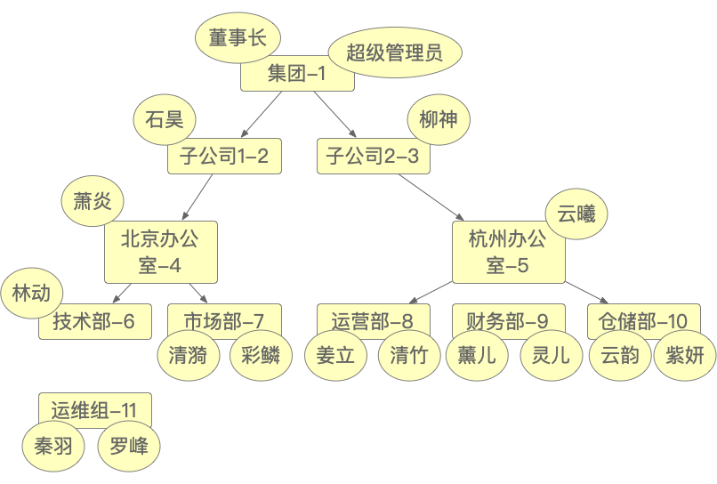

“汉堡包”中间部分的分组或角色可能是如图9-16所示那样。

> 图9-16 “汉堡包”的中间角色或分组

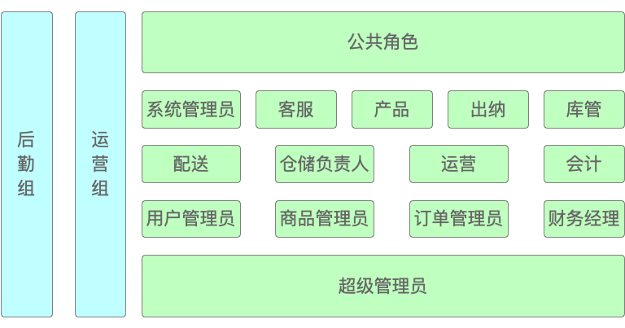

而“汉堡包”的下层权限集合则可能是如图9-17所示那样的。

> 图9-17 “汉堡包”的下层权限集合

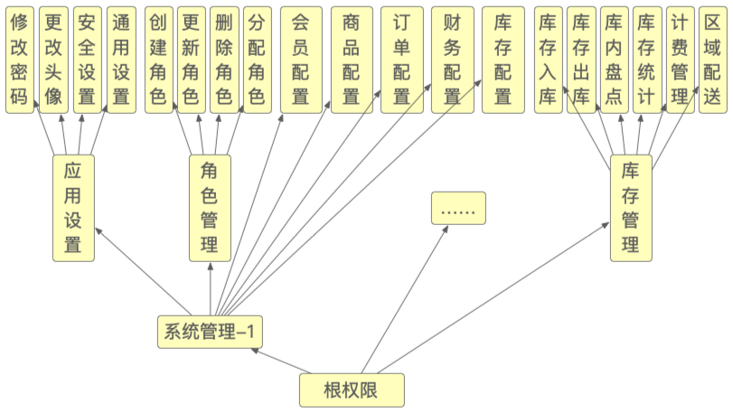

如果要做权限叠加的话，可能如图9-18所示那样。

> 图9-18 权限叠加

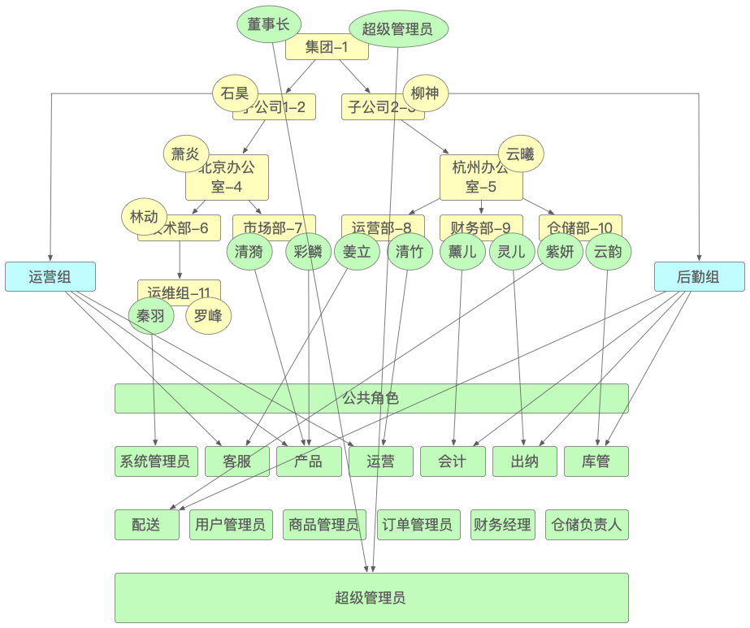

这里把和权限进行连线的图省略掉了，因为实在是有些复杂。刚开始接触权限系统的读者，也不要被这种复杂性给吓到，即使是最复杂的权限也是从RBAC0进化而来的，完全可以通过不断地实践，逐渐熟悉并熟练掌握。

#### 9.1.5 实现权限

前面几小节把RBAC的来龙去脉及分析、设计方法撸了一遍，现在学以致用，结合Spring Security权限框架来实现它。假定此处按照图9-18的设计来实现自定义的权限系统，整个过程大致分这么几个步骤：

1. 定义出完整的权限系统表结构；
2. 实现Entity、Dao、Service等类代码；
3. 实现Spring Security自定义拦截器；
4. 实现Controller，完成权限验证。

因限于篇幅，故此处只展示核心代码，所有基础性和辅助性的代码就不再单列出来。本章所有涉及到的源代码读者都可在cn.javabook.chapter09.rbac.*包中找到，数据库文件在resources/db/rbac3.sql中，相关的pom.xml和application.properties源码中也已给出，只需安装、配置并连接MySQL数据库即可运行。

数据库中定义了机构、组、角色、权限、用户及其之间的关系，分别对应SysBranch、SysGroup、SysRole、SysPermission、SysUser实体类。除了SysBranch外，它们也都有对应的Service类，分别是GroupService、RoleService、PermissionService、UserService。

Spring Security的强大之处就在于它的拦截器，所以这里也参照它实现自己的权限拦截器。所以首先定义需要的注解，如代码清单9-1所示。

> 代码清单9-1 PreAuthorize.java

```java
@Target({ ElementType.METHOD, ElementType.TYPE })
@Retention(RetentionPolicy.RUNTIME)
@Inherited
@Documented
public @interface PreAuthorize {
    String group() default "";
    String role() default "";
    String permission() default "";
}
```

这里的拦截器需要完成两个任务：

1. 查找用户拥有的资源，也就是要完成下面的工作：
  - 找到某个用户所属的所有组（不需要去找这些组的父组）；
  - 找到某个用户拥有的所有角色（同时要逐个找到所有这些角色的父角色）；
  - 找到某个用户拥有的所有权限。
2. 将权限与资源做比对，确认是否对该资源有访问权限。

有了注解之后，再来定义拦截处理器，其核心代码如代码清单9-2所示。

> 代码清单9-2 InterceptorHandler.java部分源码

```java
public class InterceptorHandler {
   ......
   @Around("controllerMethodPointcut()")
   public Object Interceptor(final ProceedingJoinPoint pjp) {
      ......
      SysUser user = userService.queryByUsername(username);
      if (null == user) {
         return "user is not exist";
      }
      Set<SysRole> userRoleSet = new HashSet<>();
      Set<SysRole> userAllRoleSet = new HashSet<>();
      StringBuilder roleIds = new StringBuilder();
      Set<String> userRoleNameSet = new HashSet<>();
      List<SysRole> ugr = roleService.queryUGRByUserId(user.getId());
      if (null != ugr && ugr.size() > 0) {
         userRoleSet.addAll(ugr);
      }
      ......
      Set<String> userPermissionSet = new HashSet<>();
      List<SysPermission> ugrp = permissionService.queryUGRPByUserId(user.getId());
      if (null != ugrp && ugrp.size() > 0) {
         ugrp.forEach(r -> userPermissionSet.add(r.getPath()));
      }
      ......
   }
}
```

从代码中可以知道，InterceptorHandler类中的代码做了几件事：

1. 首先查询用户信息，如果用户不存在则直接返回；
2. 把用户所拥有的角色及其父角色全部查出来，再合并到集合Set<SysRole>的变量中；
3. 再把这些角色所用的全部权限查出来，存放到集合List<SysPermission>的变量中；
4. 查询直接给用户、组分配权限，并且把它们全部放在Set<String>的变量中；
5. 将集合List<SysPermission>和集合Set<String>中的权限合并；
6. 解析拥有注解@PreAuthorize的方法，判断用户是否拥有某个角色、组、权限。如果有则可以顺利访问，否则返回“permission denied”。

Controller中的接口是通过InterceptorHandler类和@PreAuthorize注解起作用的，如代码清单9-3所示。

> 代码清单9-3 UserController.java

```java
@RestController
public class UserController {
    @PreAuthorize(role = "客服")
    @RequestMapping(value = "/api/v1.0.0/user/details", method = RequestMethod.GET)
    public String details(String username) {
        return username + " 有查看用户详情的权限";
    }

    @PreAuthorize(role = "产品")
    @RequestMapping(value = "/api/v1.0.0/system/setting/password", method = RequestMethod.GET)
    public String password(String username) {
        return username + " 有修改密码的权限";
    }
}
```

读者可以按照代码注释中的用例，用接口调试工具如Postman等试试效果，当然自己也尝试可以制造更多的用例看看权限系统是否管用。相关的用户信息在数据库初始化时已插入sys_user表。

#### 9.1.6 另一种方式

通过Spring Security参照框架实现的注解非常方便，但有一个很大的问题，就是某些接口或方法的角色、组、权限直接在代码里面被写死了，例如下面这段代码：

```java
@PreAuthorize(role = "客服")
@RequestMapping(value = "/api/v1.0.0/user/details", method = RequestMethod.GET)
public String details(String username) {
    return username + " 有查看用户详情的权限";
}
```

可以看到，接口“/api/v1.0.0/user/details”如果想调整所属的角色，将不得不修改代码，这非常不友好。现实中的权限更多时候是通过勾选、配置的方式实现的。

如果读者有兴趣尝试的话，会发现这种方式真正难于实现地方不在于角色、组、权限等如何存储，而是怎么能够把数据库中存储的数据行变成树型结构。笔者在这里提供一种思路，它是将图9-13中的数据表结构变为树型结构的关键代码，供读者参考。如代码清单9-4所示。

> 代码清单9-4 Menu.java部分源码

```java
public class Menu {
   private String id; // 菜单编号
   private Menu parent; // 父级菜单
   private String parentIds; // 所有父级编号
   private String name; // 名称
   private String level; // 层级
   private String path; // 路径
   private List<Menu> childList = Lists.newArrayList();// 拥有子菜单列表
   private List<Role> roleList = Lists.newArrayList(); // 所属角色列表
   // getter、setter
   ......

   // 一个递归的种树方法
   public static void getTree(List<Menu> list, List<Menu> sourcelist, String parentId) {
      for (int i = 0; i < sourcelist.size(); i++) {
         Menu e = sourcelist.get(i);
         if (e.getParent() != null && e.getParent().getId() != null && e.getParent().getId().equals(parentId)) {
            list.add(e);
            // 判断是否还有子节点, 有则继续获取子节点
            for (int j = 0; j < sourcelist.size(); j++) {
               Menu child = sourcelist.get(j);
               if (child.getParent() != null && child.getParent().getId() != null && child.getParent().getId().equals(e.getId())) {
                  getTree(list, sourcelist, e.getId());
                  break;
               }
            }
         }
      }
   }
}
```

图9-13中的数据表确切地说是一张菜单表（sys_menu）或权限表（sys_permission），很明显，getTree()是一个递归方法。它接收三个参数：

1. 第一个参数List<Menu> list，它是最终要输出成树型菜单的一个输出参数；
2. 第二个参数List<Menu> sourcelist，是从数据库中读取出来的数据项集合，它是按照行集RowSet的方式组织的；
3. 第三个参数String parentId表示树型列表是从哪个菜单节点开始的。一般情况下，如果parentId = 0表示从Root根节点开始组织树型菜单。

代码清单9-4就是整个可分配的权限系统中最为核心和关键的部分，没有之一。至于列表、查询、修改、勾选、保存都只不过是非常简单的CRUD，没有任何技术含量，读者肯定可以写出比这更高效、更简洁的代码。

这里顺便提一句，有些技术课程将权限系统讲的天花乱坠，把诸如Session/Cookie机制、数据加密、Spring Security Realm源码解析、认证流程分析、权限校验流程、rememberMe机制、过滤器等一大堆杂七杂八的东西都加了进去。这些东西看起来好像很高大上，但其实和真正的权限系统压根就没啥关系，充其量只是一些边路助攻或者奶妈角色，根本无法做到Gank输出。RBAC权限系统就那么点东西，其核心无非两点：

1. 完成权限比对（跟用不用注解无关）；
2. 生成树型菜单。

如果读者能把本小节和上一小节的内容都搞得明明白白，那可以说几乎没有任何RBAC权限系统的分析、设计和开发能够难得倒。但也切忌复杂，因为超级复杂的角色权限，也就意味着超级复杂的SQL查询，纯粹找虐。

### 9.2 OAuth 2.0

如今，通过第三方账号授权进行登录的互联网应用已经成为了主流，如图9-19所示。

> 图9-19 某应用的网页登录界面


对此，自然会让人产生两个疑问：

1. 这是怎么实现的呢？
2. 自己的业务系统又该怎么实现给其他应用授权呢？

本节接下来就来回答这两个疑问。

#### 9.2.1 OAuth机制

OAuth全称Open Authorization（开放授权），是一个关于授权的开放网络标准，记住以下两点有助于加深对它的理解：

1. 它是一种协议或标准，而非一组API、服务或技术实现；
2. 它关注授权（Authorization）而非认证（Authentication）。

它允许用户授权第三方应用，访问他们将要使用的应用中的信息，而不需要将应用的用户名密码提供给第三方应用或分享应用数据的所有内容。

上面这句话的意思用大白话来说就是：当石昊登录某在线音乐应用的账号时，可以通过微信实现授权登录，然后通过自己喜欢的歌单听歌。

OAuth之所以如此流行，不仅仅只是因为可以用微信登录其他应用，更重要的是它结束了SSO（Single Sign On，单点登录）技术的混乱无序状态。在有SSO以前，各大应用都是完全独立的，如图9-20所示。

> 图9-20 各应用完全独立

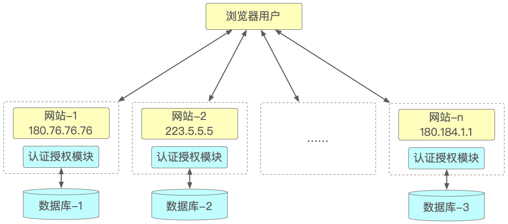

所以，那时候的用户，不得不记住一大堆的密码以及所谓的密保问题，真的是很头疼的一件事。但是后来出现了一些SSO技术产品，能够代理用户完成登录，如图9-21所示。

> 图9-21 众多的SSO

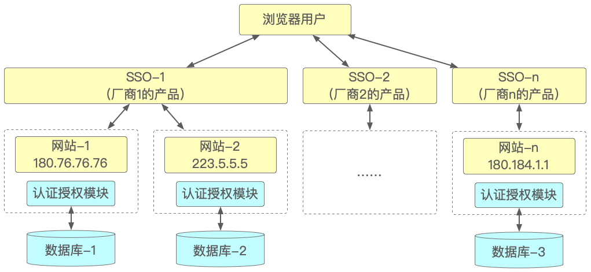

虽然SSO貌似能实现登录多个站点应用，但其实治标不治本，因为：

1. 这类SSO产品大多数都是基于企业级用户而非终端用户，所以应用面很窄；
2. 各家SSO的标准、机制和实现技术都不一样，互不兼容，非常混乱。

直到OAuth出现，才从事实上统一了企业级应用和个人应用两大领域，并从某种程度上取代了SSO技术。

目前OAuth 1.0已经被淘汰，可以跳过，直接从OAuth 2.0开始。OAuth 2.0有四种实现机制：

1. 授权码模式（authorization-code）：微信先通过网页向音乐网站申请一个授权码code，然后再用它获取音乐网站后端生成的令牌token，只有携带这个令牌才能访问歌曲列表听歌。code和token是前后端分离的；
2. 隐藏模式（implicit）：和授权码不同，它通过网页直接向微信颁发了token，省去了code，所以称为“隐藏”，而且token也保存在前端页面中；
3. 密码模式（password）：这种方式下，微信会要求笔者输入在音乐网站的用户名和密码，通过以后再获得token令牌。这时生成的token可以让前端保存，也可以在后端保存；
4. 客户端凭证模式（client credentials）：有些应用没有网站页面或APP，只有以命令行交互的方式实现功能。这种模式生成的token是针对第三方应用的，例如微信，而不是终端用户，所以它有可能会出现当多个用户都用微信登录时，共享一个token的情况。

目前大多数应用选择的都是授权码模式，因为它的安全性最高，侵入性最小。

#### 9.2.2 用Github代替微信

在了解了机制之后，就可以来实现自己的OAuth了。因为申请微信的OAuth 2.0应用需要一些前提条件，例如下载模板、盖章签名、提交审核之类的，会比较麻烦，给学习造成了阻碍，而且这些与技术毫无关系。所以，如果只是演示OAuth 2.0技术，完全可以用Github来代替微信成为第三方，因为底层机制是一样的。

目前在OAuth 2.0中授权码模式（authorization-code）是使用最为广泛的，因为它功能完整，流程严密。所以这里实现的也是Github授权码模式（authorization-code）。

1. 首先需要在Github中注册，然后访问链接`https://github.com/settings/applications/new`，并填写信息。如图9-22所示。

> 图9-22 在Github创建新应用

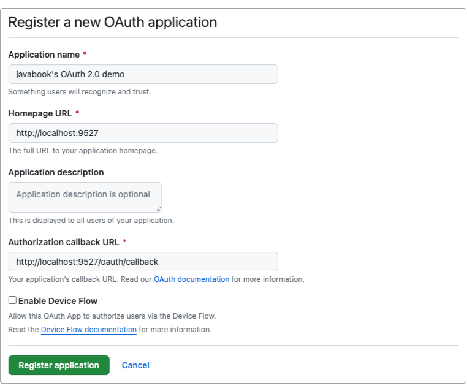

这里的URL和callback URL都可以是本地调试环境的地址。应用登记成功之后，Github就会给应用生成一个Client ID，然后再生成一个Client Secret。由Client ID和Client Secret共同组成应用的身份识别码。除了Client ID，Client Secret是可以更改的。

2. 再创建Spring脚手架，可以访问`https://start.spring.io/`，选择所需要的依赖。选择完成后点击“GENERATE”创建项目zip文件。浏览器会自动下载zip文件，解压后导入IDEA中，然后在pom.xml文件中再增加一些相关的依赖，此处略过。这部分完整的源代码读者可参考`cn.javabook.chapter09.github.oauth`包、页面文件`resources/templates/index.ftl`和`pom.xml`。

3. 第三方登录的链接形式是：Authorize_URI + Client_ID + Callback_URI。所以，刚才在Github上申请的OAuth 2.0应用的第三方登录地址就是类似下面这样的地址：`https://github.com/login/oauth/authorize?client_id=${client_id}&redirect=http://localhost:9527/oauth/callback`；

4. 可以将这个链接以二维码的形式展现，这样就可以通过移动端应用，例如微信或支付宝扫码访问；

5. 如果之前未在移动端页面中登录过Github，那么会要求先登录。如果已经登录过，那么扫码的结果则如图9-23所示。

> 图9-23 已登录Github则显示授权页面

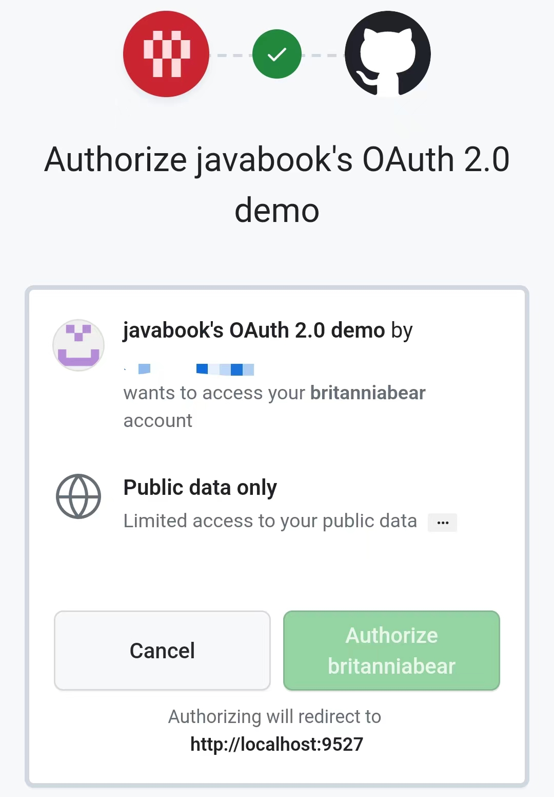

因为此时并未通过`http://localhost:9527`网站访问Github，所以右边的授权按钮无法点击，这是正常的。

6.编写网站的首页控制器，如代码清单9-5所示。

> 代码清单9-5 IndexController.java部分源码

```java
@Controller
public class IndexController {
    @GetMapping("/")
    public String index() {
        return "index";
    }
}
```

当访问`http://localhost:9527`，控制器会给浏览器返回`resources/templates/oauth/index.ftl`页。

启动SpringBoot项目，然后访问`http://localhost:9527`，如图9-24所示。

> 图9-24 访问http://localhost:9527后的首页内容

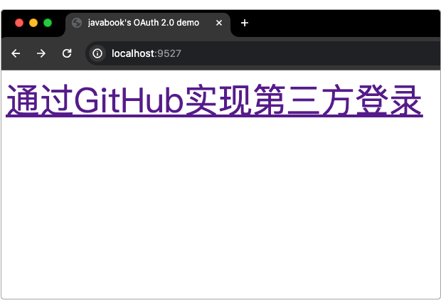

7. 点击链接后跳转到Github授权页面，此时图9-23中的“授权”按钮成为可点击状态。根据OAuth 2.0的流程，Github会生成授权码，并以GET方法调用`http://localhost:9527/oauth/callback`，同时以参数形式返回授权码code。

8.接下来，网站会拿着这个授权码，以及之前生成的client_id和client_secret，通过POST方法向Github申请token。为了验证token有效性，再拿着它向Github查询用户数据。第7步和第8步的过程如代码清单9-6所示。

> 代码清单9-6 CallbackController.java部分源码

```java
@RestController
public class CallbackController {
    @GetMapping("oauth/callback")
    public void redirect(final String code) {
        System.out.println("授权码code = " + code);
        Map<String, String> map = new HashMap<>();
        map.put("client_id", "[申请的数据]");
        map.put("client_secret", "[申请的数据]");
        map.put("code", code);
        String result = sendPost("https://github.com/login/oauth/access_token", map);
        String[] values = result.split("&");
        System.out.println("令牌token = " + values[0]);
        result = sendGet("https://api.github.com/user", values[0].split("=")[1]);
        System.out.println("获得的数据 = " + result);
    }
    ......
}
```

方法执行完成时，读者可以看看是否查询到了相应的用户数据。另外，当点击授权之后，当再次点击图9-23中的链接时页面无响应。那是因为刚才已经生成过token了，如果还想重新测试看效果，就需要在Github上清除已经生成的token。清除方法如图9-25所示。

> 图9-25 点击“Revoke”按钮可以清除所有token

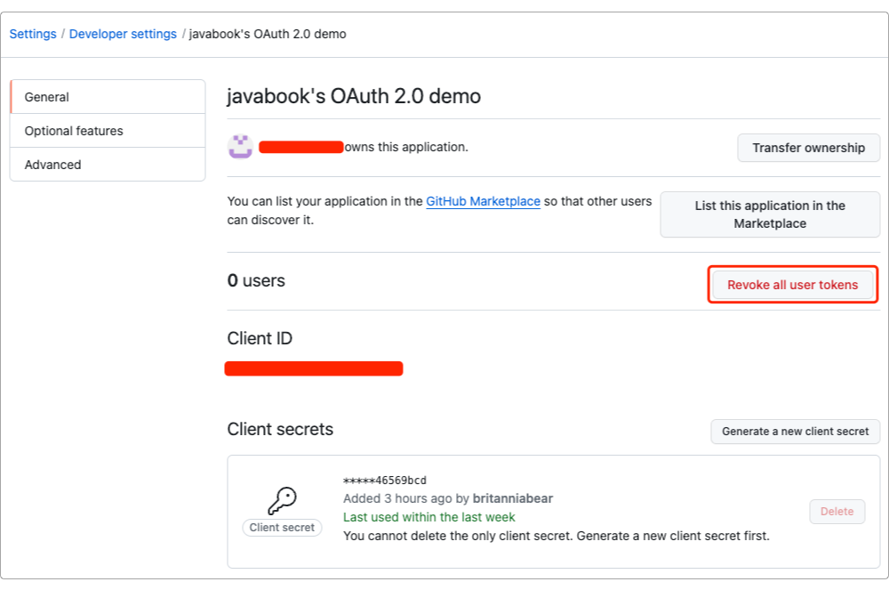

至此，用Github代替微信实现第三方登录的演示就结束了。

注意：因为之前存在RBAC相关代码，所以在演示OAuth 2.0时，需要将RBAC权限拦截部分先注释或移除，并将pom文件中Spring Security依赖部分注释掉，否则无法看到效果。

#### 9.2.3 留存用户

在上一节中向Github查询到了用户信息，而这个数据并不在当前应用的数据库里。互联网时代，用户数据作为平台最宝贵的数字资产之一，是必须要留存下来的。同时，这样也可以避免后续频繁地调用第三方平台的接口去查询用户信息。

按照典型互联网应用的要求，任何应用系统都应该存储平台用户的数据，这可以说是整个平台的基石。如果系统开发之初没有设计好用户相关的信息存储结构，待到后面有几千万上亿用户量的时候，再来修改调整，不光是人，计算机也会崩溃的。所以，如何存储用户数据，让它既能够满足当前的需求，又能兼顾后续的扩展，做到即使有局部的需求改动，也不会引发整个系统大动干戈，甚至推倒重来，就是系统开发之初必须要面对和解决的问题。

在需求不多业务也不复杂时，大多数系统中的用户表结构可能是如表9-1所示这样的。

> 表9-1 简单用户表结构

| 字段 | 说明 |
|:---:|:---:|
| id | 用户编码 |
| username | 用户名 |
| password | 秘密 |
| salt | 加密盐 |
| createtime | 创建时间 |
| updatetime | 更新时间 |

随着业务的拓展，需求也不断增多，例如需要实名注册，那么用户的身份证号、真实姓名、昵称、头像、居住地址等也需要加上了。在运营规模起来以后，包括冻结用户、上次登录IP地址、上次登录时间等也要一股脑地往上添加。由此，形成了一个比较完整的用户相关信息的表结构。如表9-2所示。

> 表9-2 更丰富的用户表结构

| 字段 | 说明 |
|:---:|:---:|
| id | 用户编码 |
| username | 用户名 |
| password | 秘密 |
| salt | 加密盐 |
| idcard | 身份证号 |
| realname | 真实姓名 |
| nickname | 昵称 |
| avatar | 头像 |
| address | 居住地址 |
| disabled | 是否禁用 |
| lastLoginIP | 上次登录IP地址 |
| lastLoginTime | 上次登录时间 |
| ... | ... |
| createtime | 创建时间 |
| updatetime | 更新时间 |

当互联网业务越做越大之后，自然而然就会希望打通之前的信息孤岛，实现数据互联互通，典型的比如电子政务、智慧城市和电信机房等项目。数据的互联互通，首先就需要各个不同的系统，不同的产品线，甚至是不同公司的平台用户账户之间能够互联互通，否则如何监管数据安全和网络安全，如何保障用户利益呢？在这个趋势下，微博开放了第三方登录授权，其他网站只需要接入微博用户授权的API，并做好接收数据的回调接口，就能和微博的用户系统实现互联互通。那么，之前设计的表结构就满足不了需要了，需要增加一个微博用户信息表，可能是如表9-3所示那样的。

> 表9-3 微博用户表结构

| 字段 | 说明 |
|:---:|:---:|
| id | 自增编码 |
| userid | 用户编码（外键），关联用户信息表 |
| weiboid | 微博编码 |
| access_token | 访问令牌 |
| access_secret | 签名密钥串 |

进入移动互联网、物联网时代，网站除了可以通过用户名登录了，还能用手机号、邮箱以及扫码方式登录，以后说不定还得支持指纹、声音、刷脸等不同的登录方式。而且，不光微博，QQ、微信、支付宝等稍有一些影响力的应用全都开放了第三方登录授权。也就是说，如果每个第三方授权和每一种不同的登录方式相组合，例如5种第三方登录 × 3种登录方式 = 15张表，那会把工程师逼疯的。基于以上考虑，可以做一个抽象的总结：

1. 用户名 + 密码；
2. 手机号 + 验证码；
3. 邮箱 + 验证码；
4. 指纹或人脸数据。

不管以上哪种方式，都只是用户信息认证（Authentication）形式中的一种。所以从这个角度来看，第三方登录中的授权码code或令牌token也是一种信息的验证形式，只不过code或token都是有时间期限的随机密码串。因为认证和业务信息本身是无关的，所以它应该和用户基础信息分离，也就是逻辑和数据必须解耦，不然认证形式改了，基础信息也得跟着改。基于以上考虑，存储用户数据的表结构应该做出一些拆分，如表9-4所示。

> 表9-4 用户信息表结构

| 字段 | 说明 |
|:---:|:---:|
| id | 用户编码 |
| idcard | 身份证号 |
| realname | 真实姓名 |
| nickname | 昵称 |
| avatar | 头像 |
| ... | ... |
| createtime | 创建时间 |
| updatetime | 更新时间 |

用户信息表存储所有与用户相关的业务属性信息，与认证授权无关。如果需要，用户信息表还可以拆分为基本信息与扩展信息，如表9-5所示。

> 表9-5 用户认证表结构

| 字段 | 说明 |
|:---:|:---:|
| id | 自增编码 |
| userid | 用户编码（外键），关联用户信息表 |
| type | 登录类型，用户名/手机号/邮箱等，或第三方应用名称，如QQ/微信/等 |
| identifier | 用户名/手机号/邮箱或第三方应用标识，如appid/openid/clientid等 |
| credential | 站内的为密码，站外的为appsecret/clientsecret/secretkey |
| expiretime | credential的过期时间（单位秒），默认值为-1，表示永不过期 |
| ... | ... |
| createtime | 创建时间 |
| updatetime | 更新时间 |

而用户认证表则存储所有与认证授权相关的内容，与用户信息表关联，区分站内和站外，方便处理。另外，因为token、secret等令牌、密钥串数据有很强的时效性，所以放在缓存中更合适，数据库中就不必保存了。根据这种划分，创建物理数据表的SQL脚本如代码清单9-7所示。

> 代码清单9-7 创建物理数据表的sql脚本

```sql
-- 创建user_info表
DROP TABLE IF EXISTS user_info;
CREATE TABLE user_info (
  id INT(11) NOT NULL AUTO_INCREMENT COMMENT '用户编码',
  realname VARCHAR(32) NOT NULL COMMENT '真实姓名',
  nickname VARCHAR(32) NOT NULL DEFAUlT '佚名' COMMENT '昵称',
  avatar VARCHAR(256) NOT NULL DEFAUlT '' COMMENT '头像',
  cover VARCHAR(256) NOT NULL DEFAUlT '' COMMENT '封面地址',
  createtime DATETIME NOT NULL DEFAULT CURRENT_TIMESTAMP COMMENT '创建时间',
  updatetime DATETIME NOT NULL DEFAULT CURRENT_TIMESTAMP ON UPDATE CURRENT_TIMESTAMP COMMENT '更新时间',
  PRIMARY KEY (id)
) ENGINE=InnoDB DEFAULT CHARSET=utf8mb4 COMMENT '用户信息表';

......

-- 创建唯一索引
CREATE UNIQUE INDEX auth_identifier ON user_auth (identifier);
```

接下来，需要做的工作就是：

1. 要么通过本地用户名注册，完善手机号、邮箱信息，稍后可以通过用户名、手机号或邮箱登录；
2. 要么通过Github登录，并留存Github用户名、client_id、client_secret、code和token信息。

因为第一种通过本地用户名注册再登录的方式实在是没啥技术含量，所以笔者就不再浪费篇幅讲解。

第二种通过Github登录，然后再保留Github用户名及相关信息的方式，主要是通过InfoAuthService类的saveThirdLoginInfo()方法实现的。它接收identifier、credential、username和avatar这四个参数，并把它们分别保存在user_info表和user_auth表中，同时建立主外键关系。那么当再次查询Github用户信息时，就可以直接利用之前保存过的token，而不必重新调用API接口去请求了。这两种方式的相关代码在cn.javabook.chapter09.github.userauth包及resource/templates/userauth的页面代码文件中。

不过此处RedirectController类的redirect()方法保存的其实是token，如下列代码段所示。

```java
......
String token = values[0].split("=")[1];
......
String identifier = content.getString("login");
String avatar = content.getString("avatar_url");
infoAuthService.saveThirdLoginInfo(identifier, token, identifier, avatar);
```

由于token、secret等令牌、密钥串这类数据有很强的时效性，实际开发中是不会把它们保存在SQL数据库中的，因为这里只是为了方便演示，所以没有顾及这些。

#### 9.2.4 成为第三方

所谓的第三方登录授权，其实有点类似于“上帝视角”，如图9-26所示。

> 图9-26 第三方授权的视角

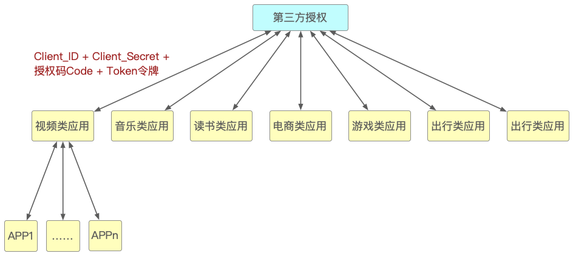

第三方登录的本质就是互利共赢，既然OAuth 2.0的技术机制都已经清楚了，那么如果某家公司发展的很好，体量足够大，是不是也可以自己做一回“上帝”呢？显然是可以的。

假如前一章的母婴用品电商公司按照OAuth 2.0的机制，想自己做一回第三方，那么她只需要做好关键的几件事就行了：

1. 开放接口，登记申请，给申请者发放appid和appsecret（不管是username/password、clienid/clientsecret，还是appid/appsecret，或者openid/secretkey，本质上都是用户名/密钥对，只是形式和命名习惯不同而已）；
2. 如果是授权码模式，那么要先给对方一个有时效性的回执，也就是授权码Code。它表明即将生成的Token确实是指定的第三方生成的。也就是说Code和Token虽然都是具有时效性的随机字符串，但授权码代表的是机构，由前端保存。而Token代表的是应用或功能，由后端保存，两者的侧重点不同；
3. 最后通过用户名/密钥对 + 授权码生成并发放具有实效性的Token令牌；
4. 在Token令牌的时效期内，可通过它来访问第三方平台的接口读取数据。

OAuth 2.0所需记录的数据，其形式总体上应该是如图9-27所示的那样。

> 图9-27 第三方需要记录的数据

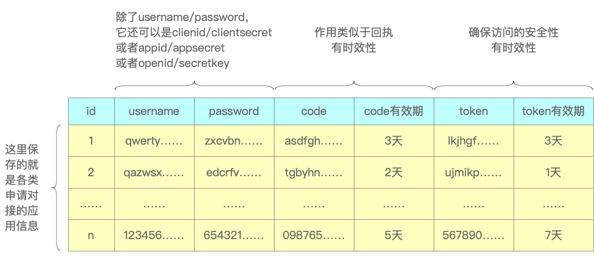

某应用调用第三方授权登录的OAuth 2.0流程，如图9-28所示。

> 图9-28 某应用调用第三方授权登录的OAuth 2.0流程

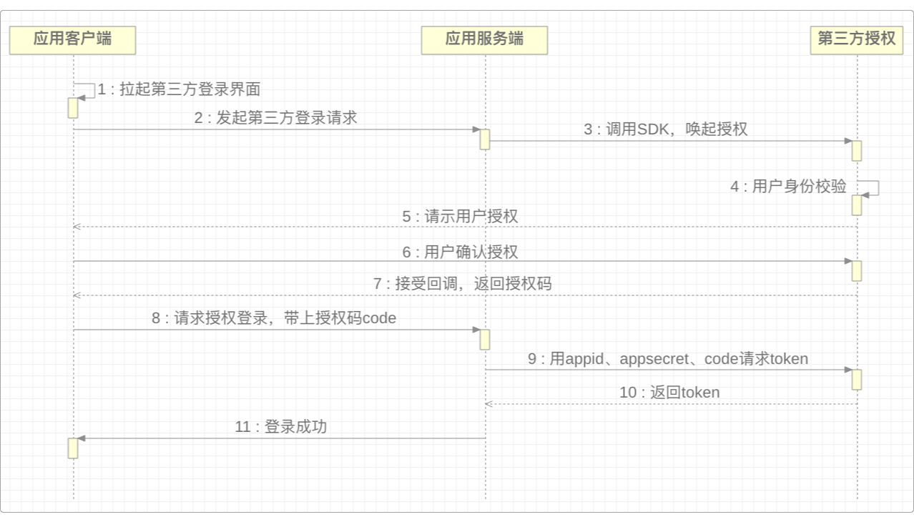

现在，知道了机制、流程及其“数据结构”之后，用代码实现就比较容易了。

之前为了将Github的数据留存在本地而创建了cn.javabook.chapter09.github.userauth包。现在，为了成为第三方，需要做的是：

1. 将原idea中cn.javabook.chapter09.github.userauth包作为基础代码，拷贝到新创建的cn.javabook.chapter09.oauth2包中，将oauth2包中的代码作为测试应用的后端，而resources/templates/oauth2中的页面文件作为测试应用的前端；
2. 同时将cn.javabook.chapter09.oauth2包中的代码及resources/templates/oauth2中的页面文件复制一份到新创建的eclipse项目中，改名为third，更改端口和代码功能，作为第三方授权平台的前端和后端。不用eclipse，用idea也完全可以，依据个人习惯而定；
3. 实现oauth2项目和third项目之间的OAuth 2.0授权机制。

说明：这里主要是以展示OAuth 2.0的机制、流程为主，因为完整的步骤较多，全部实现既浪费时间也没有太大意义。所以为了演示方便，在不影响理解的前提下，仅实现其中较为关键的步骤，一些可做可不做的地方，都会忽略掉。

前一小节将Github的用户数据留存在了user_info表和user_auth表中，但是当角色转换过来，本地应用成为第三方应用以后，光凭这两张表显然是不够的。因为成为第三方应用，一个首要解决的问题就是要开放接口，登记申请者的身份，也就是用户/密钥对（不管是username/password、clienid/clientsecret、appid/appsecret，或者openid/secretkey别的什么不重要，只要是用户/密钥对就行），这里的申请者，指的是申请接入的应用，而不是某个具体的用户。因此，需要一张表能够记录所有申请者的信息。有的第三方平台允许同一个申请者申请多个应用，例如石昊既申请了音乐应用授权，又申请了视频应用授权，所以会有多个用户/密钥对。但作为演示，这里只要实现一个就可以了。按照Github的模式，应用申请表结构应该是如表9-6所示那样。

> 表9-6 应用申请信息表结构apply_info

| 字段 | 说明 |
|:---:|:---:|
| id | 自增编码 |
| userid | 用户编码（外键），关联用户信息表 |
| appid | 申请者id或用户名 |
| appsecret | 申请者secret或密码 |
| appname | 申请应用的名称 |
| description | 应用描述 |
| homepage | 应用主页地址|
| redirect | 回调地址 |

表9-6记录的是应用本身的一些信息，但是应用申请的授权信息是否也该保存在这里面呢？读者看到这里是否觉得有些似曾相识？不错，这里面临的问题其实和之前user_info、user_auth两张表之间的关系一样：需要将业务信息和授权信息分开。所以，还需要增加一张表来做这件事，如表9-7所示。

> 表9-7 应用申请授权表结构apply_auth

| 字段 | 说明 |
|:---:|:---:|
| id | 自增编码 |
| userid | 用户编码 |
| appid | 申请的应用编码 |
| code | 申请者授权码 |
| token | 申请者令牌 |

根据表9-6和表9-7创建的数据库SQL脚本如代码清单9-8所示。

> 代码清单9-8 创建物理数据表的sql脚本

```sql
-- 创建apply_info表
DROP TABLE IF EXISTS apply_info;
CREATE TABLE apply_info (
  id INT(11) NOT NULL AUTO_INCREMENT COMMENT '自增编码',
  userid INT(11) NOT NULL DEFAUlT 0 COMMENT '用户编码',
  appid VARCHAR(32) NOT NULL COMMENT '应用编码',
  appsecret VARCHAR(32) NOT NULL COMMENT '应用secret',
  appname VARCHAR(256) NOT NULL COMMENT '应用名称',
  description VARCHAR(256) NOT NULL COMMENT '应用描述',
  homepage VARCHAR(256) NOT NULL COMMENT '应用主页地址',
  redirect VARCHAR(256) NOT NULL COMMENT '应用回调地址',
  createtime DATETIME NOT NULL DEFAULT CURRENT_TIMESTAMP COMMENT '创建时间',
  updatetime DATETIME NOT NULL DEFAULT CURRENT_TIMESTAMP ON UPDATE CURRENT_TIMESTAMP COMMENT '更新时间',
  PRIMARY KEY (id)
) ENGINE=InnoDB DEFAULT CHARSET=utf8mb4 COMMENT '应用申请信息表';

-- 创建apply_auth表
DROP TABLE IF EXISTS apply_auth;
CREATE TABLE apply_auth (
  id INT(11) NOT NULL AUTO_INCREMENT COMMENT '自增编码',
  userid INT(11) NOT NULL DEFAUlT 0 COMMENT '用户编码',
  appid VARCHAR(32) NOT NULL COMMENT '应用编码',
  code VARCHAR(32) NOT NULL COMMENT '应用授权码',
  token VARCHAR(32) NOT NULL COMMENT '应用令牌',
  createtime DATETIME NOT NULL DEFAULT CURRENT_TIMESTAMP COMMENT '创建时间',
  updatetime DATETIME NOT NULL DEFAULT CURRENT_TIMESTAMP ON UPDATE CURRENT_TIMESTAMP COMMENT '更新时间',
  PRIMARY KEY (id)
) ENGINE=InnoDB DEFAULT CHARSET=utf8mb4 COMMENT '应用申请授权表';
......
```

同时，第三方平台也肯定会有自己的用户。所以只需要把之前代码清单9-7的SQL脚本拷贝过来就行了。为了测试方便，SQL脚本里已经事先插入了一条应用申请的数据。明确整体流程和数据库表设计之后，在动手实现之前再回头看看有无遗漏或错误：

1. idea的oauth2项目作为应用申请方，eclipse的third项目作为第三方授权平台；
2. 用户访问oauth2前端并点击第三方登录的third地址（将之前github替换为third）；
3. third前端申请用户授权（包含用户登录页面，简化后，登录成功即授权成功）；
4. 用户确认给予授权，third前台向third后台请求授权（生成并添加授权码记录）；
5. third后端访问应用回调地址以入参形式返回授权码（跳转到oauth2回调地址）；
6. oauth2前端拿到授权码并传给oauth2后端，oauth2后端将授权码连同appid、appsecret一起，向third接口申请token令牌（访问third生成token的接口）；
7. third核对了授权码并确认无误后，生成token返回给oauth2；
8. oauth2将token令牌保存起来，下次调用时third接口时直接使用。

注意，oauth2代码执行时需要将之前的权限拦截校验部分注释或删除，并将pom文件中的Spring Security依赖部分也注释掉，否则无法看到效果。
oauth2和third的核心交互的过程如图9-29所示。

> 图9-29 应用和第三方授权平台之间的核心交互

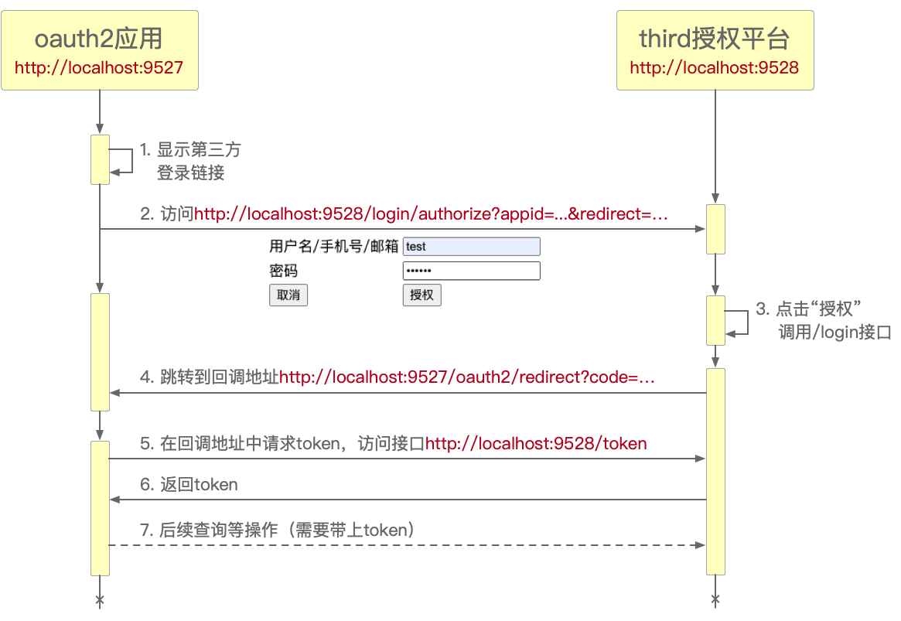

OAuth 2.0授权码模式的关键技术步骤就是获取code授权码和token令牌。除此之外，所有的其他操作都是业务性的，和技术无关。这里通过两个项目之间的互相调用，就已经把整个过程展示得很清晰了，其代码实现不再赘述。

不过，还有几个非常容易混淆的地方，不澄清的话很容易犯错：

1. user_auth表中的授权编码id不等同于apply_info表或apply_auth表中的id，因为没有哪个平台会闲的无聊自己做自己的第三方授权，所以user_info表和user_auth表组成一部分，保存应用方的用户数据。而apply_info表和apply_auth表组成另一部分，保存向第三方平台提交授权请求的申请者相关信息；
2. user_info.id == user_auth.userid == apply_info.userid == apply_iauth.userid，因为Github中的授权申请是由用户来完成的，就像图9-23那样，而微信是2在用户授权界面实现的申请，这里笔者则是直接在数据库中创建了一条申请记录。这三种方式本质上没有区别，都是将提交申请的用户和授权记录相关联。

### 9.3 动态令牌

令牌，在古代称为腰牌，比如东厂的锦衣卫腰牌，是一种官职和身份的象征。令牌在现代计算机中又称为token，在软件开发中用于身份认证。如果每次访问某个应用都要输入用户名和密码，这既繁琐也不安全，这时候令牌这种已经认证过的“信物”就可以作为用户密钥对的替代物。

相对于普通令牌的一成不变（只是相对而言），另一种用于访问控制的令牌技术应用已越来越多，那就是动态令牌。动态令牌还有另外一个雅称：二次验证码。现在大家每天都在用的付款码，也是OTP应用的典型案例。

#### 9.3.1 什么是OTP

动态令牌或二次验证码源于一种称之为OTP的技术。OTP全称“One-Time Password”，即“一次性密码”，是一种依据共享密钥（或种子密钥）来生成令牌（或者验证码）的专门算法，它每隔一段较短的时间就会生成一个不可预测的随机字母和数字的组合字符串，只有输入正确的组合才能通过验证。玩过网游的人可能会知道动态令牌，比如魔兽世界的将军令，就是典型的OTP技术实现。OTP已在电信、支付、网游等领域被广泛应用，OTP避免了一些与传统的密码认证有关系的缺点，有些OPT的技术变种还加入了双因素认证，确保每次有效的密码都需要借助某件事物或某个人知道的某件事。相对于静态密码，OTP不容易受到重放攻击（replay attack）和暴力破解。

动态密码的生成原理是以密码产生器和认证服务器之间的时间差作为条件的。在需要登录的时候，就利用密码产生器产生动态密码。OTP可以分为计次使用以及计时使用两种：

1. 计次模式：OTP生成密码后，可在不限时间内使用，但有次数限制。它由HOTP支持。HOTP全称“HMAC-Based One-Time Password”，是一种基于HMAC算法加密的用于计次模式的一次性密码；
2. 计时模式：OTP生成密码后，可设置密码有效时间，默认60秒有效。它由TOTP支持。TOTP全称“Time-based One-time Password”，是一种基于时间戳算法的用于计时模式的一次性密码，它要求客户端和服务器要保持比较精确的时间同步。

而OTP密码生成模式如图9-30所示。

> 图9-30 OTP利用时间差作为密码产生条件


生成HOTP密码串的公式在RFC4266中，而生成TOTP密码串的公式在RFC6238中，它们形式一致，都是：

```java
HOTP(K, C) = TOTP(K, C) = Truncate(HMAC-SHA-1(K, C))
```

这看起来不太好理解，如果将它换成伪代码的话，则如下所示：

```java
// 生成一个64位的随机字符串
String original_secret = GenerateOriginalSecret(64);
// 将这个字符串去除空格、转大写并且使用Base32工具解码
String secret = Base32_Decode(To_UpperCase(Rmove_Space(original_secret)));
// 将解码后的字符串用十六进制编码器编码
String secret_hex = HexEncoding.encode(secret);
// 将编码后的十六进制字符串转换为字节数组
byte[] k = Hex_String_To_Bytes(secret_hex);
// 在TOTP中的c是使用当前Unix时间戳减去初始计数时间戳，然后除以时间窗口（也就是有效期）而获得的。这里的“30”表示30秒内有效
byte[] totp_c = Hex_String_To_Bytes(Long.toHexString(Current_Time / 30).toUpperCase());
// 在HOTP中的c是一个由随机数转换而成的字节数组
byte[] hotp_c = GenerateRamdomNumber();
// 使用SHA1算法对HMAC哈希运算消息认证码进行签名认证，参数为k和c
byte[] hash = Hmac_Sha1(k, c);
// 将签名认证所得结果的字节数组的最后一位和十六进制数0xf执行按位与运算获得偏移量
int offset = hash[hash.length - 1] & 0xf;
// 按偏移量对hash数组进行左移
int binary = ((hash[offset] & 0x7f) << 24) | ((hash[offset + 1] & 0xff) << 16) | ((hash[offset + 2] & 0xff) << 8) | (hash[offset + 3] & 0xff);
// 运算后取模所得整数再转字符串，其结果就是6位数的二次验证码
String otp = Integer.toString(binary % 1000000);
```

可以看到，除了参数c不同之外，HOTP和TOTP的算法实现过程都是一样的，代码量虽然并不多，但实现起来还是有点复杂的，主要是一些加解密、编码和位移运算。

OTP与其他验证方式的比较如表9-8所示。

> 表9-8 OTP与其他验证方式的比较

| 解决方案 | 安全性 | 兼容性 | 易用性 | 灵活性 | 价格 |
|:---:|:---:|:---:|:---:|:---:|:---:|
| USBKey加密狗 | 高 | 差 | 一般 | 差 | 高 |
| 动态口令卡（刮刮卡） | 一般 | 好 | 一般 | 好 | 低 |
| 动态短信 | 高 | 好 | 一般 | 一般 | 高 |
| IC卡 | 高 | 差 | 一般 | 差 | 高 |
| 生物识别 | 高 | 差 | 一般 | 差 | 高 |
| 动态令牌OTP | 高 | 好 | 方便 | 好 | 低 |


#### 9.3.2 实现OTP


#### 9.3.3 集成到第三方授权


### 9.4 本章小节


### 9.5 本章练习
