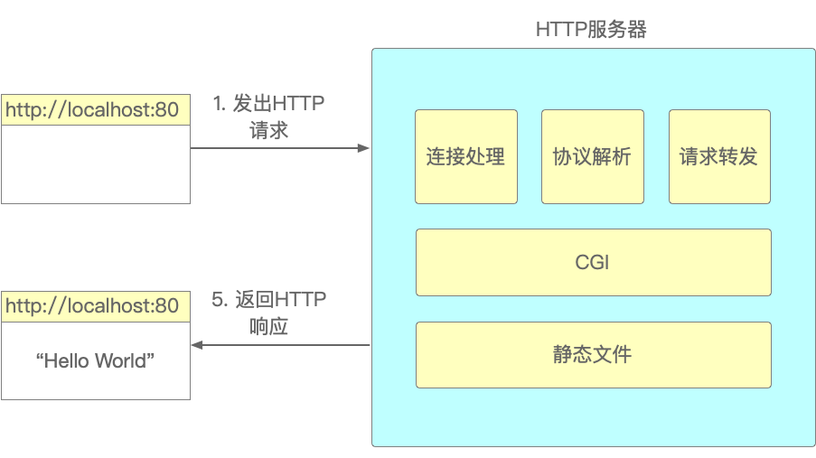
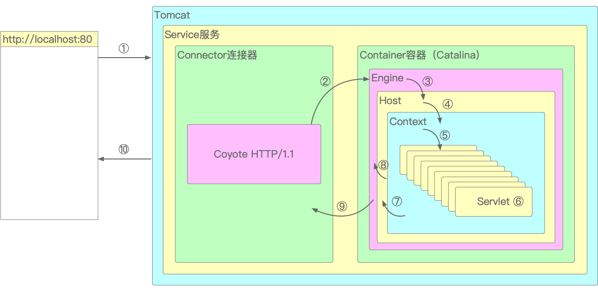
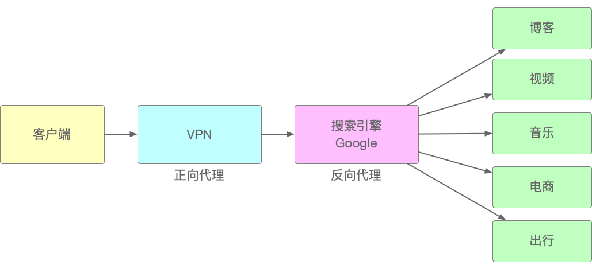

## 第13章 Nginx与OpenResty

Nginx诞生于2002年，由俄罗斯程序员Igor Sysoev开发。它最初是为了解决C10K问题而创建。之后，诞生了一种称之为LUA的嵌入式脚本语言。它是一种语法简单、易于学习、易于嵌入到其他程序中，并且运行速度非常快的轻量级脚本语言。虽然Nginx和LUA更多属于运维工作的范畴，但它们作为互联网应用开发中多级缓存架构中的一员，以及在微服务和API网关中所发挥的重要作用，作为开发工程师，还是有必要了解它们的。

本章讲解了服务器与容器的区别，也介绍了Nginx的三个拿手绝活，最后演示了如何将Nginx和OpenResty结合起来实现更为强大的功能。

本章所有Nginx配置和LUA脚本均在javabook-nginxlua子模块的src/main/resources目录中。

### 13.1 服务器、容器与代理

为了更好地了解和学习Nginx，有三个与之相关的概念需要先明确澄清，那就是服务器、容器与代理。另外，这里所说的服务器是特指的软件，而非硬件。

#### 13.1.1 服务器

HTTP（超文本传输协议）服务器是一种软件应用程序或服务，它用于接收HTTP客户端的请求并返回相应的内容，例如在网页上发送登录请求之后，如果成功就会返回首页，如果失败则返回错误页面。HTTP服务器只是Web服务器的一种，专门处理和分发基于HTTP协议之上的Web网页、图像、视频、文件等资源。因为除了HTTP服务器之外，Web服务器还包括Socket、Telnet、FTP、SMTP等服务器。HTTP服务器通过监听指定的端口（通常是80端口），等待客户端的连接请求，并根据请求的内容返回相应的数据或执行相应的操作。这里的HTTP客户端通常指的就是浏览器，例如IE、Chrome、FireFox等。在一般情况下，如无特别说明，本章中出现的Web服务器指的就是HTTP服务器。

不过，在专用的Web服务器诞生之前的很长一段时间，网络应用程序的功能都是由CGI来完成的。CGI的英文全称是“Common Gateway Interface”，即“公共网关接口”，它是一种用于在Web服务器和外部应用程序之间传递数据的标准协议。CGI之所以诞生，其初衷就是为了能够让Web服务器调用外部应用程序，从而实现动态网页的生成，因为在那个时候，HTML页面基本上都是静态的，没法动态地生成网页内容，如图13-1所示。

> 图13-1 HTTP服务器的组成



#### 13.1.2 容器

一般来说，C#服务端用到的IIS，PHP服务端用到的Apache和Java服务端用到的Tomcat，它们都属于一种Web服务器，因为它们都可以通过浏览器发出请求，然后收到由服务端返回来的响应内容。但它们又和单纯的Web服务器有所不同。因为纯粹的Web服务器仅仅只是接收HTTP请求，然后根据协议处理请求内容，并返回结果，而Web容器则在此基础之上更进一步。以Java中的Tomcat为例，除了要履行Web服务器的那部分功能之外，还需要完成维护Servlet组件生命周期、解释/执行JSP页面标签、静态资源管理等诸多任务。从用户访问`http://localhost:8080/index.jsp`开始，Tomcat中就发生了如下事件：

1. 用户请求被发送到Tomcat，该请求被监听8080端口并处理HTTP协议的Connector连接器捕获；
2. Connector连接器把请求交给它所在的Service服务的Engine引擎来处理，并等待Engine引擎的回应；
3. Engine引擎获得请求localhost/index.jsp的路径，匹配所有的虚拟主机Host；
4. Engine引擎匹配到名为localhost的Host虚拟主机来处理/index.jsp请求（即使匹配 不到会请求交给默认 Host 处理），Host会根据“/”匹配它所拥有的全部Context上下文；
5. 匹配到的Context上下文获得请求/index.jsp；
6. 构造HttpServletRequest对象和HttpServletResponse对象，作为参数调用Servlet的doGet()或doPost()方法来执行业务逻辑、数据存储等程序；
7. Context把执行完之后的结果通过HttpServletResponse对象返回给Host对象；
8. Host把HttpServletResponse返回给Engine引擎；
9. Engine把HttpServletResponse对象返回Connector连接器；
10. Connector把HttpServletResponse对象返回给客户浏览器。

整个过程如图13-2所示。

> 图13-2 Tomcat容器



其他的Web容器与Tomcat类似，都需要维护其中组件的生命周期及相关语法标签的解析，这正是Web容器与Web容器最主要的不同之处。

另外，如果在Web容器的基础之上，再融合加入更多的应用功能或服务，例如事务管理、数据库连接（池）、Bean注入等，则被称之为“Web应用服务器”，JBoss、WebLogic和WebSphere就属于是这种重量级Web应用服务器的典型代表。所以，从应用范畴的角度来看：

`Web（或HTTP）服务器 < Web容器 < Web应用服务器（“<”表示小于...的范畴）`。

#### 13.1.3 代理

这里所说的代理，不完全等同于前述“反射与代理”中的“代理”。这里的代理，指的是一个位于客户端和目标服务器之间的中间服务，客户端通过它从目标服务器上获取内容。在这个意义上，前述的中介就是一种租客和房东之间的代理。再比如通过VPN技术实现对不同网络的访问，也是一种代理。只不过这里所说的代理，是一种正向的代理，也就是为了客户端而屏蔽了目标服务器的访问复杂性，让客户端能自由获取所需的数据与服务。

除了正向代理之外，还有一种反向代理，其访问过程与正向代理相同，但它和正向代理的区别是：正向代理时，客户端知道访问的是代理服务器，而反向代理时，客户端是无感的，用户并不知道自己访问是代理服务器，还是真正提供服务的服务器，正向代理和反向代理的区别如图13-3所示。

> 图13-3 正向代理与反向代理



图13-3已经清楚地展示了正向代理和反向代理的区别。作为反向代理的搜素引擎，可以让用户不必记住并在浏览器的地址栏上输入每种提供服务的网站网址，而只需要在搜索出来的结果上轻点鼠标，即可访问网站服务，这正是典型的反向代理服务。

### 13.2 Nginx的“三宝”

Nginx作为一个高性能且高可用的HTTP服务器，反向代理、负载均衡和流量管控是它最拿手的三样本领。

#### 13.2.1 反向代理

Nginx最拿手的就是提供反向代理服务。以Java应用为例，一般都是以8080端口为入口，但如果想改为80端口，就可以用Nginx来“代理”，修改nginx.conf文件，如代码清单13-1所示。

> 代码清单13-1 nginx.conf

```yml
server {
    listen        80;
    server_name  localhost;
    location / {
        proxy_pass http://localhost:9529;
        proxy_set_header Host $host:$server_port;
    }
}
```

#### 13.2.2 负载均衡


#### 13.2.3 流量管控


### 13.3 OpenResty与LUA


#### 13.3.1 运行OpenResty


#### 13.3.2 第一个LUA脚本


#### 13.3.3 LUA API


### 13.4 用LUA操作数据


#### 13.4.1 访问Redis缓存


#### 13.4.2 操作MySQL数据库


### 13.5 OpenResty的协程


#### 13.5.1 Coroutine库


#### 13.5.2 关于并行调度


### 13.6 本章小节
