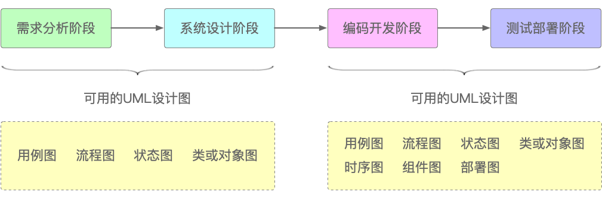
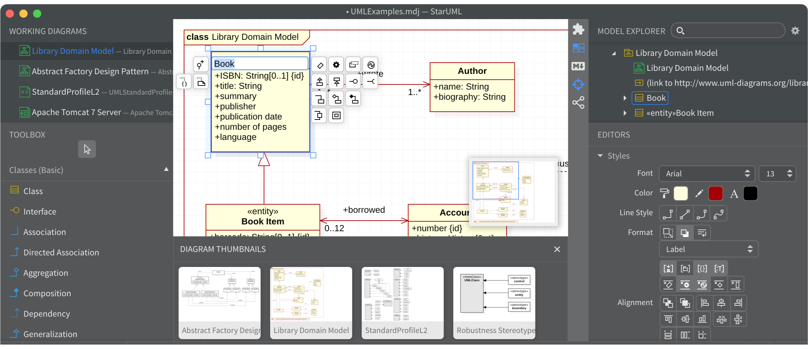

# 第三篇 工程实践篇

现在的互联网大厂和过去的软件小作坊之间，最大的区别并非人数变得更多了，业务变得更复杂了，而是其日益流程化、规范化和系统化的软件开发方式，这种流程化、规范化和系统化的方式，通常也被称之为“软件工程（化）”。就像盖房子时的脚手架一样，虽然钢筋混凝土很坚固，但它从浇筑到凝固也是需要一个过程的，如果没有这些脚手架的干预，那么“质变”过程绝不会凭空出现。对于软件项目来说也是一样，软件工程就相当于开发过程中的脚手架，它不仅能够帮助工程师们快速启动项目，减少枯燥的重复性工作，提升开发效率，而且它提供了一套标准化的开发过程。所谓“功夫在诗外”——掌握这些软件开发能力之外的能力，不仅能够统一软件开发团队的想法和做法，也能提高软件产品的质量，让软件变得更容易使用和维护，进而提高软件研发团队整体的开发水准。

本篇包括如何以图表强化软件协同，如何开发和调试出性能卓越的接口，如何以流水线的方式部署应用服务，如何合理地运用开发过程提升软件质量，以及如何做好开源软件。本篇内容是一次对软件工程实践的系统性回顾，全部以实践为主，取其精华，扔其鸡肋，详细阐述了笔者多年来的软件工程实践经验和心得体会。

希望本篇内容能够将广大读者从“西绪福斯的苦役”中解脱出来。

## 第14章 字不如表不如图

俗话说“字不如表，表不如图”。不管是什么行业什么岗位，做什么工作，工程师也好，设计师也罢，哪怕是办公室的Office Lady或外卖小哥，在日常和人沟通之时，总会有比划几下，或者画个图让对方明白自己意思的时候。因为相比于说一大堆话，用一张图显然可以让对方更快地明白自己所要表达的意思。软件开发中也是如此，不同的工程师，不同的团队，不同的部门之间在合作时，总会有大量的正式或非正式的文档、会议、IM消息，如果将之归类的话，那么它们无非分为：UML图、ER图、架构图以及项目相关图表，本章就来将它们一一盘点。

### 14.1 UML建模语言

UML是“Unified Modeling Language”的英文缩写，称为“统一建模语言”，其诞生历史可以追溯到20世纪80年代末和90年代初。当时软件开发领域面临着快速发展和复杂化的挑战，为了更好地描述、设计和理解软件系统，人们意识到需要一种标准的用于彼此协作和沟通的“语言”，以便更好地描述、设计和理解软件系统。为此，UML提供了一套图形化的符号和规则，用于描述软件系统的结构、行为、交互等方面，帮助工程师们更好地分析、设计和沟通软件系统。这套图形化的符号和规则，就如同工程建筑行业中起着至关重要作用的蓝图一样，是众多工程师们用于设计、施工和沟通的“语言”。

UML包括了多种不同类型的设计图，按照分类，它们包括：

1. 结构图：用于描述系统的静态结构，包括类图（Class Diagram）、对象图（Object Diagram）、组件图（Component Diagram）、部署图（Deployment Diagram）；
2. 行为图：用于描述系统的动态行为，包括用例图（Use Case Diagram）、活动图（Activity Diagram，也叫流程图）、状态图（State Diagram）、时序图（Sequence Diagram）、通信图（Communication Diagram）；
3. 交互图：描述系统中对象之间的交互关系，包括时序图（Sequence Diagram）和协作图（Collaboration Diagram）。

但出现频率最高的几种分别是用例图、类或对象图、流程图、状态图和时序图。如果按软件项目的开发阶段来分，它们的作用如图14-1所示。

> 图14-1 不同阶段可用的UML设计图

可以画图的工具很多，但能完整遵循标准UML语法的工具很少，笔者经常使用的只有两种：一是IBM的Rational Rose，可惜直到2010年发布Rose 7.0.0.4 iFix001版本之后就再也没有更新过，目前已经不可用了。二是StarUML，它很好地继承了Rational Rose大部分功能，且至今仍在更新，而且风格上也是一脉相承，如图14-2所示。

> 图14-2 StarUML界面

本章的内容均以StatUML 3.2.2版本作为UML工具来展开讲解。当然，也许有些读者更习惯使用其他的软件，例如VISIO、ProcessOn等。

工具并不重要，重要的是设计思想和沟通方式。

#### 14.1.1 用例图

#### 14.1.2 类图

#### 14.1.3 流程图

#### 14.1.4 状态图

#### 14.1.5 时序图

### 14.2 ER图

#### 14.2.1 逻辑模型

#### 14.2.2 物理模型

### 14.3 架构图

#### 14.3.1 架构思维

#### 14.3.2 架构图模板

#### 14.3.3 架构图分类

### 14.4 其他

#### 14.4.1 甘特图

#### 14.4.2 鱼骨图

#### 14.4.3 思维导图

### 14.5 本章小节

常言道“一图胜千言”。如果对一个从未见过榴莲的人，通过言语来向他来描述榴莲的样子，恐怕1000个人就会有1000种不同的说法。但如果给他看一张榴莲的照片，他就会立刻明白榴莲的样子了，而不会被言语所“迷惑”。同样，在软件开发的设计、开发和部署等各个阶段，也有诸多可使用的相关图表，用好这些图表，不但能起到事半功倍的作用，而且也能消除歧义、统一思想、节省时间，有效地提高团队协作的效率和效果。

在软件系统的设计、开发、测试和交付阶段，常见且常用的图表包括UML图、ER图、架构图和诸如甘特图、鱼骨图、思维导图等各类图表，它们涵盖了一名软件工程师在其职业生涯中所能遇到的图表的90%左右。

UML作为建模语言，是一套专用于描述系统需求、行为、结构、交互和状态的符号规则。通过UML用例图，需求分析人员、项目经理或产品经理可以用一种更为精炼有效的方式，来告诉开发工程师系统需要完成什么样的功能，有哪些输入和输出，又需要遵循哪些前提条件，尤其是对于不同的角色来说，他们又是如何使用这同一套系统的。类图则为系统的结构和交互铺设了龙骨，描述了系统中的类、接口、关系和属性等元素，将现实世界的各种存在抽象为软件系统的虚拟实体。既反向验证了系统设计是否符合需求，以帮助开发人员及时发现和解决设计上的问题，又可以作为代码生成工具的输入，帮助开发人员自动生成部分代码，提高开发效率。UML中的流程图是在实际工作工作接触最多的图表之一，原因之一就是但凡业务则必有流程，而将流程描述清楚后用系统来实现，则一定会借助流程图工具。而且，通过分析流程图，还可以发现流程中的瓶颈和冗余，进而优化流程，提高效率和质量。现实世界的业务实体往往不止一种状态，而是在不同前提条件下和不同业务环节中，表现出多面性。找到并描述这些不同的业务侧面，就是UML状态图的职责。如果说状态图是从比较“宏观”的角度来看待业务逻辑的转换和交互的话，那么时序图则是从“微观”的层面来描述系统中对象与对象之间、方法与方法之间的交互行为、调用顺序和消息传递。通过时序图，既可以反映对象在交互过程中的状态变化，帮助工程师理解系统的动态行为，也可以理清对象之间的交互和消息传递逻辑。

在数据库设计阶段，最常用的设计图表就是ER图，没有之一。因为ER是着眼于映射为数据库表结构的现实中的实体，而着手于它们之间的关系。通过ER模型，工程师或系统分析员、DBA们可以用于对系统中的数据进行建模，包括实体、属性和关系等，帮助他们理清数据之间的关系、结构和各种约束。ER图中的逻辑模型关注的是实体间的关系，例如一对一、一对多和多对多等关系。而Navicat则提供了六种可选的关系，它们是None、One and Only One、Many、One or Many、Zero or One和Zero or Many。ER图中的物理模型只是比逻辑模型的属性更多而已，但不同的工具在创建不同的模型时会有不同的作用，例如，PowerDesigner就可以依据物理模型逆向创建出SQL脚本。因此有时物理模型会用数据字典来替代。

从工程师成长为架构师，并非是靠画几张漂亮的架构图，而是需要怎整理解并掌握架构思维，它们包括但不限于抽象思维、解构思维、集成思维、分层思维、发散思维、结构化思维、迭代思维、系统思维和模式匹配等。虽说掌握这些思维、模式需要耗费不少的时间浸润，但先从模板开始学着画架构图也是个不错的办法。笔者依据个人多年的工作经验整理了几种常见的架构模板。架构图可以分为业务架构图、应用架构图、技术架构图和数据架构图几类。但在实际工作中，并不会完全照着这些分类来画架构图，而是可能会将诸多类型混杂在一起。例如有些系统架构图，既有业务架构图，又有应用架构图和技术架构图的影子。

在项目管理中经常会用到甘特图，它不仅仅可以用于项目管理，对于制定个人工作计划，它也是完全可以胜任的。甘特图只是项目管理思想的一种体现，只要具备了成熟的项目管理思想，即使是不画甘特图，工程师或项目经理对于项目计划、进度的掌控也会自然而然地出现。鱼骨图是一种类似于鱼骨形状的因果图。通过它可以定义问题、找到产生问题的根本原因和找到如何解决问题的办法。但如何使用它可不仅仅限于寻找“因果循环”，因为工作总结、迭代计划同样可以用鱼骨图来做。常见的思维导图称为Mind Map，但是其实还存在另外一种思维导图，称之为Thinking Map，因为具有八种不同的类型的图示，因此又叫它八大思维图示法。其中的圆圈图、气泡图、双气泡图、多流程图和桥形图虽然使用场合不多，但对于想象、类比、归因等思维方式的训练，却是很好的实践方法。

### 14.6 本章练习

1. 请补全图14-18登录流程，将用户名格式、密码连续错误三次锁定账户、人机验证、是否单点登录等条件加入进去。当然，也可以加入其他可能的业务约束。

2. 请参照图14-18登录流程，画出用户注册流程、验证码登录流程、扫码登录流程和第三方账号登录流程。

3. 请尝试参照图14-20中的流程图，画出平台视角的订单履约状态流转过程，以及订单履约的时序图。

4. 请尝试参照某图书电商，给咚咚图书电商画出其平台业务架构图、应用架构图、技术架构图和数据架构图。

5. 如果让一个7人组成的敏捷开发团队（产品经理1、Java工程师3、前端工程师1、UI设计师1、测试工程师1）来开发这个咚咚图书网，如何通过甘特图排期？
